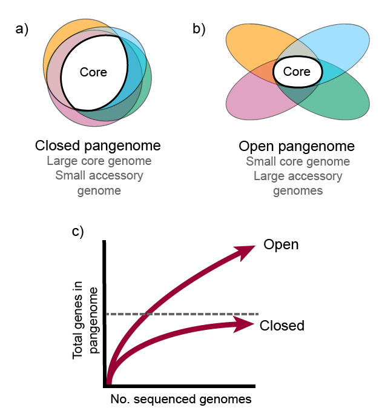

## What is a pangenome?

The term **pangenome** derives from the Greek *pan*, meaning 'whole' or 'everything', while *genome* describes an organism's complete genetic material. In 2005, Tettelin et al. used the term pangenome by first time to describe the entire collection of genes from a group of bacteria. Currently, this term has been used for other grups of organisms, including plants, animals, fungi, virus, etc. Today, the pangenome is defined as the entire set of genes from all strains of a clade.

The pangenome could be divided in three principal components: **core genome** which contains genes present in all the strains compared, **shell genome** a proportion of genes absent in one or more strains and **dispensable genome** comprised by genes that are unique to each strain. 

There are two classes of pangenomes: open and closed. An **open pangenome** occurs when the size of the pangenome increases considerably every added genome (p. e. *Escherichia coli*). Whereas, a **closed pangenome** results when only few gene families are incorporated to the pangenome when a new member is added.

## How to select a group of genomes to construct a pangenome?

Selection of proper data to construct a pangenome analysis is a crucial task of the process. By definition, a pangenome represents the entire set of genes from all strains in a clade. Thus, let's define and understand what a clade is. 

A **clade** (*kládos*, 'branch'), also known as *monophyletic group*, is a group of organisms that share the same common ancestor. In a phylogenetic tree, clades can be distinguished by identified the common ancestor of branch subgroups. For instance, in Fig.2, the blue and red subgroups are considered clades but green subgruop is not a clade, it is a *parahyletic group*. Why is that? Becuse it excludes the blue clade which has descended from the same common ancestor. Instead, the green and blue subgroups together form a clade.

## Exercise 
Download data. 
`wget https://zenodo.org/record/6622053/files/dc_workshop.zip?download=1`

## Brief description of *Streptococcus agalactiae* dataset

For this lesson purposes, we selected 6 *Streptococcus agalactiae* genomes... 

**Selected genomes**

| Organism                | Host    | Serotype   | Country     | SRA accesion number |
|-------------------------|---------|------------|-------------|---------------------|
|*S. agalactiae*  18RS21  | Human   |            |             |                     |
|*S. agalactiae*  515     | Human   |            |             |                     |
|*S. agalactiae*  A909    | Human   |            |             |                     |
|*S. agalactiae*  CJB111  | Human   |            |             |                     |
|*S. agalactiae*  COH1    | Human   |            |             |                     |
|*S. agalactiae*  H36B    | Human   |            |             |                     |



