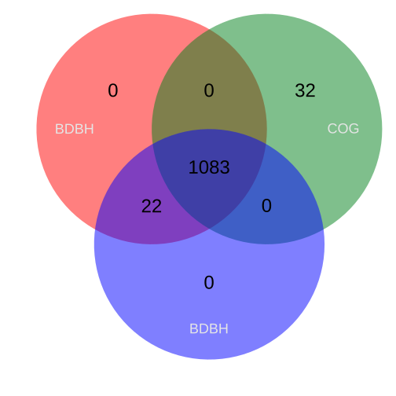

Get_Homologues a versatile software package for pan-genome analysis is maintained by Bruno Contreras-Moreira and Pablo Vinuesa. 
## Introducction 
## Main Task
- Clustering protein and nucleotide sequences in homologous (possibly orthologous) groups, on the grounds of sequence similarity.
- Identification of orthologous groups of intergenic regions, flanked by orthologous open reading frames (ORFs), conserved across related genomes.
- Definition of pan- and core-genomes by calculation of overlapping sets of proteins.

## Considerations
Please ensure that you are in the environment of Pangenomics. You can omit his step if you have activated the environment.

~~~
$ conda activate Pangenomics_Globals  
~~~
{: .language-bash}
Now, We ensure that get_homologues is install

~~~
$ get_homologues.pl -h #This command display the options
~~~
{: .language-bash}

~~~
-v print version, credits and checks installation
-d directory with input FASTA files ( .faa / .fna ),           (overrides -i,
   GenBank files ( .gbk ), 1 per genome, or a subdirectory      use of pre-clustered sequences
   ( subdir.clusters / subdir_ ) with pre-clustered sequences   ignores -c, -g)
   ( .faa / .fna ); allows for new files to be added later;    
   creates output folder named 'directory_homologues'
-i input amino acid FASTA file with [taxon names] in headers,  (required unless -d is set)
   creates output folder named 'file_homologues'

Optional parameters:
-o only run BLAST/Pfam searches and exit                       (useful to pre-compute searches)
-c report genome composition analysis                          (follows order in -I file if enforced,
                                                                ignores -r,-t,-e)
-R set random seed for genome composition analysis             (optional, requires -c, example -R 1234,
                                                                required for mixing -c with -c -a runs)
-m runmode [local|cluster|dryrun]                              (default local)
-n nb of threads for BLAST/HMMER/MCL in 'local' runmode        (default=2)
-I file with .faa/.gbk files in -d to be included              (takes all by default, requires -d)

Algorithms instead of default bidirectional best-hits (BDBH):
-G use COGtriangle algorithm (COGS, PubMed=20439257)           (requires 3+ genomes|taxa)
-M use orthoMCL algorithm (OMCL, PubMed=12952885)

Options that control sequence similarity searches:
-X use diamond instead of blastp                               (optional, set threads with -n)
-C min %coverage in BLAST pairwise alignments                  (range [1-100],default=75)
-E max E-value                                                 (default=1e-05,max=0.01)
-D require equal Pfam domain composition                       (best with -m cluster or -n threads)
   when defining similarity-based orthology
-S min %sequence identity in BLAST query/subj pairs            (range [1-100],default=1 [BDBH|OMCL])
-N min BLAST neighborhood correlation PubMed=18475320          (range [0,1],default=0 [BDBH|OMCL])
-b compile core-genome with minimum BLAST searches             (ignores -c [BDBH])

Options that control clustering:
-t report sequence clusters including at least t taxa          (default t=numberOfTaxa,
                                                                t=0 reports all clusters [OMCL|COGS])
-a report clusters of sequence features in GenBank files       (requires -d and .gbk files,
   instead of default 'CDS' GenBank features                    example -a 'tRNA,rRNA',
                                                                NOTE: uses blastn instead of blastp,
                                                                ignores -g,-D)
-g report clusters of intergenic sequences flanked by ORFs     (requires -d and .gbk files)
   in addition to default 'CDS' clusters
-f filter by %length difference within clusters                (range [1-100], by default sequence
                                                                length is not checked)
-r reference proteome .faa/.gbk file                           (by default takes file with
                                                                least sequences; with BDBH sets
                                                                first taxa to start adding genes)
-e exclude clusters with inparalogues                          (by default inparalogues are
                                                                included)
-x allow sequences in multiple COG clusters                    (by default sequences are allocated
                                                                to single clusters [COGS])
-F orthoMCL inflation value                                    (range [1-5], default=1.5 [OMCL])
-A calculate average identity of clustered sequences,          (optional, creates tab-separated matrix,
 by default uses blastp results but can use blastn with -a      recommended with -t 0 [OMCL|COGS])
-P calculate percentage of conserved proteins (POCP),          (optional, creates tab-separated matrix,
 by default uses blastp results but can use blastn with -a      recommended with -t 0 [OMCL|COGS])
-z add soft-core to genome composition analysis                (optional, requires -c [OMCL|COGS])
~~~
{: .output}

> ## Notes
> Get_homologues suggests that you run your data with a directory because you could add a new file *.gbk* in the future, if necessary.
{: .callout}

## Step 1. Generate a folder get_homologues
It's necessary that we create a new folder when all results are sent.
~~~

$ mkdir -p ~/dc_workshop/results/pangenome/get_homologues/data_get #Create directory (-p create all parents)
$ cd  ~/dc_workshop/results/pangenome/get_homologues/data_get # Change to the directory 'data_get'
~~~
{: .language-bash}
We need to create a Symbolic link with the file *.gbk*
~~~
$ find ~/dc_workshop/results/annotated/. -name "*aga*_prokka.gbk*" -exec ln -s {} . ';' 
$ ls ~dc_workshop/results/pangenome/get_homologues/data_get #List the symbolic link
~~~
{: .language-bash}

~~~
agalactiae_18RS21_prokka.gbk  agalactiae_A909_prokka.gbk    agalactiae_COH1_prokka.gbk
agalactiae_515_prokka.gbk     agalactiae_CJB111_prokka.gbk  agalactiae_H36B_prokka.gbk
~~~
{: .output}

## Step 2. Generate the directory clusters
~~~
$ cd  ~/dc_workshop/results/pangenome/get_homologues/
~~~
{: .language-bash}

To generate the directory clusters with BDBH, this option is default.
~~~
$ get_homologues.pl -d data_get
~~~
{: .language-bash}

> ## Notes
> When run the script above typically takes about 20 minutes.
{: .callout}

~~~
# finding BDBHs between agalactiae_18RS21_prokka.gbk and agalactiae_COH1_prokka.gbk
# 1369 sequences

# clustering inparalogues in agalactiae_H36B_prokka.gbk
# 71 sequences

# finding BDBHs between agalactiae_18RS21_prokka.gbk and agalactiae_H36B_prokka.gbk
# 1390 sequences

# looking for valid ORF clusters (n_of_taxa=6)...

# number_of_clusters = 1105
# cluster_list = data_get_homologues/agalactiae18RS21prokka_f0_alltaxa_algBDBH_e0_.cluster_list
# cluster_directory = data_get_homologues/agalactiae18RS21prokka_f0_alltaxa_algBDBH_e0_

# runtime: 838 wallclock secs (10.78 usr  0.25 sys + 560.38 cusr 10.61 csys = 582.02 CPU)
# RAM use: 65.8 MB
~~~
{: .output}

To generate the directory cluster with COG 

~~~
$ get_homologues.pl -d data_get -G
~~~
{: .language-bash}

~~~
# creating indexes, this might take some time (lines=3.15e+05) ...

# construct_taxa_indexes: number of taxa found = 6
# number of file addresses/BLAST queries = 1.2e+04

# clustering orthologous sequences
# checking lineage-specific expansions
# making COGs
# prunning COGs
# done

# looking for valid ORF clusters (n_of_taxa=6)...

# number_of_clusters = 1115
# cluster_list = data_get_homologues/agalactiae18RS21prokka_f0_alltaxa_algCOG_e0_.cluster_list
# cluster_directory = data_get_homologues/agalactiae18RS21prokka_f0_alltaxa_algCOG_e0_

# runtime: 17 wallclock secs ( 1.51 usr  0.07 sys +  3.12 cusr  0.83 csys =  5.53 CPU)
# RAM use: 60.0 MB
~~~
{: .output}

To Generate the OMCL cluster director y(OMCL, PubMed=12952885)

~~~
$ get_homologues.pl -d data_get -M
~~~
{: .source}

~~~
# identifying inparalogs in agalactiae_COH1_prokka.gbk
# 60 sequences

# identifying inparalogs in agalactiae_H36B_prokka.gbk
# 71 sequences

# running MCL (inflation=1.5) ...
# running MCL finished

# find_OMCL_clusters: parsing clusters (/home/betterlab/dc_workshop/results/pangenome/get_homologues_pr/data_get_homologues/tmp/all_ortho.mcl)

# looking for valid ORF clusters (n_of_taxa=6)...

# number_of_clusters = 1110
# cluster_list = data_get_homologues/agalactiae18RS21prokka_f0_alltaxa_algOMCL_e0_.cluster_list
# cluster_directory = data_get_homologues/agalactiae18RS21prokka_f0_alltaxa_algOMCL_e0_

# runtime:  6 wallclock secs ( 3.51 usr  0.13 sys +  0.88 cusr  0.31 csys =  4.83 CPU)
# RAM use: 67.0 MB
~~~
{: .output}

## Step 3. Compare all clusters from different algorithms
~~~
$ compare_clusters.pl -o alg_intersection -m -d\
gbk_homologues/A909_f0_alltaxa_algBDBH_e0_,\
gbk_homologues/A909_f0_alltaxa_algCOG_e0_,\
gbk_homologues/A909_f0_alltaxa_algOMCL_e0_
~~~
{: .language-bash}
~~~
# number_of_clusters = 1105
# cluster_list = data_get_homologues/agalactiae18RS21prokka_f0_alltaxa_algBDBH_e0_.cluster_list
# cluster_directory = data_get_homologues/agalactiae18RS21prokka_f0_alltaxa_algBDBH_e0_

# runtime: 840 wallclock secs (13.44 usr  0.24 sys + 593.88 cusr 10.63 csys = 618.19 CPU)
# RAM use: 65.8 MB
~~~
{: .output}

Use the scp protocol in order to see the venn diagram
~~~
$ scp user@ip:/path/to/file/venn_t0.pdf .
~~~
{: .language-bash}

~~~
$ usuario@ip password:
~~~
{: .output}

search file in the file browser on your computer.

## Step 4. Obtaining a pangenome matrix
first we use the -t 0 option with COG ang OMCL alghortims to include all possible clusters, including those which might not contain sequences from all input genomes (taxa)
~~~
$ get_homologues.pl -d data_get -t 0 -M
~~~
{: .language-bash}

~~~
# number_of_clusters = 3632
# cluster_list = data_get_homologues/agalactiae18RS21prokka_f0_0taxa_algCOG_e0_.cluster_list
# cluster_directory = data_get_homologues/agalactiae18RS21prokka_f0_0taxa_algCOG_e0_

# runtime:  3 wallclock secs ( 1.41 usr  0.12 sys +  0.36 cusr  0.06 csys =  1.95 CPU)
# RAM use: 59.9 MB
~~~
{: .output}

~~~
$ get_homologues.pl -d data_get -t 0 -M
~~~
{: .language-bash}
 
~~~
# number_of_clusters = 3634
# cluster_list = data_get_homologues/agalactiae18RS21prokka_f0_0taxa_algOMCL_e0_.cluster_list
# cluster_directory = data_get_homologues/agalactiae18RS21prokka_f0_0taxa_algOMCL_e0_

# runtime:  5 wallclock secs ( 2.07 usr  0.26 sys +  0.52 cusr  0.08 csys =  2.93 CPU)
# RAM use: 54.2 MB
~~~
{: .output}

then we use the option 

~~~
$ compare_clusters.pl -o prueba_intersection -m -d\ 
data_get_homologues/agalactiae18RS21prokka_f0_0taxa_algCOG_e0_,\
data_get_homologues/agalactiae18RS21prokka_f0_0taxa_algOMCL_e0_
~~~
{: .language-bash}

~~~ 
# pangenome_phylip file = prueba_intersection2/pangenome_matrix_t0.phylip
# pangenome_FASTA file = prueba_intersection2/pangenome_matrix_t0.fasta
# pangenome CSV file (Scoary) = prueba_intersection2/pangenome_matrix_t0.tr.csv
# input set: prueba_intersection2/agalactiae18RS21prokka_f0_0taxa_algCOG_e0_.venn_t0.txt
# input set: prueba_intersection2/agalactiae18RS21prokka_f0_0taxa_algOMCL_e0_.venn_t0.txt

# Venn diagram = prueba_intersection2/venn_t0.pdf prueba_intersection2/venn_t0.svg
# Venn region file: prueba_intersection2/unique_agalactiae18RS21prokka_f0_0taxa_algCOG_e0_.venn_t0.txt (182)
# Venn region file: prueba_intersection2/unique_agalactiae18RS21prokka_f0_0taxa_algOMCL_e0_.venn_t0.txt (186)
~~~
{: .output}

> ## Exercise 1: 
> 
> What is the interpret the Venn diagrams?
>> ## Solution
>> 
> {: .solution}
{: .challenge} 

> ## Exercise 2: 
> 
> Complete the line blank with the correct clustering algorithms
> 
> |------------------------------+------------------------------------------------------------------------------|  
> | **algorithms**                           |     **Information required**                                     |  
> |------------------------------+------------------------------------------------------------------------------|  
> | ___________________ |  Starting from a reference genome, keep adding genomes stepwise while storing the sequence clusters that result of merging the latest bidirectional best hits                                  |  
> |------------------------------+------------------------------------------------------------------------------|  
> | ___________________ | Merges triangles of inter-genomic symmetrical best matches |   
> |------------------------------+------------------------------------------------------------------------------|  
> | ___________________ | uses the Markov Cluster Algorithm to group sequences, with inflation (-F) controlling cluster granularity  |  
> |------------------------------+------------------------------------------------------------------------------| 
>
>
>> ## Solution
>> 
>> |------------------------------+------------------------------------------------------------------------------|  
>> | **algorithms**                           |     **Information required**                                     |  
>> |------------------------------+------------------------------------------------------------------------------|  
>> | BDBH                      |  Starting from a reference genome, keep adding genomes stepwise while storing the sequence clusters that result of merging the latest bidirectional best hits                                  |  
>> |------------------------------+------------------------------------------------------------------------------|  
>> | COGS  | Merges triangles of inter-genomic symmetrical best matches |   
>> |------------------------------+------------------------------------------------------------------------------|  
>> | OMCL    | uses the Markov Cluster Algorithm to group sequences, with inflation (-F) controlling cluster granularity  |  
>> |------------------------------+------------------------------------------------------------------------------| 
>> 
>>
> {: .solution}
{: .challenge} 


