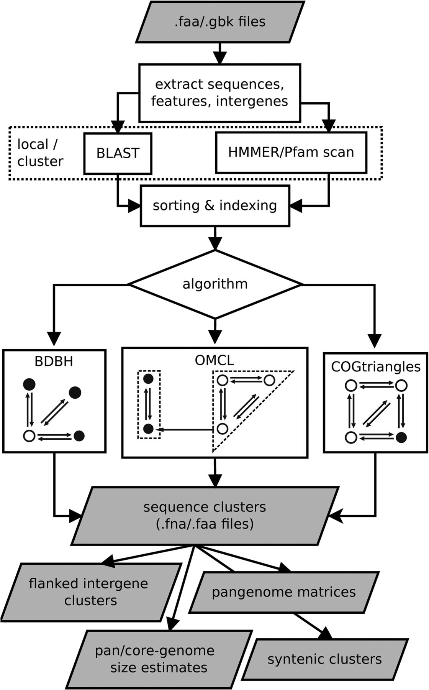
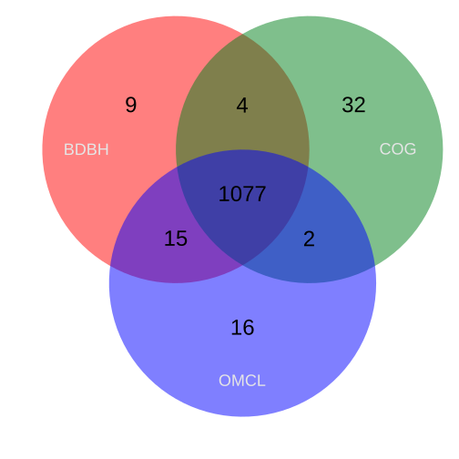
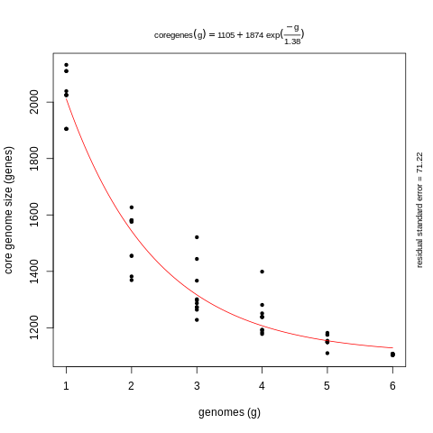
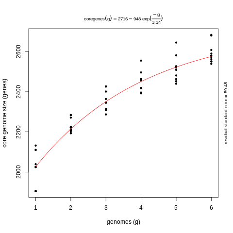
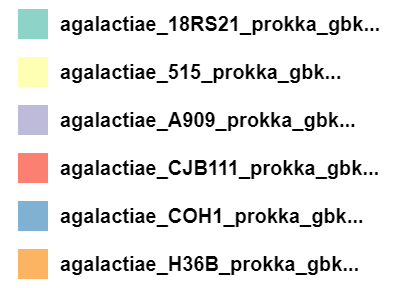

Get_Homologues a versatile software package for pan-genome analysis is maintained by Bruno Contreras-Moreira and Pablo Vinuesa. 
## Introduction 
## Main Task
- Clustering protein and nucleotide sequences in homologous (possibly orthologous) groups, on the grounds of sequence similarity.
- Identification of orthologous groups of intergenic regions, flanked by orthologous open reading frames (ORFs), conserved across related genomes.
- Definition of pan- and core-genomes by calculation of overlapping sets of proteins.

## Considerations
Please ensure that you are in the environment of Pangenomics. You can omit his step if you have activated the environment.

~~~
$ conda activate Pangenomics_Global  
~~~
{: .language-bash}
Now, We ensure that get_homologues is install

~~~
$ get_homologues.pl -h #This command display the options
~~~
{: .language-bash}

~~~
-v print version, credits and checks installation
-d directory with input FASTA files ( .faa / .fna ),           (overrides -i,
   GenBank files ( .gbk ), 1 per genome, or a subdirectory      use of pre-clustered sequences
   ( subdir.clusters / subdir_ ) with pre-clustered sequences   ignores -c, -g)
   ( .faa / .fna ); allows for new files to be added later;    
   creates output folder named 'directory_homologues'
-i input amino acid FASTA file with [taxon names] in headers,  (required unless -d is set)
   creates output folder named 'file_homologues'

Optional parameters:
-o only run BLAST/Pfam searches and exit                       (useful to pre-compute searches)
-c report genome composition analysis                          (follows order in -I file if enforced,
                                                                ignores -r,-t,-e)
-R set random seed for genome composition analysis             (optional, requires -c, example -R 1234,
                                                                required for mixing -c with -c -a runs)
-m runmode [local|cluster|dryrun]                              (default local)
-n nb of threads for BLAST/HMMER/MCL in 'local' runmode        (default=2)
-I file with .faa/.gbk files in -d to be included              (takes all by default, requires -d)

Algorithms instead of default bidirectional best-hits (BDBH):
-G use COGtriangle algorithm (COGS, PubMed=20439257)           (requires 3+ genomes|taxa)
-M use orthoMCL algorithm (OMCL, PubMed=12952885)

[...]

Options that control clustering:
-t report sequence clusters including at least t taxa          (default t=numberOfTaxa,
                                                                t=0 reports all clusters [OMCL|COGS])
-a report clusters of sequence features in GenBank files       (requires -d and .gbk files,
   instead of default 'CDS' GenBank features                    example -a 'tRNA,rRNA',
                                                                NOTE: uses blastn instead of blastp,
                                                                ignores -g,-D)
-g report clusters of intergenic sequences flanked by ORFs     (requires -d and .gbk files)
   in addition to default 'CDS' clusters
-f filter by %length difference within clusters                (range [1-100], by default sequence
                                                                length is not checked)
-r reference proteome .faa/.gbk file                           (by default takes file with
                                                                least sequences; with BDBH sets
                                                                first taxa to start adding genes)
-e exclude clusters with inparalogues                          (by default inparalogues are
                                                                included)
[...]
~~~
{: .output}

> ## Notes
> Get_homologues suggests that you run your data with a directory because you could add a new file *.gbk* in the future, if necessary.
{: .callout}

## Step 1. Generate a folder get_homologues
It's necessary that we create a new folder when all results are sent.

~~~
$ mkdir -p ~/gm_workshop/results/pangenome/get_homologues/data_get #Create directory (-p create all parents)
$ cd  ~/gm_workshop/results/pangenome/get_homologues/data_get # Change to the directory 'data_get'
~~~
{: .language-bash}
We need to create a Symbolic link with the file *.gbk*
~~~
$ find ~/gm_workshop/results/annotated/. -name "*Streptococcus_agalactie_*[A-Z]*.prokka.gbk*" -exec ln -s {} . ';' 
$ ls ~/gm_workshop/results/pangenome/get_homologues/data_get #List the symbolic link
~~~
{: .language-bash}

~~~
Streptococcus_agalactie_18RS21.prokka.gbk  Streptococcus_agalactie_COH1.prokka.gbk
Streptococcus_agalactie_A909.prokka.gbk    Streptococcus_agalactie_H36B.prokka.gbk
Streptococcus_agalactie_CJB111.prokka.gbk
~~~
{: .output}

## Step 2. Generate the directory clusters
~~~
$ cd  ~/gm_workshop/results/pangenome/get_homologues/
~~~
{: .language-bash}

To generate the directory clusters with BDBH, this option is default. We use the -c flag to generate a report from core and pangenome.
~~~
$ get_homologues.pl -d data_get -c
~~~
{: .language-bash}

> ## Notes
> When run the script above typically takes about 20 minutes.
{: .callout}

~~~
# number_of_clusters = 1177
# cluster_list = data_get_homologues/Streptococcusagalactie18RS21_f0_alltaxa_algBDBH_e0_.cluster_list
# cluster_directory = data_get_homologues/Streptococcusagalactie18RS21_f0_alltaxa_algBDBH_e0_

# runtime: 581 wallclock secs (19.27 usr  0.49 sys + 303.82 cusr  4.51 csys = 328.09 CPU)
# RAM use: 62.1 MB
~~~
{: .output}

To generate the directory cluster with COG 

~~~
$ get_homologues.pl -d data_get -G
~~~
{: .language-bash}

~~~
# number_of_clusters = 1180
# cluster_list = data_get_homologues/Streptococcusagalactie18RS21_f0_alltaxa_algCOG_e0_.cluster_list
# cluster_directory = data_get_homologues/Streptococcusagalactie18RS21_f0_alltaxa_algCOG_e0_

# runtime: 15 wallclock secs ( 0.82 usr  0.05 sys +  1.79 cusr  0.52 csys =  3.18 CPU)
# RAM use: 50.9 MB
~~~
{: .output}

To Generate the OMCL cluster directory (OMCL, PubMed=12952885)

~~~
$ get_homologues.pl -d data_get -M
~~~
{: .language-bash}

~~~
# number_of_clusters = 1181
# cluster_list = data_get_homologues/Streptococcusagalactie18RS21_f0_alltaxa_algOMCL_e0_.cluster_list
# cluster_directory = data_get_homologues/Streptococcusagalactie18RS21_f0_alltaxa_algOMCL_e0_

# runtime:  5 wallclock secs ( 2.02 usr  0.11 sys +  0.49 cusr  0.24 csys =  2.86 CPU)
# RAM use: 55.4 MB
~~~
{: .output}

> ## Notes
If we add the option -e the resulting clusters will contain only single-copy genes from each taxon, i.e. the orthologues. This flag form singleton clusters, which are created when you exclude clusters with inparalogues. This is useful to make genome-level phylogenetic analyses in only single copy-genes.
{: .callout}

## Step 3. Compare all clusters from different algorithms

Get_Homologues for default the algorithm BDBH takes from the set of genomes to the smallest as a reference genome
~~~
$ ls -d data_get_homologues/*alltaxa* #List the genome reference
~~~
{: .language-bash}

> ## Notes
> After typing the comma in the following command line make sure you don't leave a space after the comma. This could cause an error.
{: .callout}

~~~
$ compare_clusters.pl -o alg_intersection -d/
data_get_homologues/Streptococcusagalactie18RS21_f0_alltaxa_algBDBH_e0_,/
data_get_homologues/Streptococcusagalactie18RS21_f0_alltaxa_algCOG_e0_,/
data_get_homologues/Streptococcusagalactie18RS21_f0_alltaxa_algOMCL_e0_
~~~
{: .language-bash}
~~~
# Venn diagram = alg_intersection/venn_t0.pdf alg_intersection/venn_t0.svg
# Venn region file: alg_intersection/unique_Streptococcusagalactie18RS21_f0_alltaxa_algBDBH_e0_.venn_t0.txt (9)
# Venn region file: alg_intersection/unique_Streptococcusagalactie18RS21_f0_alltaxa_algCOG_e0_.venn_t0.txt (28)
# Venn region file: alg_intersection/unique_Streptococcusagalactie18RS21_f0_alltaxa_algOMCL_e0_.venn_t0.txt (14)
# Venn region file: alg_intersection/intersection_Streptococcusagalactie18RS21_f0_alltaxa_algBDBH_e0__Streptococcusagalactie18RS21_f0_alltaxa_algCOG_e0_.venn_t0.txt (1)
# Venn region file: alg_intersection/intersection_Streptococcusagalactie18RS21_f0_alltaxa_algBDBH_e0__Streptococcusagalactie18RS21_f0_alltaxa_algOMCL_e0_.venn_t0.txt (16)
# Venn region file: alg_intersection/intersection_Streptococcusagalactie18RS21_f0_alltaxa_algCOG_e0__Streptococcusagalactie18RS21_f0_alltaxa_algOMCL_e0_.venn_t0.txt (0)
~~~
{: .output}

Use the scp protocol in order to see the venn diagram
~~~
$ scp user@bioinformatica.matmor.unam.mx:/home/alumno6/gm_workshop/results/pangenome/get_homologues/alg_intersection/*.svg .
~~~
{: .language-bash}

> ## Exercise 1: 
> 
> Lets explore one of the gene clusters that result from the intersection of all algorithms with grep command: 
>~~~
> $ ls alg_intersection | grep clpX
>~~~
>{: .language-bash}
>
>Why do you think these genes are at the intersection?/
>Is this cluster gene essential for a living?/
>What other gene do you think can be in this output folder?/
>
>
>> ## Solution
>>clpX is a gene that encodes a part of a protease found in mitochondria, which is essential for living. The reason why they are in the intersection folder is that >>these cluster genes belong to the core genome
> {: .solution}
{: .challenge} 

> ## Exercise 2: 
> 
> Complete the line blank with the correct clustering algorithms
> 
> |------------------------------+------------------------------------------------------------------------------|  
> | **algorithms**                           |     **Information required**                                     |  
> |------------------------------+------------------------------------------------------------------------------|  
> | ___________________ |  Starting from a reference genome, keep adding genomes stepwise while storing the sequence clusters that result of merging the latest bidirectional best hits                                  |  
> |------------------------------+------------------------------------------------------------------------------|  
> | ___________________ | Merges triangles of inter-genomic symmetrical best matches |   
> |------------------------------+------------------------------------------------------------------------------|  
> | ___________________ | uses the Markov Cluster Algorithm to group sequences, with inflation (-F) controlling cluster granularity  |  
> |------------------------------+------------------------------------------------------------------------------| 
>
>
>> ## Solution
>> 
>> |------------------------------+------------------------------------------------------------------------------|  
>> | **algorithms**                           |     **Information required**                                     |  
>> |------------------------------+------------------------------------------------------------------------------|  
>> | BDBH                      |  Starting from a reference genome, keep adding genomes stepwise while storing the sequence clusters that result of merging the latest bidirectional best hits                                  |  
>> |------------------------------+------------------------------------------------------------------------------|  
>> | COGS  | Merges triangles of inter-genomic symmetrical best matches |   
>> |------------------------------+------------------------------------------------------------------------------|  
>> | OMCL    | uses the Markov Cluster Algorithm to group sequences, with inflation (-F) controlling cluster granularity  |  
>> |------------------------------+------------------------------------------------------------------------------| 
>> 
>>
> {: .solution}
{: .challenge} 

## Step 4. Plot core- and pan-genome clustering from BDBH algorithm

Use plot_pancore-matrix.pl to plot the core and pan-genome

~~~
$ plot_pancore_matrix.pl -i data_get_homologues/pan_genome_algBDBH.tab
~~~
{: .language-bash}
~~~
# /opt/anaconda3/envs/Pangenomics_Global/bin/plot_pancore_matrix.pl -i data_get_homologues/pan_genome_algBDBH.tab -f core_Tettelin -F 0.80 -a
# outfiles: data_get_homologues/pan_genome_algBDBH.tab_core_Tettelin.log , data_get_homologues/pan_genome_algBDBH.tab_core_Tettelin.png , data_get_homologues/pan_genome_algBDBH.tab_core_Tettelin.pdf , data_get_homologues/pan_genome_algBDBH.tab_core_Tettelin.svg
~~~
{: .output}

Use the scp protocol to see the pan and core-genome plot
~~~
$ scp user@bioinformatica.matmor.unam.mx:/home/alumno6/gm_workshop/results/pangenome/get_homologues/alg_intersection/*_genome_algBDBH.tab_core_Tettelin.png
~~~
{: .language-bash}
~~~
$ user@bioinformatica.matmor.unam.mx's password:
~~~
{: .output}

search file in the file browser on your computer.

> ## Exercise 3: 
> 
> Now we add another genome of the Streptococcus family. Let's probe with another S. agalactie genomes which are in the annotated folder.
> We need to make a symbolic path in our data_get directory:
> ~~~ 
> $ find ~/gm_workshop/results/annotated/. -name "*Streptococcus_agalactie_[1-9]*.prokka.gbk*" -exec ln -s {} . ';'
> ~~~
> {: .language-bash}
> Now we ask for clustering all gene sequences with the get_homologues.pl default algorithm
> ~~~
> $ get_homologues.pl -d data_get -c
> ~~~
> {: .language-bash}
> What do you think happens to the number of gene clusters?/
> Does it increase or decrease?
>> ## Solution
>> As we can check in the output:
>> ~~~
>> # number_of_clusters = 1105
>> # runtime: 247 wallclock secs ( 9.44 usr  0.37 sys + 128.79 cusr  1.90 csys = 140.50 CPU)
>> # RAM use: 56.4 MB
>> ~~~
>> {: .output}
>>    
>> The number of clusters decreases from  1177 to 1105. This is because the number of genes that all genomes share, i.e. core genome, decreases as we add another
>> genome, while the pangenome increase. We can see this with the command :
>> ~~~
>> $ less data_get_homologues/pan_genome_algBDBH.tab
>> ~~~
>> {: .language-bash}
>> 
> {: .solution}
{: .challenge}  

## Step 4. Obtaining a pangenome matrix
first we use the -t 0 option with COG ang OMCL alghortims to include all possible clusters, including those which might not contain sequences from all input genomes (taxa)
~~~
$ get_homologues.pl -d data_get -t 0 -M
~~~
{: .language-bash}

~~~
# number_of_clusters = 3634
# cluster_list = data_get_homologues/Streptococcusagalactie18RS21_f0_0taxa_algOMCL_e0_.cluster_list
# cluster_directory = data_get_homologues/Streptococcusagalactie18RS21_f0_0taxa_algOMCL_e0_

# runtime:  5 wallclock secs ( 2.10 usr  0.12 sys +  0.61 cusr  0.32 csys =  3.15 CPU)
# RAM use: 60.3 MB
~~~
{: .output}

~~~
$ get_homologues.pl -d data_get -t 0 -G
~~~
{: .language-bash}
 
~~~
# number_of_clusters = 3632
# cluster_list = data_get_homologues/Streptococcusagalactie18RS21_f0_0taxa_algCOG_e0_.cluster_list
# cluster_directory = data_get_homologues/Streptococcusagalactie18RS21_f0_0taxa_algCOG_e0_

# runtime: 17 wallclock secs ( 1.39 usr  0.12 sys +  2.46 cusr  0.71 csys =  4.68 CPU)
# RAM use: 56.0 MB
~~~
{: .output}

then we use the option 

~~~~
$ ls -d data_get_homologues/*0taxa* #list cluster directories of COG and OMCL 
~~~~
{: .language-bash}

~~~
$ compare_clusters.pl -o alg_intersection -m -T -d/ 
data_get_homologues/Streptococcusagalactie18RS21_f0_0taxa_algCOG_e0_,/
data_get_homologues/Streptococcusagalactie18RS21_f0_0taxa_algOMCL_e0_
~~~
{: .language-bash}

~~~ 
# Venn diagram = alg_intersection/venn_t0.pdf alg_intersection/venn_t0.svg
# Venn region file: alg_intersection/unique_Streptococcusagalactie18RS21_f0_0taxa_algCOG_e0_.venn_t0.txt (182)
# Venn region file: alg_intersection/unique_Streptococcusagalactie18RS21_f0_0taxa_algOMCL_e0_.venn_t0.txt (186)
~~~
{: .output}

## Step 5. Create a cladogram with our data

Now let's create a cladogram with the file pangenome_matrix_t0.phylip.ph which is one of the different versions of the same pangenome matrix. This version contains a tree in Newick format. Let us make sure that is in Newick format and change the extension to visualize in microreact.org, lets' check with the head command:
~~~
$ head alg_intersection/pangenome_matrix_t0.phylip.ph
~~~
{: .language-bash}

then we rename the file replacing the extension .ph to .nwk with the mv command:

~~~
$ mv pangenome_matrix_t0.phylip.ph pangenome_matrix_t0.phylip.nwk
~~~
{: .language-bash}

Use the scp protocol to download the cladogram and see on microreact

~~~
$ scp user@132.248.196.38:/home/alumno9/gm_workshop/results/pangenome/get_homologues/alg_intersection/*nwk
~~~
{: .language-bash}

> ## Exercise 2: 
> 
> {: .solution}
{: .challenge} 


