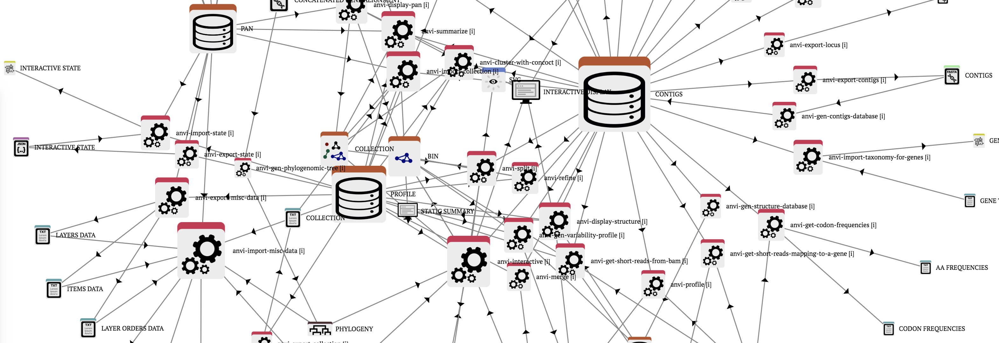

## Anvi'o

Anvi’o is an open-source, community-driven analysis and visualization platform for microbial omics.
It brings together many aspects of today's cutting-edge strategies, including **genomics, metagenomics, metatranscriptomics, phylogenomics, microbial population genetics, pangenomics, and metapangenomics** in an *integrated* and *easy-to-use* fashion through extensive interactive visualization capabilities.

### Get all ready to start the Anvi'o workflow to build a pangenome

To start using Anvi'o, activate the conda environment `Pangenomics_Global`

~~~
conda activate Pangenomics_Global
~~~
{: .language-bash}

Move into the directory named `results` and create a new directory called `anvi-o` for the Anvi'o analysis
~~~
cd ~/pan_workshop/results/pangenome
mkdir anvi-o
cd anvi-o
~~~
{: .language-bash}

In order to better organize our Anvi'o results, create a new directory named `genome-db` that will be used to store the genome database needed for the Anvi'o pangenome workflow
~~~
mkdir genome-db
~~~
{: .language-bash}

> ## Note
> The bacterial genomes that will be used in this practice
>  come from the Prokka annotation analysis.
>  We will use the `.gbk` files as input for the Anvi'o workflow.
>  The `.gbk` files can be found in `~/pan_workshop/results/annotated`.
{: .callout}

## Ten steps guide to build a Pangenome in Anvi'o

### Step 1

Process the genome files (`.gbk`) with the `anvi-script-process-genbank` script

~~~
ls ~/pan_workshop/results/annotated/Streptococcus_agalactiae_* | cut -d'/' -f7 | cut -d '.' -f1 | while read line; do anvi-script-process-genbank -i GENBANK --input-genbank ~/pan_workshop/results/annotated/$line.gbk -O genome-db/$line; done
~~~
{: .language-bash}

~~~
cd genome-db
ls
~~~
{: .language-bash}

~~~
Streptococcus_agalactiae_18RS21_prokka-contigs.fa               Streptococcus_agalactiae_CJB111_prokka-contigs.fa
Streptococcus_agalactiae_18RS21_prokka-external-functions.txt   Streptococcus_agalactiae_CJB111_prokka-external-functions.txt
Streptococcus_agalactiae_18RS21_prokka-external-gene-calls.txt  Streptococcus_agalactiae_CJB111_prokka-external-gene-calls.txt
Streptococcus_agalactiae_2603V_prokka-contigs.fa                Streptococcus_agalactiae_COH1_prokka-contigs.fa
Streptococcus_agalactiae_2603V_prokka-external-functions.txt    Streptococcus_agalactiae_COH1_prokka-external-functions.txt
Streptococcus_agalactiae_2603V_prokka-external-gene-calls.txt   Streptococcus_agalactiae_COH1_prokka-external-gene-calls.txt
Streptococcus_agalactiae_515_prokka-contigs.fa                  Streptococcus_agalactiae_H36B_prokka-contigs.fa
Streptococcus_agalactiae_515_prokka-external-functions.txt      Streptococcus_agalactiae_H36B_prokka-external-functions.txt
Streptococcus_agalactiae_515_prokka-external-gene-calls.txt     Streptococcus_agalactiae_H36B_prokka-external-gene-calls.txt
Streptococcus_agalactiae_A909_prokka-contigs.fa                 Streptococcus_agalactiae_NEM316_prokka-contigs.fa
Streptococcus_agalactiae_A909_prokka-external-functions.txt     Streptococcus_agalactiae_NEM316_prokka-external-functions.txt
Streptococcus_agalactiae_A909_prokka-external-gene-calls.txt    Streptococcus_agalactiae_NEM316_prokka-external-gene-calls.txt

~~~
{: .output}

### Step 2

Reformat the fasta files using the `anvi-script-reformat-fasta` script

~~~
ls *fa |while read line; do anvi-script-reformat-fasta --seq-type NT $line -o $line\.fasta; done
ls
~~~
{: .language-bash}

~~~
Streptococcus_agalactiae_18RS21_prokka-contigs.fa               Streptococcus_agalactiae_CJB111_prokka-contigs.fa
Streptococcus_agalactiae_18RS21_prokka-contigs.fa.fasta         Streptococcus_agalactiae_CJB111_prokka-contigs.fa.fasta
Streptococcus_agalactiae_18RS21_prokka-external-functions.txt   Streptococcus_agalactiae_CJB111_prokka-external-functions.txt
Streptococcus_agalactiae_18RS21_prokka-external-gene-calls.txt  Streptococcus_agalactiae_CJB111_prokka-external-gene-calls.txt
Streptococcus_agalactiae_2603V_prokka-contigs.fa                Streptococcus_agalactiae_COH1_prokka-contigs.fa
Streptococcus_agalactiae_2603V_prokka-contigs.fa.fasta          Streptococcus_agalactiae_COH1_prokka-contigs.fa.fasta
Streptococcus_agalactiae_2603V_prokka-external-functions.txt    Streptococcus_agalactiae_COH1_prokka-external-functions.txt
Streptococcus_agalactiae_2603V_prokka-external-gene-calls.txt   Streptococcus_agalactiae_COH1_prokka-external-gene-calls.txt
Streptococcus_agalactiae_515_prokka-contigs.fa                  Streptococcus_agalactiae_H36B_prokka-contigs.fa
Streptococcus_agalactiae_515_prokka-contigs.fa.fasta            Streptococcus_agalactiae_H36B_prokka-contigs.fa.fasta
Streptococcus_agalactiae_515_prokka-external-functions.txt      Streptococcus_agalactiae_H36B_prokka-external-functions.txt
Streptococcus_agalactiae_515_prokka-external-gene-calls.txt     Streptococcus_agalactiae_H36B_prokka-external-gene-calls.txt
Streptococcus_agalactiae_A909_prokka-contigs.fa                 Streptococcus_agalactiae_NEM316_prokka-contigs.fa
Streptococcus_agalactiae_A909_prokka-contigs.fa.fasta           Streptococcus_agalactiae_NEM316_prokka-contigs.fa.fasta
Streptococcus_agalactiae_A909_prokka-external-functions.txt     Streptococcus_agalactiae_NEM316_prokka-external-functions.txt
Streptococcus_agalactiae_A909_prokka-external-gene-calls.txt    Streptococcus_agalactiae_NEM316_prokka-external-gene-calls.txt

~~~
{: .output}

### Step 3

Create a database per genome with the `anvi-gen-contigs-database` script

~~~
ls *fasta | while read line; do anvi-gen-contigs-database -T 4 -f $line -o $line-contigs.db; done
ls
~~~
{: .language-bash}

~~~
Streptococcus_agalactiae_18RS21_prokka-contigs.fa                   Streptococcus_agalactiae_CJB111_prokka-contigs.fa
Streptococcus_agalactiae_18RS21_prokka-contigs.fa.fasta             Streptococcus_agalactiae_CJB111_prokka-contigs.fa.fasta
Streptococcus_agalactiae_18RS21_prokka-contigs.fa.fasta-contigs.db  Streptococcus_agalactiae_CJB111_prokka-contigs.fa.fasta-contigs.db
Streptococcus_agalactiae_18RS21_prokka-external-functions.txt       Streptococcus_agalactiae_CJB111_prokka-external-functions.txt
Streptococcus_agalactiae_18RS21_prokka-external-gene-calls.txt      Streptococcus_agalactiae_CJB111_prokka-external-gene-calls.txt
Streptococcus_agalactiae_2603V_prokka-contigs.fa                    Streptococcus_agalactiae_COH1_prokka-contigs.fa
Streptococcus_agalactiae_2603V_prokka-contigs.fa.fasta              Streptococcus_agalactiae_COH1_prokka-contigs.fa.fasta
Streptococcus_agalactiae_2603V_prokka-contigs.fa.fasta-contigs.db   Streptococcus_agalactiae_COH1_prokka-contigs.fa.fasta-contigs.db
Streptococcus_agalactiae_2603V_prokka-external-functions.txt        Streptococcus_agalactiae_COH1_prokka-external-functions.txt
Streptococcus_agalactiae_2603V_prokka-external-gene-calls.txt       Streptococcus_agalactiae_COH1_prokka-external-gene-calls.txt
Streptococcus_agalactiae_515_prokka-contigs.fa                      Streptococcus_agalactiae_H36B_prokka-contigs.fa
Streptococcus_agalactiae_515_prokka-contigs.fa.fasta                Streptococcus_agalactiae_H36B_prokka-contigs.fa.fasta
Streptococcus_agalactiae_515_prokka-contigs.fa.fasta-contigs.db     Streptococcus_agalactiae_H36B_prokka-contigs.fa.fasta-contigs.db
Streptococcus_agalactiae_515_prokka-external-functions.txt          Streptococcus_agalactiae_H36B_prokka-external-functions.txt
Streptococcus_agalactiae_515_prokka-external-gene-calls.txt         Streptococcus_agalactiae_H36B_prokka-external-gene-calls.txt
Streptococcus_agalactiae_A909_prokka-contigs.fa                     Streptococcus_agalactiae_NEM316_prokka-contigs.fa
Streptococcus_agalactiae_A909_prokka-contigs.fa.fasta               Streptococcus_agalactiae_NEM316_prokka-contigs.fa.fasta
Streptococcus_agalactiae_A909_prokka-contigs.fa.fasta-contigs.db    Streptococcus_agalactiae_NEM316_prokka-contigs.fa.fasta-contigs.db
Streptococcus_agalactiae_A909_prokka-external-functions.txt         Streptococcus_agalactiae_NEM316_prokka-external-functions.txt
Streptococcus_agalactiae_A909_prokka-external-gene-calls.txt        Streptococcus_agalactiae_NEM316_prokka-external-gene-calls.txt

~~~
{: .output}

### Step 4

When using external genomes in Anvi'o, a list of the genome IDs and their corresponding genome database is required. This list tells Anvi'o which genomes will be processed to construct the pangenome.
~~~
ls *.fa | cut -d '-' -f1 | while read line; do echo $line$'\t'$line-contigs.db >>external-genomes.txt; done
head external-genomes.txt
~~~
{: .language-bash}

~~~
Streptococcus_agalactiae_18RS21_prokka  Streptococcus_agalactiae_18RS21_prokka-contigs.db
Streptococcus_agalactiae_2603V_prokka   Streptococcus_agalactiae_2603V_prokka-contigs.db
Streptococcus_agalactiae_515_prokka     Streptococcus_agalactiae_515_prokka-contigs.db
Streptococcus_agalactiae_A909_prokka    Streptococcus_agalactiae_A909_prokka-contigs.db
Streptococcus_agalactiae_CJB111_prokka  Streptococcus_agalactiae_CJB111_prokka-contigs.db
Streptococcus_agalactiae_COH1_prokka    Streptococcus_agalactiae_COH1_prokka-contigs.db
Streptococcus_agalactiae_H36B_prokka    Streptococcus_agalactiae_H36B_prokka-contigs.db
Streptococcus_agalactiae_NEM316_prokka  Streptococcus_agalactiae_NEM316_prokka-contigs.db
~~~
{: .output}

### Step 5

Modify the headers of the list `external-genomes.txt`
~~~
nano external-genomes.txt
~~~
{: .language-bash}

~~~
  GNU nano 4.8                                                         	external-genomes.txt                                   name    contigs_db_path
Streptococcus_agalactiae_18RS21_prokka  Streptococcus_agalactiae_18RS21_prokka-contigs.db
Streptococcus_agalactiae_2603V_prokka   Streptococcus_agalactiae_2603V_prokka-contigs.db
Streptococcus_agalactiae_515_prokka     Streptococcus_agalactiae_515_prokka-contigs.db
Streptococcus_agalactiae_A909_prokka    Streptococcus_agalactiae_A909_prokka-contigs.db
Streptococcus_agalactiae_CJB111_prokka  Streptococcus_agalactiae_CJB111_prokka-contigs.db
Streptococcus_agalactiae_COH1_prokka    Streptococcus_agalactiae_COH1_prokka-contigs.db
Streptococcus_agalactiae_H36B_prokka    Streptococcus_agalactiae_H36B_prokka-contigs.db
Streptococcus_agalactiae_NEM316_prokka  Streptococcus_agalactiae_NEM316_prokka-contigs.db

^G Get Help 	^O Write Out	^W Where Is 	^K Cut Text 	^J Justify  	^C Cur Pos  	M-U Undo    	M-A Mark Text   M-] To Bracket  M-Q Previous
^X Exit     	^R Read File	^\ Replace  	^U Paste Text   ^T To Spell 	^_ Go To Line   M-E Redo    	M-6 Copy Text   ^Q Where Was	M-W Next
~~~
{: .output}

~~~
head external-genomes.txt
~~~
{: .language-bash}

~~~
name    contigs_db_path
Streptococcus_agalactiae_18RS21_prokka  Streptococcus_agalactiae_18RS21_prokka-contigs.db
Streptococcus_agalactiae_2603V_prokka   Streptococcus_agalactiae_2603V_prokka-contigs.db
Streptococcus_agalactiae_515_prokka     Streptococcus_agalactiae_515_prokka-contigs.db
Streptococcus_agalactiae_A909_prokka    Streptococcus_agalactiae_A909_prokka-contigs.db
Streptococcus_agalactiae_CJB111_prokka  Streptococcus_agalactiae_CJB111_prokka-contigs.db
Streptococcus_agalactiae_COH1_prokka    Streptococcus_agalactiae_COH1_prokka-contigs.db
Streptococcus_agalactiae_H36B_prokka    Streptococcus_agalactiae_H36B_prokka-contigs.db
Streptococcus_agalactiae_NEM316_prokka  Streptococcus_agalactiae_NEM316_prokka-contigs.db

~~~
{: .output}

### Step 6

Rename the `.db` files

~~~
rename s'/.fa.fasta-contigs.db/.db/' *db
ls *.db
~~~
{: .language-bash}

~~~
Streptococcus_agalactiae_18RS21_prokka-contigs.db  Streptococcus_agalactiae_CJB111_prokka-contigs.db
Streptococcus_agalactiae_2603V_prokka-contigs.db   Streptococcus_agalactiae_COH1_prokka-contigs.db
Streptococcus_agalactiae_515_prokka-contigs.db     Streptococcus_agalactiae_H36B_prokka-contigs.db
Streptococcus_agalactiae_A909_prokka-contigs.db    Streptococcus_agalactiae_NEM316_prokka-contigs.db

~~~
{: .output}

### Step 7
Execute HMM analysis with the `anvi-run-hmms` script to identify matching genes in each contigs database file

~~~
ls *contigs.db | while read line; do anvi-run-hmms -c $line; done
~~~
{: .language-bash}

~~~
Contigs DB ...................................: Streptococcus_agalactiae_18RS21_prokka-contigs.db
HMM sources ..................................: Ribosomal_RNA_5S, Ribosomal_RNA_12S, Bacteria_71, Ribosomal_RNA_16S, Archaea_76,
                                                Ribosomal_RNA_28S, Ribosomal_RNA_18S, Protista_83, Ribosomal_RNA_23S
Alphabet/context target found ................: AA:GENE
Alphabet/context target found ................: RNA:CONTIG

HMM Profiling for Ribosomal_RNA_5S
===============================================
Reference ....................................: Seeman T, https://github.com/tseemann/barrnap
Kind .........................................: Ribosomal_RNA_5S
Alphabet .....................................: RNA
Context ......................................: CONTIG
Domain .......................................: N/A
HMM model path ...............................: /tmp/tmpigzysqa6/Ribosomal_RNA_5S.hmm
Number of genes in HMM model .................: 5
Noise cutoff term(s) .........................: --cut_ga
Number of CPUs will be used for search .......: 1
HMMer program used for search ................: nhmmscan
Temporary work dir ...........................: /tmp/tmplk81rft0
Log file for thread 0 ........................: /tmp/tmplk81rft0/RNA_contig_sequences.fa.0_log
Done 🎊

Number of raw hits in table file .............: 0

* The HMM source 'Ribosomal_RNA_5S' returned 0 hits. SAD (but it's stil OK).

HMM Profiling for Ribosomal_RNA_12S
===============================================
Reference ....................................: Seeman T, https://github.com/tseemann/barrnap
Kind .........................................: Ribosomal_RNA_12S
Alphabet .....................................: RNA
Context ......................................: CONTIG
Domain .......................................: N/A
HMM model path ...............................: /tmp/tmpigzysqa6/Ribosomal_RNA_12S.hmm
Number of genes in HMM model .................: 1
Noise cutoff term(s) .........................: --cut_ga
Number of CPUs will be used for search .......: 1
HMMer program used for search ................: nhmmscan
Temporary work dir ...........................: /tmp/tmplk81rft0
Log file for thread 0 ........................: /tmp/tmplk81rft0/RNA_contig_sequences.fa.0_log
Done 🎊

Number of raw hits in table file .............: 0

* The HMM source 'Ribosomal_RNA_12S' returned 0 hits. SAD (but it's stil OK).

~~~
{: .output}

### Step 8

Create the genome database `genomes-storage-db` using the `anvi-gen-genomes-storage` script. In this case, we named this `genomes-storage-db` as **STREPTOCOCCUS_AGALACTIAE_GENOMES.db**, which will be used downstream as input in other processes.

~~~
anvi-gen-genomes-storage -e external-genomes.txt -o STREPTOCOCCUS_AGALACTIAE_GENOMES.db
ls *.db
~~~
{: .language-bash}

~~~
Streptococcus_agalactiae_18RS21_prokka-contigs.db  Streptococcus_agalactiae_COH1_prokka-contigs.db
Streptococcus_agalactiae_2603V_prokka-contigs.db   STREPTOCOCCUS_AGALACTIAE_GENOMES.db
Streptococcus_agalactiae_515_prokka-contigs.db     Streptococcus_agalactiae_H36B_prokka-contigs.db
Streptococcus_agalactiae_A909_prokka-contigs.db    Streptococcus_agalactiae_NEM316_prokka-contigs.db
Streptococcus_agalactiae_CJB111_prokka-contigs.db
~~~
{: .output}

### Step 9

Construct the pangenome database `pan-db` with the `anvi-pan-pangenome` script using the `genomes-storage-db` named `STREPTOCOCCUS_AGALACTIAE_GENOMES.db` as input

~~~
anvi-pan-genome -g STREPTOCOCCUS_AGALACTIAE_GENOMES.db \
            	--project-name "PANGENOME-AGALACTIAE" \
            	--output-dir AGALACTIAE \
            	--num-threads 6 \
            	--minbit 0.5 \
            	--mcl-inflation 10 \
            	--use-ncbi-blast
~~~
{: .language-bash}

~~~
WARNING
===============================================
If you publish results from this workflow, please do not forget to cite DIAMOND
(doi:10.1038/nmeth.3176), unless you use it with --use-ncbi-blast flag, and MCL
(http://micans.org/mcl/ and doi:10.1007/978-1-61779-361-5_15)

Functions found ..............................:
Genomes storage ..............................: Initialized (storage hash: hash8a837d50)
Num genomes in storage .......................: 8
Num genomes will be used .....................: 8
Pan database .................................: A new database,
                                                /home/shaday/pan_workshop/results/pangenome/anvi-o/genome-db/AGALACTIAE/PANGENOME-AGALACTIAE-PAN.db,
                                                has been created.
Exclude partial gene calls ...................: False

AA sequences FASTA ...........................: /home/shaday/pan_workshop/results/pangenome/anvi-o/genome-db/AGALACTIAE/combined-aas.fa

Num AA sequences reported ....................: 17,199
Num excluded gene calls ......................: 0
Unique AA sequences FASTA ....................: /home/shaday/pan_workshop/results/pangenome/anvi-o/genome-db/AGALACTIAE/combined-aas.fa.unique

WARNING
===============================================
You elected to use NCBI's `blastp` for amino acid sequence search. Running
blastp will be significantly slower than DIAMOND, but in some cases, slightly
more sensitive. We are unsure about whether the slight increase in sensitivity
may justify significant increase in run time, but you are the boss.

NCBI BLAST MAKEDB
===============================================
BLAST search db ..............................: /home/shaday/pan_workshop/results/pangenome/anvi-o/genome-db/AGALACTIAE/combined-aas.fa.unique

NCBI BLAST SEARCH
===============================================
BLAST results ................................: /home/shaday/pan_workshop/results/pangenome/anvi-o/genome-db/AGALACTIAE/blast-search-results.txt

MCL INPUT
===============================================
Min percent identity .........................: 0.0
Minbit .......................................: 0.5
Filtered search results ......................: 140,540 edges stored
MCL input ....................................: /home/shaday/pan_workshop/results/pangenome/anvi-o/genome-db/AGALACTIAE/mcl-input.txt

MCL
===============================================
MCL inflation ................................: 10.0
MCL output ...................................: /home/shaday/pan_workshop/results/pangenome/anvi-o/genome-db/AGALACTIAE/mcl-clusters.txt
Number of MCL clusters .......................: 2,842

CITATION
===============================================
The workflow you are using will likely use 'muscle' by Edgar,
doi:10.1093/nar/gkh340 (http://www.drive5.com/muscle) to align your sequences.
If you publish your findings, please do not forget to properly credit this tool.

* Your pangenome is ready with a total of 2,842 gene clusters across 8 genomes 🎉

~~~
{: .output}

### Step 10

Create the interactive pangenome with the `anvi-display-pan` script using as input the `genomes-storage-db`  `STREPTOCOCCUS_AGALACTIAE_GENOMES.db` and the `pan-db`  `PANGENOME-AGALACTIAE-PAN.db` (located in `AGALACTIAE` directory)

~~~
anvi-display-pan -g STREPTOCOCCUS_AGALACTIAE_GENOMES.db \
	-p AGALACTIAE/PANGENOME-AGALACTIAE-PAN.db
~~~
{: .language-bash}

~~~
* The server is up and running 🎉

WARNING
===============================================
If you are using OSX and if the server terminates prematurely before you can see
anything in your browser, try running the same command by putting 'sudo ' at the
beginning of it (you will be prompted to enter your password if sudo requires
super user credentials on your system). If your browser does not show up, try
manually entering the URL shown below into the address bar of your favorite
browser. *cough* CHROME *cough*.

Server address ...............................: http://0.0.0.0:8080

* When you are ready, press CTRL+C once to terminate the server and go back to the
command line.

~~~
{: .output}

Without disturbing the active terminal, open a new window in your preferred browser (recommended Chrome), copy-paste the following link `http://bioinformatica.matmor.unam.mx:8080` and click on the bottom `Draw` to see your results and start interacting with your pangenome

{: .output}

 
> ## Exercise 1: The homogeneity of gene clusters.
>Anvi’o allows to identify different levels of disagreement between amino acid sequences in different genomes. Amino acid sequences from different genomes in a gene cluster that are almost identical tell us that the gene cluster is highly homogeneous.
>
> The **geometric homogeneity index** tell us the degree of geometric configuration between the genes of a gene cluster and the **functional homogeneity index** considers aligned residues and quantifies differences across residues in a site.
>
>For more info see [this.](https://merenlab.org/2016/11/08/pangenomics-v2/#inferring-the-homogeneity-of-gene-clusters)
>
>Go to this [page](https://anvio.org/help/main/programs/anvi-get-sequences-for-gene-clusters/) and explore the pangenome graph according to the following homogeneity index.
>
>a) Order the pangenome based on the geometric homogeneity index and inspect a gene cluster with a relatively low score.
>
>b) Filter the gene cluster according to a functional homogeneity index above 0.25.
>
>Extra) How can you estimate evolutionary relationships between genomes? With the `concatenated-gene-alignment-fasta` produce the phylogenomic tree and explore it.
> >## Solution
>> a) Go to the main settings panel and modify the `items order`.
>>
>> b)
>>~~~
anvi-get-sequences-for-gene-clusters -g genomes-storage-db \
                                 	-p pan-db \
                                 	-o genes-fasta \
                                 	--min-functional-homogenity-index 0.25
>>~~~
>>{: .language-bash}
>>
>>Extra)Explore this [page.](https://anvio.org/help/main/programs/anvi-gen-phylogenomic-tree/)
>{: .solution}
{: .challenge}
 
 
> ## Exercise 2: Splitting the pangenome.
> 1. Read about [`anvi-split`](https://anvio.org/help/main/programs/anvi-split/)
> 2. With this program split your pangenome in independent pangenomes that:
> > * Contains only singletons.
> > * Contains only core gene clusters.
>
> Tip: [anvi-display-pan](https://anvio.org/help/main/programs/anvi-display-pan/) can be useful
{: .challenge}



