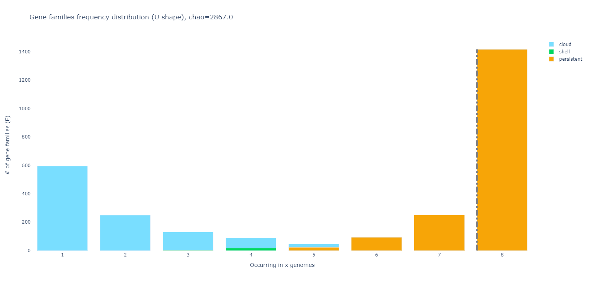
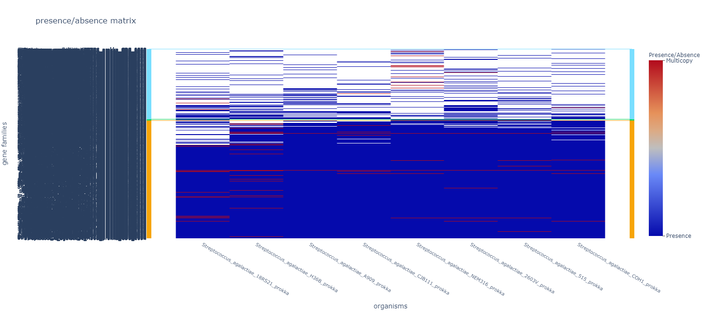
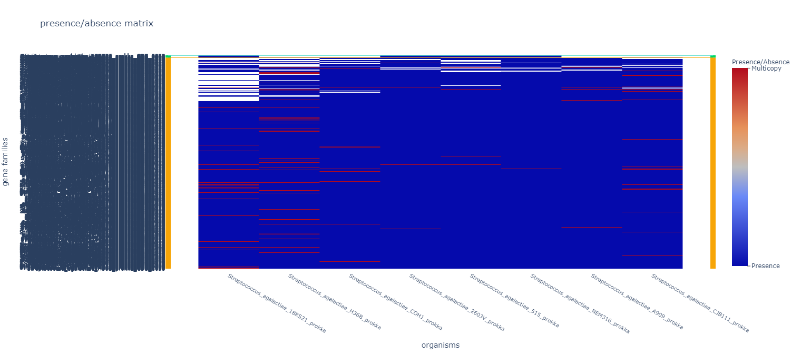
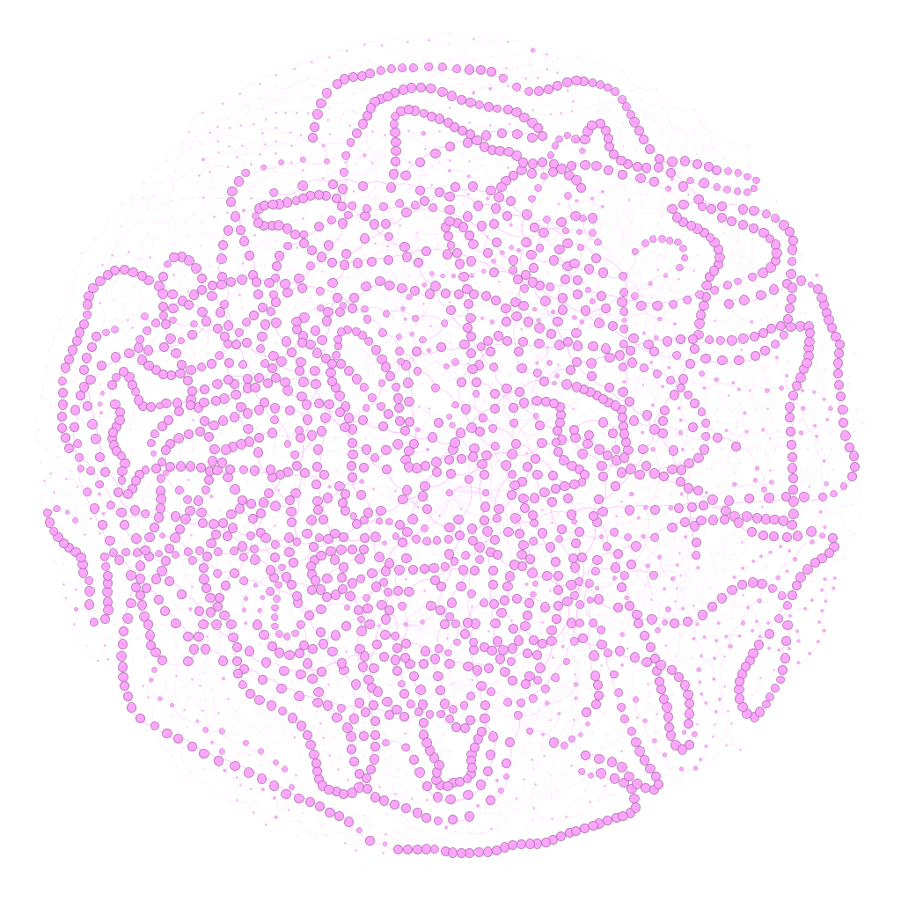
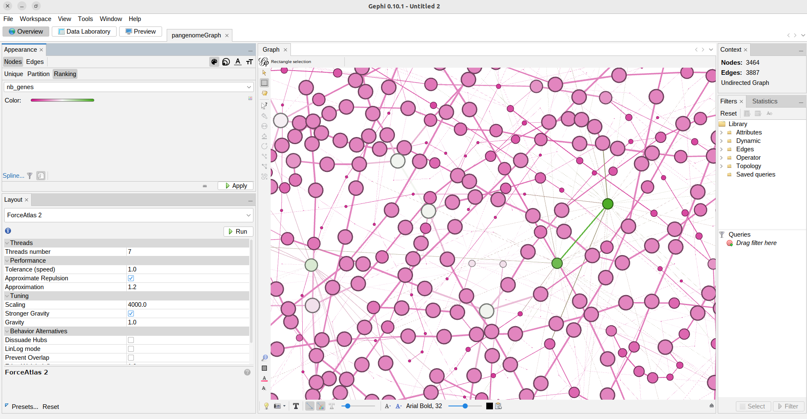
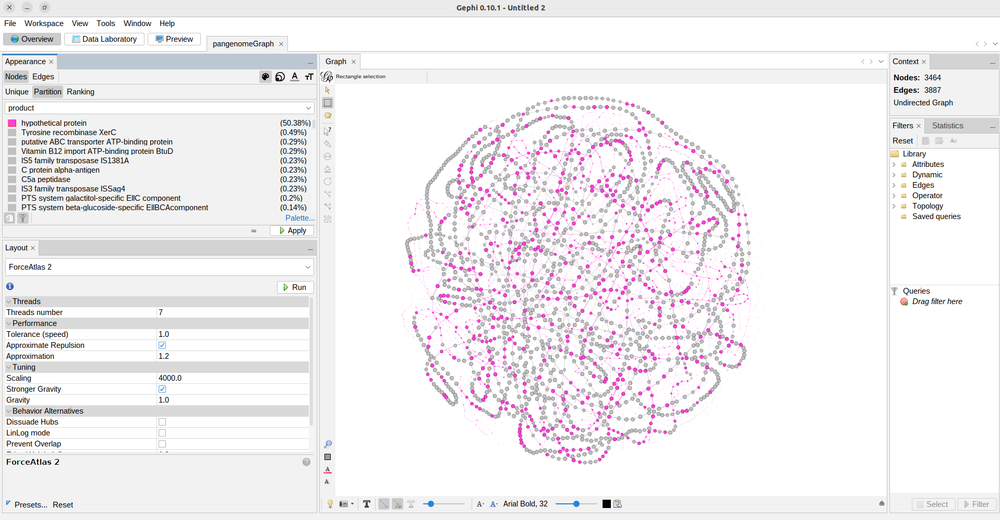

## PPanGGOLiN: Partitioned PanGenome Graph Of Linked Neighbors

[PPanGGOLiN](https://journals.plos.org/ploscompbiol/article?id=10.1371/journal.pcbi.1007732) is a software designed to create and manipulate 
prokaryotic pangenomes in its own special way. It gives a lot more information than just 
the presence and absence of the gene families and it can be used with [thousands of genomes](https://github.com/labgem/PPanGGOLiN/wiki/Basic-usage-and-practical-information). This program **represents the pangenome in a graph** where each node is a gene family, and two gene 
families are connected by an edge if they are neighbors (their sequences are next to each other) in at least one genome. The width of this edge 
represents the number of genomes in which these two families are neighbors. And the size of the nodes represents the number of genes that are part of the
gene family.

To classify a gene family into a partition, PPanGGOLiN not only takes into account the percentage of genomes the family is present in, but it also 
considers its neighbors. If two gene families are consistently linked across the genomes, they will more likely belong to the same partition. The software uses statistical approach to decide how many partitions should be made and in which partition a gene family should be placed. 

|    	Classes   		 |                           	Definition                         		 |
|:---------------------:    |:---------------------------------------------------------------------:    |
| **Persistent genome**     |      	For gene families present in almost all genomes.    		 |
|	**Shell genome**  	 | For gene families present at intermediate frequencies in the genomes. There can be multiple shells.    |
|	**Cloud genome**  	 |   	For gene familes present at low frequency in the species.  		 |

The PPanGGOLiN pipeline can be divided into **building the pangenome**, and **extracting results**. You can also perform some **special analyses** and
extract the corresponding results.

## Building a Pangenome

The required steps to build a pangenome can be achieved with a single command `ppanggolin workflow`,
or can be run individually if you want to make adjustments to each of them. The adjustment that we want to make is to use the clusters that Get_Homologues already found.

The pangenome will be built in a single HDF-5 file that will be the input and output of all the commands and will get enriched with each of them.

### Genome annotation

Before starting using PPanGGOLiN, we need to activate the Pangenomics environment.
~~~
$ conda activate Pangenomics_Global
~~~
{: .language-bash}
~~~
(Pangenomics_Global) ~$
~~~
{: .output}

Now we should make a special directory for this analysis.
~~~
$ mkdir -p  ~/pan_workshop/results/pangenome/ppanggolin
$ cd ~/pan_workshop/results/pangenome/ppanggolin
~~~
{: .language-bash}

PPanGGOLiN analysis can start from genomic DNA sequences in FASTA format or annotated genomes in GBK or GFF formats. The first step is getting this 
genomic information into the HDF-5 file and annotate it if it is not already.  
To use the GBKs in the annotation step we need to create a text file with the unique name of each organism in one column and the path to the
corresponding `.gbk` in another one. 
We already have links to our Prokka annotations in the `get_homologues/` directory, so we can tell PPanGGOLiN to use those.  

~~~
$ ls ~/pan_workshop/results/pangenome/get_homologues/data_gbks/* | while read line
> do 
> name=$(echo $line | cut -d'/' -f9 | cut -d'.' -f1)
> echo $name$'\t'$line >> organisms.gbk.list
> done
~~~
{: .language-bash}

~~~
$ cat organisms.gbk.list
~~~
{: .language-bash}

~~~
Streptococcus_agalactiae_18RS21_prokka	/home/dcuser/pan_workshop/results/pangenome/get_homologues/data_gbks/Streptococcus_agalactiae_18RS21_prokka.gbk
Streptococcus_agalactiae_2603V_prokka	/home/dcuser/pan_workshop/results/pangenome/get_homologues/data_gbks/Streptococcus_agalactiae_2603V_prokka.gbk
Streptococcus_agalactiae_515_prokka	/home/dcuser/pan_workshop/results/pangenome/get_homologues/data_gbks/Streptococcus_agalactiae_515_prokka.gbk
Streptococcus_agalactiae_A909_prokka	/home/dcuser/pan_workshop/results/pangenome/get_homologues/data_gbks/Streptococcus_agalactiae_A909_prokka.gbk
Streptococcus_agalactiae_CJB111_prokka	/home/dcuser/pan_workshop/results/pangenome/get_homologues/data_gbks/Streptococcus_agalactiae_CJB111_prokka.gbk
Streptococcus_agalactiae_COH1_prokka	/home/dcuser/pan_workshop/results/pangenome/get_homologues/data_gbks/Streptococcus_agalactiae_COH1_prokka.gbk
Streptococcus_agalactiae_H36B_prokka	/home/dcuser/pan_workshop/results/pangenome/get_homologues/data_gbks/Streptococcus_agalactiae_H36B_prokka.gbk
Streptococcus_agalactiae_NEM316_prokka	/home/dcuser/pan_workshop/results/pangenome/get_homologues/data_gbks/Streptococcus_agalactiae_NEM316_prokka.gbk

~~~
{: .output}

Using the organisms list, we can run the `annotate` module of PPanGGOLiN, which will not really annotate the genomes, because they are already annotated, but it will integrate them into it's special `.h5` file that will be 
used as input and output in all of the steps.

~~~
$ ppanggolin annotate --anno organisms.gbk.list --output pangenome
~~~
{: .language-bash}

Now a new directory named `pangenome/`  was created, let's move into it and explore it. PPanGGolin created the `pangenome.h5` that will be getting enriched throughout the processing. Let's monitor it's increase in size.
~~~
$ cd pangenome/
$ ls -lh
~~~
{: .language-bash}

~~~
total 8.9M
-rw-r--r-- 1 user user 8.9M mar 31 09:41 pangenome.h5
~~~
{: .output}

### Gene clustering

PPanGGolin uses by default [MMseqs2](https://github.com/soedinglab/MMseqs2) but we will provide the clusters that Get_Homologues found. For this, it is mandatory that in the `annotate` step we provided GBK files, not FASTA files. 

For this we only need the `gene_families.tsv` that we made in the previous episode. PPanGGOLiN will use this to know which genes belong to which families and build the pangenome from that. 
~~~
$ ppanggolin cluster -p pangenome.h5 --clusters ../../get_homologues/gene_families.tsv --cpu 8
~~~
{: .language-bash}

We can now notice that the size of out file has increased.

~~~
$ ls -lh
~~~
{: .language-bash}

~~~
total 9.0M
-rw-r--r-- 1 user user 9.0M mar 31 09:47 pangenome.h5
~~~
{: .output}

### Build a pangenome graph

Now that the clustering step identified all the gene families we can build the graph with them. 

~~~
$ ppanggolin graph --pangenome pangenome.h5 --cpu 8
~~~
{: .language-bash}

### Partition the graph

Finally we can assign the gene families to the persistent, shell, or cloud partitions. PPanGGOLiN can find the optimal number of partitions, if it is
larger than three it will make more shell partitions. You can also specify how many partitions you want with the option `-K`.

Besides these partitions, PPanGGOLiN will also calculate the exact core (families in 100% of genomes) and exact accessory 
(families in less than 100% of genomes) and the soft core (families in more than 95% of genomes) and soft accessory (families in less than 95% of genomes).

~~~
$ ppanggolin partition --pangenome pangenome.h5 --cpu 8
~~~
{: .language-bash}

## Extracting results

### Print files with information of the pangenome

For a first glimpse of our pangenome we can obtain the summary statistics with the command `ppanggolin info`.
~~~
ppanggolin info -p pangenome.h5 --content
~~~
{: .language-bash}
~~~
Genes : 16439
Organisms : 8
Families : 3464
Edges : 3887
Persistent ( min:0.5, max:1.0, sd:0.1, mean:0.94 ): 1793
Shell ( min:0.5, max:0.5, sd:0.0, mean:0.5 ): 22
Cloud ( min:0.12, max:0.75, sd:0.12, mean:0.19 ): 1649
Number of partitions : 3
~~~
{: .output}

If we want to have this in a file we can redirect this output adding `> summary_statistics.txt` to the command.

With the `ppanggolin write` command you can extract many text files and tables with a lot of information. For this you need to provide the 
`pangenome.h5` file and the name of the directory to store the files. Each of the additional flags indicates which file or files to write. Let's 
use all of the flags that will give us basic information of our analysis. And then see what was generated.

~~~
ppanggolin write -p pangenome.h5 --output files --stats --csv --Rtab --partitions --projection --families_tsv
~~~
{: .language-bash}
~~~
tree
~~~
{: .language-bash}
~~~
.
├── files
│   ├── gene_families.tsv
│   ├── gene_presence_absence.Rtab
│   ├── matrix.csv
│   ├── mean_persistent_duplication.tsv
│   ├── organisms_statistics.tsv
│   ├── partitions
│   │   ├── cloud.txt
│   │   ├── exact_accessory.txt
│   │   ├── exact_core.txt
│   │   ├── persistent.txt
│   │   ├── shell.txt
│   │   ├── soft_accessory.txt
│   │   ├── soft_core.txt
│   │   ├── S.txt
│   │   └── undefined.txt
│   └── projection
│       ├── Streptococcus_agalactiae_18RS21_prokka.tsv
│       ├── Streptococcus_agalactiae_2603V_prokka.tsv
│       ├── Streptococcus_agalactiae_515_prokka.tsv
│       ├── Streptococcus_agalactiae_A909_prokka.tsv
│       ├── Streptococcus_agalactiae_CJB111_prokka.tsv
│       ├── Streptococcus_agalactiae_COH1_prokka.tsv
│       ├── Streptococcus_agalactiae_H36B_prokka.tsv
│       └── Streptococcus_agalactiae_NEM316_prokka.tsv
└── pangenome.h5
~~~
{: .language-bash}

> ## Exercise 1: PPanGGolin results.
> Go to small groups (if you are learning at a Workshop) and explore one result file or set of result files to see what information they are giving you. 
> Then explain to the rest of the group what you learned.
> > ## Solution  
> > `gene_families.tsv` is a table that shows you which individual genes (second column) correspond to which gene family (first column). 
> > In the third column it has an F is the gene is potentialy fragmented.  
> > `gene_presence_absence.Rtab` is a binary matrix that shows if a gene family is present (1) or absent (0) in each genome.  
> > `matrix.csv` is a table with one row per gene family, many columns with metadata and one column per genome showing the name 
> > of the gene in the corresponding gene family.  
> >  `mean_persistent_duplication.tsv` has one row per persistent gene family and metrics about its duplication and if it is 
> >  considered a single-copy marker.  
> >  `organisms_statistics.tsv` has one row per genomes and columns for the number of gene families and genes in total and in each partition, 
> >  the completeness and the number of single-copy markers.  
> >  `partitions/` has one list per partition with the names of the gene families it contains.
> >  `projection/` has one file per genome with the metadata of each gene (ie. contig, coordinates, strand, gene family, 
> >  number of copies, partition, neighbours in each partition).  
> {: .solution}
{: .challenge}

### Draw interactive plots

We can also extract two interactive plots with the command `ppanggolin draw`, following a similar syntax than with the command `ppanggolin write`.

~~~
$ ppanggolin draw --pangenome pangenome.h5 --output plots --ucurve --tile_plot
~~~
{: .language-bash}
~~~
tree plots
~~~
{: .language-bash}
~~~
plots/
├── tile_plot.html
└── Ushaped_plot.html
~~~
{: .output}

Let's download them to our local machines to explore them. Open a new local terminal, navigate to the directory where you want the files 
and use the `scp` command.
~~~
$ scp -r user@server-address:~/pan_workshop/results/pangenome/ppanggolin/pangenome/plots .
~~~
{: .language-bash}

Open both `html` files in a browser and explore them. They are interactive so play with the plots for a while to see what information can be 
obtained from them.

* **U-shaped plot**

The U-shaped plot is a bar chart where you can see how many gene families (y-axis) are in how many genomes (x-axis). They are colored according to the 
partition they belong to.
<a href="../fig/01-06-02.png">
  

* **Tile plot**

 The tile plot is a presence/absence heatmap of the gene families (y-axis) in each genome (x-axis) ordered by a hierarchical clustering and showing the 
  multycopy families.
<a href="../fig/01-06-03.png">
  

> ## Difficulty showing the plots?
> If your browser is taking too long to open your tile plot repeat the `pangolin draw` command with the option `--nocloud`, this will remove the 
> families in the cloud partition from the plot to make it easier to handle.  
{: .callout}
  
> ## Discussion: Partitions
>   Why are there bars with two partitions in the U plot?
> > ## Solution
> > Because in PPanGGOLiN the partitions not only depend on the number of genomes a gene family is present in, but also on the conservation of the 
> > neighborhood of the gene. So a gene that is in only a few genomes but has the same shell neighbors in all or most of them, will more likely be placed 
> > in the shell than in the cloud. 
> {: .solution}
{: .challenge}

### Draw the pangenome graph

Now its time to see the actual partitioned graph. For that we can use the `ppangolin write` command.
~~~
$ ppanggolin write -p pangenome.h5 --gexf --output gexf
~~~
{: .language-bash}

Let's download the `gexf` file to our local machines to explore it. Open a new local terminal, navigate to the directory where you want the file 
and use the `scp` command.
~~~
$ scp -r user@server-address:~/pan_workshop/results/pangenome/ppanggolin/pangenome/gexf .
~~~
{: .language-bash}
  
To view the interactive graph we will use the software **gephi**.

> ## Gephi setup
> Download from this [web page](https://gephi.org/) the gephi installer that suits your opperating system.  
>     
> Open gephi:   
> > ## Linux
> > Go to the directory where you downloaded the program and type:
> > ~~~
> > ./gephi-0.10.1/bin/gephi
> > ~~~
> > {: .language-bash}  
> > If you do not see the graph properly you may have problems with the video driver. Open it this way instead:  
> > ~~~
> >  LIBGL_ALWAYS_SOFTWARE=1 ./gephi-0.10.1/bin/gephi
> >  ~~~
> >  {: .language-bash}  
> {: .solution}
> 
> > ## Windows and Mac
> > Click the Gephi icon to open the App.
> {: .solution}
> 
> If your download is in a language that is not English, change the language to English to make it easier to find the options that we will mention. 
> Find the equivalent to `Tools/Language/English` in the top left menu and restart gephi.
{: .prereq}
  
Go to `File/Open/`and select the file `pangenomeGraph.gexf`.  
Click OK in the window that appears.  
Scroll out with your mouse.
Go to the Layout section in the left and in the selection bar choose ForceAtlas2.
In the Tuning section change the Scaling value to 4000 and check the Stronger Gravity box.
Click on the Run button and then click it again to stop.
  

Now we have a pangenome graph!
 

> ## Exercise 2: Exploring the pangenome graph.
> Finally we are looking at the pangenome graph. Here each node is a gene family, if you click on the black **T** at the bottom of the graph you can lable them.  
>   
>  Explore the options of visualization for the pangenome graph, while trying to identify what does each element of the graph represent (ie. size of 
>  nodes and edges, etc.) and what is in the Data Laboratory.
>  
>  Use the Appearance section to color the nodes and edges according to the attribultes that you find most useful, like:
>
> a) Partition.
>  
> b) Number of organisms.
>
> c) Number of genes.
>  
> d) Product.
>  
> > ## Solution
> > In the top left panel you can color the nodes or edges accoring to different data.
> > You can choose discrete palettes in the partition section and gradients in the 
> > Ranking section. You can choose the palette, generate a new one or choose 
> > colors one by one.   
> > a) Nodes colored according to the partition they belong to.  
> > <a href="../fig/01-06-05.png">
> > 
> > </a>
> > b) Nodes colored according to the number of organisms they are present in.
> > <a href="../fig/01-06-06.png">
> > 
> > </a>
> > c) Nodes colored according to the number of genes that are part of the family.
> > <a href="../fig/01-06-07.png">
> > 
> > </a>
> > d) nodes colored according to the protein function,
> > <a href="../fig/01-06-08.png">
> > 
> > </a>
> {: .solution}
{: .challenge}

## Special analyses

Besides being able to work with thousands of genomes and having the approach of the partitioned graph, PPanGGOLiN is unique in 
  that it allows you to analyze your pangenomes in different ways. You can obtain the **Regions of Genome Plasticity** (RGP) of your pangenomes, 
  which are stretches of shell and cloud genes, and the location in the pangenome where many genomes have an RGP, 
  which are called **Spots of Insertion**.   
  
You can also use PPanGGOLiN to identify **Conserved Modules**, groups of accessory genes that are usually together and may be functional 
  modules. And you can find the modules present in RGPs and Spots of Insertion.   
  
To see how your pangenome grows ass more genomes are added and know if it is open or closed you can do **Rarefaction** analysis.  
  
If you are interested in the phylogeny of your genomes, you can retrieve the **Multiple Sequence Alignment** of each gene family and a 
  concatenation of all single-copy exact core genes.   
  
These analyses, **and more**, can be done by using commands that enrich your `pangenome.h5` file and extracting the appropriate outputs with the `ppanggolin write` command. Check the PPanGGOLiN [Wiki](https://github.com/labgem/PPanGGOLiN/wiki) to learn how to perform them.   

> ## References:
> Go to the PPanGGOLiN [GitHub Wiki](https://github.com/labgem/PPanGGOLiN/wiki) for the complete collection of instructions and posibilities.  
> And read the original PPanGGOLiN article to understand the details:
>
> Gautreau G et al. (2020) PPanGGOLiN: Depicting microbial diversity via a partitioned pangenome graph. PLOS Computational Biology 16(3): e1007732. [https://doi.org/10.1371/journal.pcbi.1007732](https://journals.plos.org/ploscompbiol/article?id=10.1371/journal.pcbi.1007732).
{: .callout}



