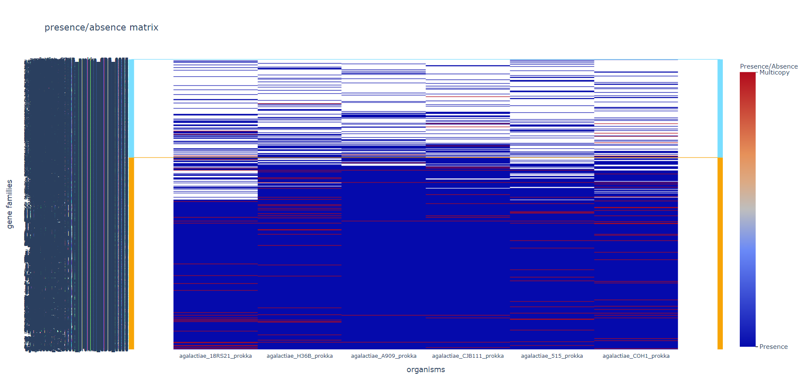
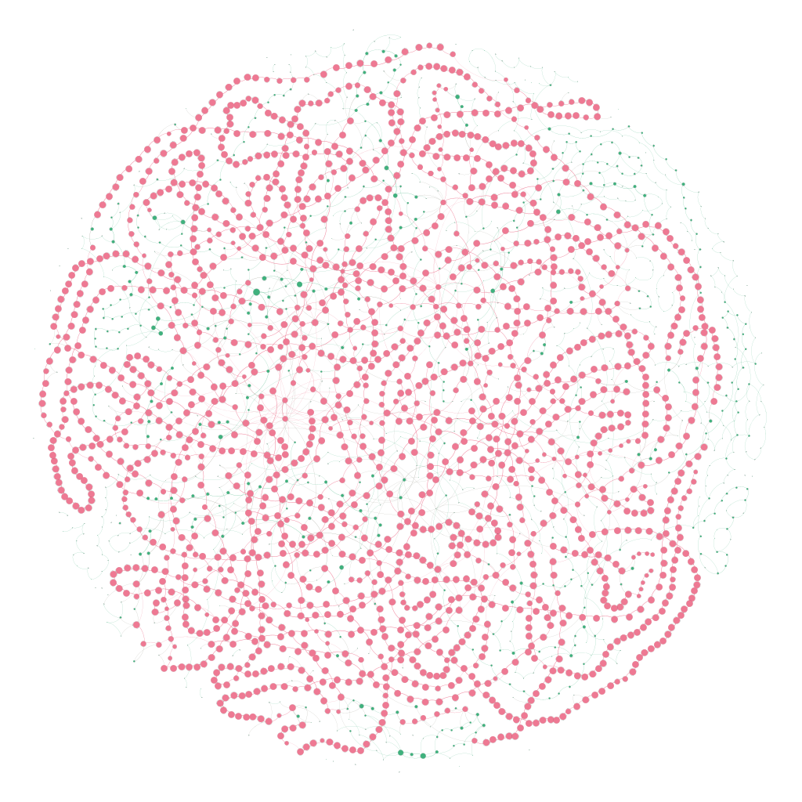
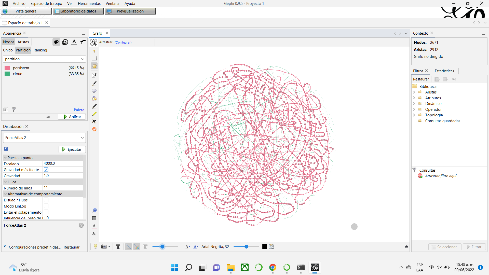
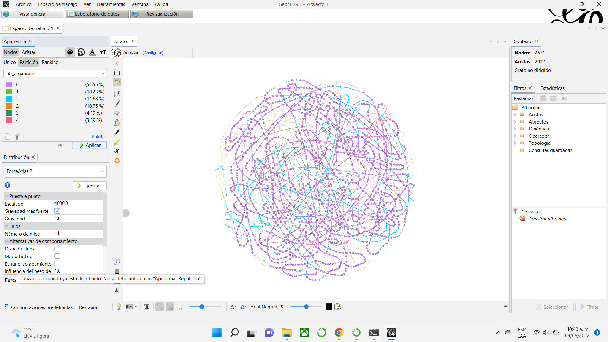
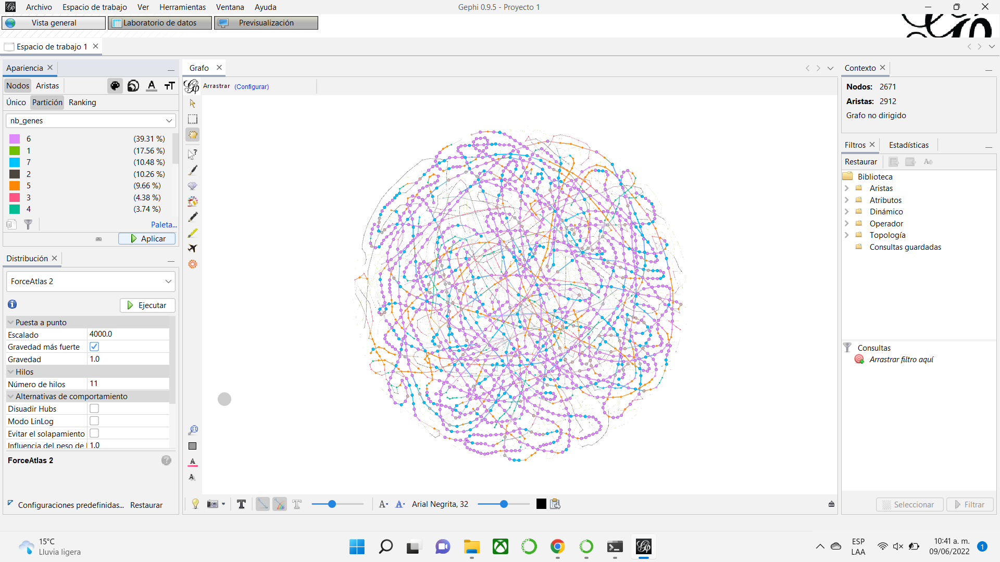
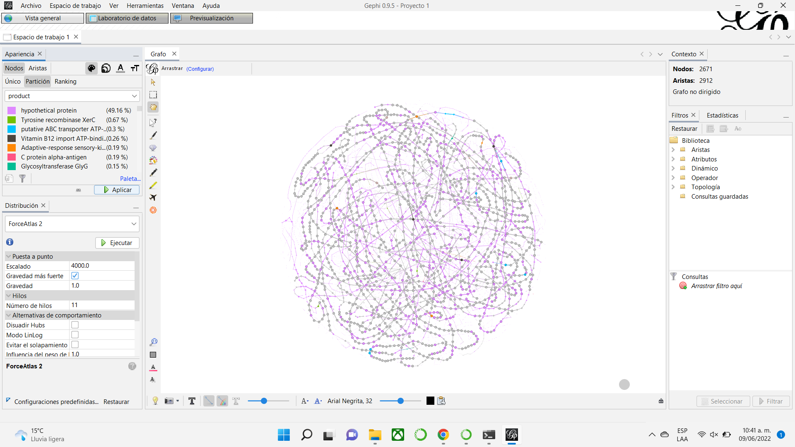
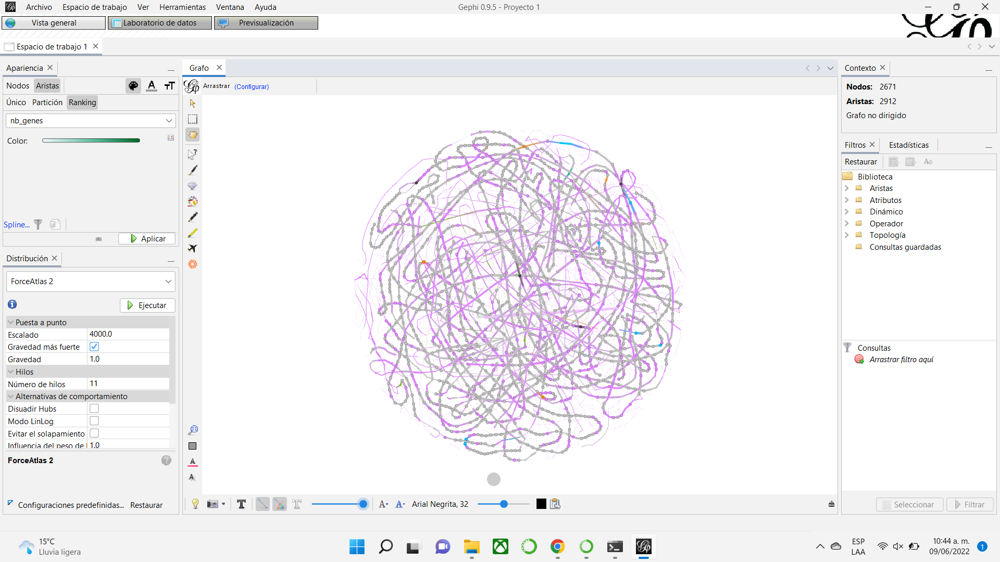

> ## Requirements:
> Install [gephi](https://gephi.org/) in your local machine to visualize the graphs.
{: .prereq}

# PPanGGOLiN

**Partitioned PanGenome Graph Of Linked Neighbors**

PPanGGOLiN is a software to create and manipulate prokaryotic pangenomes. It partitions a pangenome into persistent-, shell- and, cloud-gene families through a graphical model and a statistical approach rather than using fixed thresholds. Unlike other methods, PPanGGOLiN integrates information about protein-coding genes and their genomic neighborhood to build a graph of gene families. Each node in the graph is a gene family and the edges represent a relation of genetic contiguity. Therefore, two gene families that are consistent neighbors in the graph are more likely to belong to the same partition, yielding a partitioned pangenome graph (PPG) made up of persistent, shell, and cloud nodes. The resulting plot looks like a subway map, where the rails represent the genomes. The following table shows how the classes are defined.

|        Classes        	|                               Definition                              	|
|:---------------------:	|:---------------------------------------------------------------------:	|
| **Persistent genome** 	|          For gene families present in almost all genomes.         	|
|    **Shell genome**   	| For gene families present at intermediate frequencies in the genomes. 	|
|    **Cloud genome**   	|       For gene familes present at low frequency in the species.       	|

> ## Discussion
> Some authors call *soft core* to persistent. 
> 
> What is *core*? What is the term that PanGGolin authors used for core?
> 
{: .discussion}

## Input files

PPanGGOLiN analysis can start from genomic DNA sequences ([.fasta](https://raw.githubusercontent.com/paumayell/pangenomics/gh-pages/files/ExampleFASTA.fasta)) or annotated genomes ([.gbk](https://raw.githubusercontent.com/paumayell/pangenomics/gh-pages/files/ExampleGBK.gbk)) of whole genomes, Metagenomic Assembled Genomes (MAG), and Single-cell Amplified Genomes (SAG), useful for large-scale environmental studies, including the non-cultivable species pangenome.  It is designed to scale up to tens of thousands of genomes. 

In addition, PPanGGOLiN includes the panRGP method (Bazin et al. 2020) that predicts Regions of Genomic Plasticity (RGP) for each genome. RGPs are groups of genes made of shell and cloud genomes in the pangenome chart, most of which arise from horizontal gene transfer and correspond to genomic islands. RGPs from different genomes are then grouped into insertion sites based on their conserved persistent flanking genes.

## Outputs

PPanGGOLiN provides multiple outputs to describe a pangenome. In most cases it will provide with a HDF-5 file named `pangenome.h5`. This file stores all the information about your pangenome and the analyses that were run. You can extract information this file to get.

### U-shaped plot

A U-shaped plot is a figure presenting the number of families (y axis) per number of organisms (x axis). It is a `.html` file.

### Tile plot

A tile plot is a heatmap representing the gene families (y axis) in the organisms (x axis) making up your pangenome. The tiles on the graph will be colored if the gene family is present in an organism and uncolored if absent. The gene families are ordered by partition, and the genomes are ordered by a hierarchical clustering based on their shared gene families (basically two genomes that are close together in terms of gene family composition will be close together on the figure). In addition, it is a `.html` file.

> ## Discussion
> If you use the flag `--nocloud`, you will not see the *cloud* gene families.
> 
> What do you think this might be useful?
> 
> In the graph at the right, you can see a little bar with the legend `Multicopy`, what do you think it is?
{: .discussion}

### PangenomeGraph files

You can get the .gexf files. It will contain the gene families as nodes and the edges between gene families describing their relationship.
They can be manipulated and visualised through a software called Gephi, with which we have made extensive testings, or potentially any other softwares or libraries that can read `.gexf` files such as networkx or gexf-js among others.

> ## Exercise 1: Partitions. 
>   Which are the pangenome partitions made by PPanGGOLiN? 
>   
> a) Persistent, shell and cloud-gene. 
> 
> b) Softcore, shell and cloud-gene. 
> 
> c) Extended core, soft core and shell. 
> 
> d) Hard core, extended core and shell. 
> > ## Solution
> >a. As it was said before, PPanGGOLiN partitionates a pangenome into persistent-, shell- and, cloud-gene families.
> {: .solution}
{: .challenge}

## Step by step pangenome analysis with PPanGGOLiN

Before start using PPanGGOLiN, activate the Pangenomics environment. 

~~~
$ conda activate Pangenomics_Global
~~~
{: .language-bash}

~~~
(Pangenomics) betterlab@betterlabub:~$
~~~
{: .output}

### Step 1: Create a work directory

~~~
$ mkdir -p  ~/gm_workshop/results/pangenome/ppanggolin
~~~
{: .language-bash}

### Step 2: Identify and explore the genome files

~~~
$ ls ~/gm_workshop/results/annotated/*.gbk
~~~
{: .language-bash}

~~~
agalactiae_18RS21_prokka.gbk  agalactiae_A909_prokka.gbk    agalactiae_COH1_prokka.gbk  equinus_strain_HJ50.gbk  thermophilus_LMD-9.gbk
agalactiae_515_prokka.gbk     agalactiae_CJB111_prokka.gbk  agalactiae_H36B_prokka.gbk  ratti_ATCC_JH145.gbk     thermophilus_LMG_18311.gbk
~~~
{: .output}

Now, we need to create a Symbolic link with the file *.gbk*  (remember the previous episode)
~~~
$ find ~/gm_workshop/results/annotated/. -name "*aga*_prokka.gbk*" -exec ln -s {} . ';' 
~~~
{: .language-bash}

### Step 3: Obtain genome list

Each line of this file represent one organism, first column contains a unique organism name and the second column contains the path to the associate `.gbk` file.

~~~
$ ls agalactiae* | cut -d'.' -f1|while read line; do echo $line$'\t'$line.gbk >> organisms.gbk.list; done
~~~
{: .language-bash}

Move to the working directory.
~~~
$ cd 
$ cd ~/gm_workshop/results/pangenome/ppanggolin/
$ ls
$ head organisms.gbk.list
~~~
{: .language-bash}

~~~
agalactiae_18RS21_prokka        agalactiae_18RS21_prokka.gbk
agalactiae_515_prokka   agalactiae_515_prokka.gbk
agalactiae_A909_prokka  agalactiae_A909_prokka.gbk
agalactiae_CJB111_prokka        agalactiae_CJB111_prokka.gbk
agalactiae_COH1_prokka  agalactiae_COH1_prokka.gbk
agalactiae_H36B_prokka  agalactiae_H36B_prokka.gbk

~~~
{: .output}

### Step 4: Genome annotation

Using the organisms list, annotation of genomes is made with the `annotate` module of PPanGGOLiN.

~~~
$ ppanggolin annotate --anno organisms.gbk.list --output pangenome
~~~
{: .language-bash}

~~~
2022-06-09 23:09:00 main.py:l180 INFO   Command: /opt/anaconda3/envs/Pangenomics_Global/bin/ppanggolin annotate --anno organisms.gbk.list --output pangenome
2022-06-09 23:09:00 main.py:l181 INFO   PPanGGOLiN version: 1.1.136
2022-06-09 23:09:00 annotate.py:l338 INFO       Reading organisms.gbk.list the list of organism files ...
100%|███████████████████████████████████████████| 6/6 [00:00<00:00,  8.28file/s]
2022-06-09 23:09:01 writeBinaries.py:l481 INFO  Writing genome annotations...
100%|████████████████████████████████████████| 6/6 [00:00<00:00, 319.70genome/s]
2022-06-09 23:09:01 writeBinaries.py:l494 INFO  writing the protein coding gene dna sequences
100%|███████████████████████████████| 12439/12439 [00:00<00:00, 163659.81gene/s]
2022-06-09 23:09:01 writeBinaries.py:l530 INFO  Done writing the pangenome. It is in file : pangenome/pangenome.h5

~~~
{: .output}

Now a new directory was created.
~~~
$ ls
~~~
{: .language-bash}

~~~
organisms.gbk.list  pangenome
~~~
{: .output}

Move into the `pangenome/` directory and explore it. 
~~~
$ cd pangenome/
$ ls -lah pangenome.h5
~~~
{: .language-bash}

~~~
-rw-r--r-- 1 alumno4 rstudio 6.4M Jun  9 23:09 pangenome.h5

~~~
{: .output}

The `pangenome.h5` file will be used as input and output for all subsequent analysis.

### Step 5: Gene clustering

~~~
$ ppanggolin cluster --pangenome pangenome.h5 --cpu 8
~~~
{: .language-bash}

~~~
100%|██████████████████████████| 2671/2671 [00:00<00:00, 774649.84gene family/s]
2022-06-09 23:11:46 writeBinaries.py:l501 INFO  Writing gene families information...
100%|██████████████████████████| 2671/2671 [00:00<00:00, 551518.04gene family/s]
2022-06-09 23:11:46 writeBinaries.py:l421 INFO  Updating annotations with fragment information
100%|███████████████████████████████| 13319/13319 [00:00<00:00, 559002.70gene/s]
2022-06-09 23:11:46 writeBinaries.py:l530 INFO  Done writing the pangenome. It is in file : pangenome.h5

~~~
{: .output}

The results are saved in the `pangenome.h5` file given as input. We can notice that the size of the file has increased.

~~~
$ ls -lah pangenome.h5
~~~
{: .language-bash}

~~~
-rw-r--r-- 1 alumno4 rstudio 7.1M Jun  9 23:11 pangenome.h5
~~~
{: .output}

### Step 6: Build the pangenome graph

~~~
$ ppanggolin graph --pangenome pangenome.h5 --cpu 8 
~~~
{: .language-bash}

~~~
100%|███████████████████████████████| 12439/12439 [00:00<00:00, 305768.35gene/s]
100%|██████████████████████████| 2671/2671 [00:00<00:00, 243379.16gene family/s]
2022-06-09 23:13:45 makeGraph.py:l56 INFO       Computing the neighbors graph...
Processing agalactiae_H36B_prokka: 100%|███| 6/6 [00:00<00:00, 352.82organism/s]
2022-06-09 23:13:45 makeGraph.py:l74 INFO       Done making the neighbors graph.
2022-06-09 23:13:45 writeBinaries.py:l508 INFO  Writing the edges...
100%|█████████████████████████████████| 2912/2912 [00:00<00:00, 724167.75edge/s]
2022-06-09 23:13:45 writeBinaries.py:l530 INFO  Done writing the pangenome. It is in file : pangenome.h5

~~~
{: .output}

The results are saved in the `pangenome.h5` file given as input.

~~~
$ ls -lah pangenome.h5
~~~
{: .language-bash}

~~~
-rw-r--r-- 1 alumno4 rstudio 7.1M Jun  9 23:13 pangenome.h5
~~~
{: .output}

### Step 7: Pangenome partition

This is the step that will assign gene families to the 'persistent', 'shell', or 'cloud' partitions.
The one parameter that might be of importance is the `-K`, or `--nb_of_partitions` parameter. This will define the number of classes used to partition the pangenome. This may be of use if you expect to have well-defined subpopulations in your pangenome and you know exactly how many. If not, that number if detected automatically through an ICL criterion. The idea is that the most present partition will be 'persistent', the least present will be 'cloud', and all the others will be 'shell'. The number of partitions corresponding to the shell will be the number of expected subpopulations in your pangenome. (So if you expect 5 subpopulations, you could use `-K 7`).

In most cases, you should let the statistical criterion used by PPanGGOLiN find the optimal number of partitions for you.

~~~
$ ppanggolin partition --pangenome pangenome.h5 --cpu 8
~~~
{: .language-bash}

~~~
100%|███████████████| 19/19 [00:00<00:00, 59.43Number of number of partitions/s]
2022-06-09 23:14:41 partition.py:l358 INFO      The number of partitions has been evaluated at 3
2022-06-09 23:14:41 partition.py:l376 INFO      Partitioning...
2022-06-09 23:14:41 partition.py:l436 INFO      Partitionned 6 genomes in 0.06 seconds.
2022-06-09 23:14:41 writeBinaries.py:l408 INFO  Updating gene families with partition information
100%|██████████████████████████| 2671/2671 [00:00<00:00, 267011.13gene family/s]
2022-06-09 23:14:41 writeBinaries.py:l530 INFO  Done writing the pangenome. It is in file : pangenome.h5

~~~
{: .output}

All the results will be added to the given `pangenome.h5` input file.

~~~
$ ls -lah pangenome.h5
~~~
{: .language-bash}

~~~
-rw-r--r-- 1 alumno4 rstudio 7.2M Jun  9 23:14 pangenome.h5
~~~
{: .output}

### Step 8: Plasticity regions

~~~
$ ppanggolin rgp --pangenome pangenome.h5 --cpu 8
~~~
{: .language-bash}

~~~
100%|███████████████████████████████████████| 6/6 [00:00<00:00, 345.70genomes/s]
2022-06-09 23:15:18 genomicIsland.py:l204 INFO  Predicted 85 RGP
2022-06-09 23:15:18 writeBinaries.py:l517 INFO  Writing Regions of Genomic Plasticity...
100%|███████████████████████████████████| 85/85 [00:00<00:00, 291033.34region/s]
2022-06-09 23:15:18 writeBinaries.py:l530 INFO  Done writing the pangenome. It is in file : pangenome.h5

~~~
{: .output}

~~~
$ ls -lah pangenome.h5
~~~
{: .language-bash}

~~~
-rw-r--r-- 1 alumno4 rstudio 7.2M Jun  9 23:15 pangenome.h5
~~~
{: .output}

You also can obtain a list of the plastic regions (RGPs) for each genome by using the module write.

~~~
$ ppanggolin write -p pangenome.h5 --regions --output rgp
~~~
{: .language-bash}

~~~
100%|███████████████████████████████| 12439/12439 [00:00<00:00, 301748.66gene/s]
100%|██████████████████████████| 2671/2671 [00:00<00:00, 247241.04gene family/s]
2022-06-09 23:16:09 readBinaries.py:l320 INFO   Reading the RGP...
100%|█████████████████████████████████| 1156/1156 [00:00<00:00, 476194.80gene/s]
(Pangenomics_Global) alumno4@betterlabub:~
~~~
{: .output}

Explore the rgp results.

~~~
$ cd rgp/
$ ls
~~~
{: .language-bash}

~~~
plastic_regions.tsv
~~~
{: .output}

~~~
$ head plastic_regions.tsv
~~~
{: .language-bash}

~~~
region  organism        contig  start   stop    genes   contigBorder    wholeContig
AAJO01000011.1_RGP_0    agalactiae_18RS21_prokka        AAJO01000011.1  6863   27451    20      True    False
AAJO01000013.1_RGP_0    agalactiae_18RS21_prokka        AAJO01000013.1  564    25430    36      True    True
AAJO01000034.1_RGP_0    agalactiae_18RS21_prokka        AAJO01000034.1  95     5670     6       True    False
AAJO01000044.1_RGP_0    agalactiae_18RS21_prokka        AAJO01000044.1  14     13435    16      True    True
AAJO01000046.1_RGP_0    agalactiae_18RS21_prokka        AAJO01000046.1  156    13006    13      True    True
AAJO01000061.1_RGP_0    agalactiae_18RS21_prokka        AAJO01000061.1  84     10318    9       True    True
AAJO01000073.1_RGP_0    agalactiae_18RS21_prokka        AAJO01000073.1  91     7595     8       True    False
AAJO01000077.1_RGP_0    agalactiae_18RS21_prokka        AAJO01000077.1  1440   7746     7       True    False
AAJO01000087.1_RGP_0    agalactiae_18RS21_prokka        AAJO01000087.1  512    7469     9       True    True

~~~
{: .output}

Return to the `pangenome/` directory.
~~~
$ cd ..
~~~
{: .language-bash}

~~~
$ ls -lah pangenome.h5
~~~
{: .language-bash}

~~~
-rw-r--r-- 1 alumno4 rstudio 7.2M Jun  9 23:15 pangenome.h5
~~~
{: .output}

### Step 9: Spots of insertion

~~~
$ ppanggolin spot --pangenome pangenome.h5 --cpu 8
~~~
{: .language-bash}

~~~
2022-06-09 23:17:58 spot.py:l83 INFO    28 RGPs are being used to predict spots of insertion
2022-06-09 23:17:58 spot.py:l85 INFO    21 number of different pairs of flanking gene families
2022-06-09 23:17:58 spot.py:l140 INFO   18 spots were detected
2022-06-09 23:17:58 writeBinaries.py:l522 INFO  Writing Spots of Insertion...
100%|█████████████████████████████████████| 18/18 [00:00<00:00, 559240.53spot/s]
2022-06-09 23:17:58 writeBinaries.py:l530 INFO  Done writing the pangenome. It is in file : pangenome.h5

~~~
{: .output}

You also can obtain a list of the spots for each genome by using the module write.

~~~
$ ppanggolin write -p pangenome.h5 --spots --output spots
~~~
{: .language-bash}
~~~
100%|█████████████████████████████████| 1156/1156 [00:00<00:00, 482881.73gene/s]
2022-06-09 23:19:17 readBinaries.py:l326 INFO   Reading the spots...
100%|███████████████████████████████████| 28/28 [00:00<00:00, 188508.04region/s]
2022-06-09 23:19:17 writeFlat.py:l504 INFO      Done writing spots in : 'spots/summarize_spots.tsv'

~~~
{: .output}

Explore the spots results.

~~~
$ cd spots/
$ ls
~~~
{: .language-bash}

~~~
spots.tsv  summarize_spots.tsv
~~~
{: .output}

~~~
$ head spots.tsv
~~~
{: .language-bash}

~~~
spot_id rgp_id
spot_3  CP000114.1_RGP_4
spot_3  AAJQ01000021.1_RGP_0
spot_15 AAJQ01000032.1_RGP_0
spot_5  CP000114.1_RGP_0
spot_6  CP000114.1_RGP_3
spot_9  CP000114.1_RGP_2
spot_14 CP000114.1_RGP_12
spot_10 AAJQ01000005.1_RGP_0
spot_10 CP000114.1_RGP_6
~~~
{: .output}

~~~
$ head summarize_spots.tsv
~~~
{: .language-bash}

~~~
spot    nb_rgp  nb_families     nb_unique_family_sets   mean_nb_genes   stdev_nb_genes  max_nb_genes    min_nb_genes
spot_10 4       27      4       11.25   0.957   12      10
spot_1  4       41      4       14      4.967   20      9
spot_2  3       7       2       4.333   0.577   5       4
spot_3  2       19      2       18      0.0     18      18
spot_7  2       7       1       7.5     0.707   8       7
spot_15 1       16      1       16      0       16      16
spot_5  1       58      1       58      0       58      58
spot_6  1       27      1       27      0       27      27
spot_9  1       39      1       39      0       39      39

~~~
{: .output}

Return to the `pangenome/` directory.
~~~
$ cd ..
~~~
{: .language-bash}

~~~
$ ls -lah pangenome.h5
~~~
{: .language-bash}

~~~
-rw-r--r-- 1 alumno4 rstudio 7.2M Jun  9 23:17 pangenome.h5

~~~
{: .output}

> ## Discussion
> What is the difference between RGP regions and spots of insertion?
> 
> How can you use this information?
{: .discussion}

### Step 10: Draw pangenome plots

PPanGGOLiN provides multiple outputs to describe a pangenome. In this section the different outputs will be described.

#### U-shaped plot

A U-shaped plot is a figure presenting the number of families (y axis) per number of organisms (x axis). It is a `.html` file that can be opened with any browser and with which you can interact, zoom, move around, mouseover to see numbers in more detail, and you can save what you are seeing as a `.png` image file.

~~~
$ ppanggolin draw --pangenome pangenome.h5 --ucurve --output draw_ucurve
~~~
{: .language-bash}

~~~
100%|███████████████████████████████| 12439/12439 [00:00<00:00, 306179.27gene/s]
100%|██████████████████████████| 2671/2671 [00:00<00:00, 238518.72gene family/s]
2022-06-09 23:21:04 readBinaries.py:l314 INFO   Reading the neighbors graph edges...
100%|███████████████████| 11146/11146 [00:00<00:00, 300498.23contig adjacency/s]
2022-06-09 23:21:04 ucurve.py:l13 INFO  Drawing the U-shaped curve...
2022-06-09 23:21:05 ucurve.py:l60 INFO  Done drawing the U-shaped curve : 'draw_ucurve/Ushaped_plot.html'
~~~
{: .output}

~~~
$ cd draw_ucurve/
$ ls
~~~
{: .language-bash}

~~~
Ushaped_plot.html
~~~
{: .output}

Return to the working directory.
~~~
$ cd ..
~~~
{: .language-bash}

#### Visualize the result

Open a new terminal locally. Then move to the desire directory where the images will be download.
~~~
$ cd .\Desktop\Workshop\
~~~
{: .language-bash}

Copy the image to your directory using `scp` and write the password of the server.
~~~
$ scp betterlab@132.248.196.38:~/gm_workshop/results/pangenome/ppanggolin/pangenome/draw_ucurve/Ushaped_plot.html .
~~~
{: .language-bash}

~~~
Ushaped_plot.html                                                                     100% 3405KB   3.2MB/s   00:01
~~~
{: .output}

You can open the html file locally.

#### Tile plot

A tile plot is a heatmap representing the gene families (y axis) in the organisms (x axis) making up your pangenome. The tiles on the graph will be colored if the gene family is present in an organism and uncolored if absent. The gene families are ordered by partition, and the genomes are ordered by a hierarchical clustering based on their shared gene families (basically two genomes that are close together in terms of gene family composition will be close together on the figure).

This plot is quite helpful to observe potential structures in your pangenome, and can also help you to identify eventual outliers. You can interact with it, and mousing over a tile in the plot will indicate to you which is the gene identifier(s), the gene family and the organism that corresponds to the tile.

If you build your pangenome using the 'workflow' subcommand and you have more than 500 organisms, only the 'shell' and the 'persistent' partitions will be drawn, leaving out the 'cloud' as the figure tends to be too heavy for a browser to open it otherwise.

~~~
$ ppanggolin draw --pangenome pangenome.h5 --tile_plot --output draw_tile
~~~
{: .language-bash}

~~~
2022-06-09 23:22:00 tile_plot.py:l92 INFO       Getting the gene name(s) and the number for each tile of the plot ...
2022-06-09 23:22:00 tile_plot.py:l101 INFO      Done extracting names and numbers. Making the heatmap ...
2022-06-09 23:22:00 tile_plot.py:l157 INFO      Drawing the figure itself...
2022-06-09 23:22:01 tile_plot.py:l159 INFO      Done with the tile plot : 'draw_tile/tile_plot.html'

~~~
{: .output}

If you do not want the 'cloud' gene families as it is a lot of data and can be hard to open with a browser sometimes, you can use the following option:

~~~
$ ppanggolin draw --pangenome pangenome.h5 --tile_plot --nocloud --output draw_tile_nocloud
~~~
{: .language-bash}

~~~
100%|███████████████████| 11146/11146 [00:00<00:00, 288459.17contig adjacency/s]
2022-06-09 23:22:27 tile_plot.py:l26 INFO       Drawing the tile plot...
2022-06-09 23:22:27 tile_plot.py:l42 INFO       start with matrice
2022-06-09 23:22:27 tile_plot.py:l57 INFO       done with making the dendrogram to order the organisms on the plot
2022-06-09 23:22:27 tile_plot.py:l92 INFO       Getting the gene name(s) and the number for each tile of the plot ...
2022-06-09 23:22:27 tile_plot.py:l101 INFO      Done extracting names and numbers. Making the heatmap ...
2022-06-09 23:22:27 tile_plot.py:l157 INFO      Drawing the figure itself...
2022-06-09 23:22:27 tile_plot.py:l159 INFO      Done with the tile plot : 'draw_tile_nocloud/tile_plot.html'
~~~
{: .output}

> ## Exercise 2: Basic commands.
>   Choose the indispensable commands to create a U-shaped plot.
> 
> Commands:
> 1. cluster: Cluster proteins in protein families.
> 2. partition: partition the pangenome graph.
> 3. rgp: predicts Regions of Genomic Plasticity in the genomes of your pangenome.
> 4. annotate: Annotate genomes.
> 5. graph: Create the pangenome graph.
> 6. spot: Predicts spots in your pangenome
> 7. draw: Draw figures representing the pangenome through different aspects
> 
> a) 1, 2, 3, 4, 5.
> 
> b) 4, 1, 5, 7, 6.
> 
> c) 4, 1, 5, 2, 7.
> 
> d) 4, 2, 1, 6, 3.
> > ## Solution
> >c. Because the first step is always annotate the genes, then cluster the proteins within its corresponding families, after that is necessary create the pangenome 
> >graph, partitione it and finally with draw command; create the U-shaped plot.
> {: .solution}
{: .challenge}

> ## Exercise 3: Exploring the pangenome graph.
> 1. In your terminal, execute the following command: 
> 
> ~~~
> $ ppanggolin write -p pangenome.h5 --gexf --output gexf
> ~~~
> {: .language-bash}
>  
> 2. With `scp` copy the produced file in your local computer. 
> 3. Open the file in the Gephi program. 
> 4. Go to the layout section and in the selection bar choose the ForceAtlas2. 
> 5. In Tunning section mark the stronger gravity box and set the scale in 4000.
> 6. Finally color the nodes according to:
> 
> a) Partition. 
>  
> b) Number of organisms.
> 
> c) Number of genes. 
>  
> d) Proteins function (product).
>  
> e) Gene neighborhood (edges).
>  
> > ## Solution
> > a) <a href="../fig/01-04-06.png">
> > 
> > </a>
> >
> > b) <a href="../fig/01-04-07.png">
> > 
> > </a>
> > 
> > c) <a href="../fig/01-04-08.png">
> > 
> > </a>
> > 
> > d) <a href="../fig/01-04-09.png">
> > 
> > </a>
> > 
> > e) <a href="../fig/01-04-10.png">
> > 
> > </a>
> {: .solution}
{: .challenge}

> ## References:
> For more details you can check this article:
> 
> Gautreau G et al. (2020) PPanGGOLiN: Depicting microbial diversity via a partitioned pangenome graph. PLOS Computational Biology 16(3): e1007732. [https://doi.org/10.1371/journal.pcbi.1007732](https://journals.plos.org/ploscompbiol/article?id=10.1371/journal.pcbi.1007732).
{: .callout}


