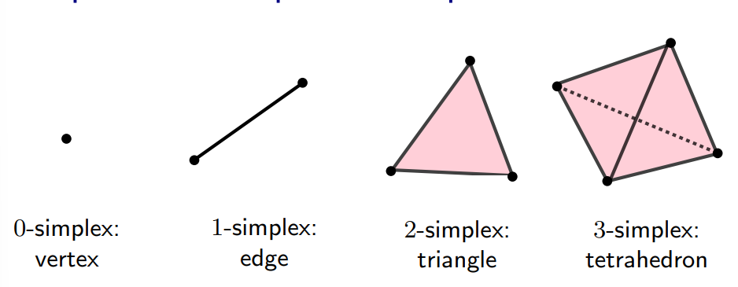
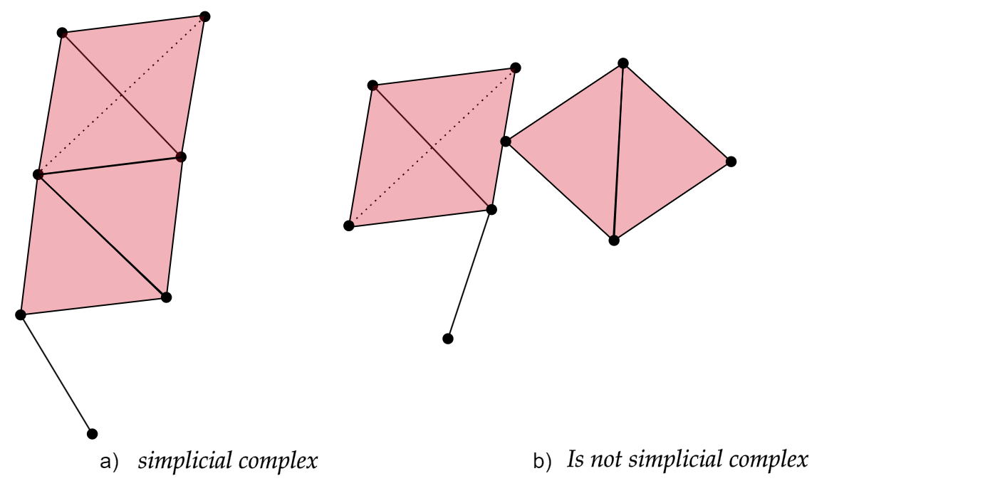
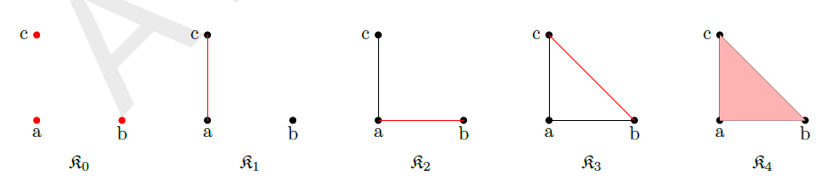
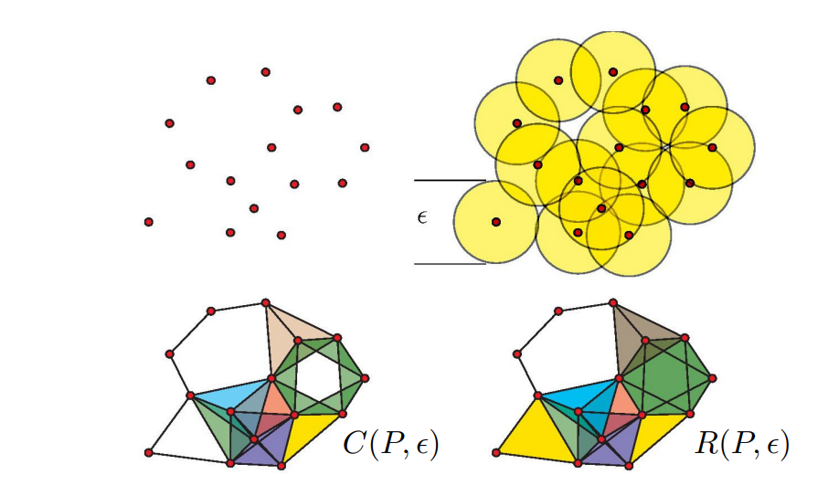

## **Topological data analysis**

Topological data analysis is a technique that uses concepts from topology to analyze complex data and find patterns and structures that are not apparent at first glance. This technique is based on the construction of a structure called a simplicial complex, which is composed of a collection of simple geometric objects called simplices. The topology of this complex is used to analyze and visualize the relationships between the data.

### **Simplex**
Simple geometric object of any dimension (point, line segment, triangle, tetrahedron, etc.) that is used to construct simplicial complexes.

> ### For Mathematicians
>
> > ## Simplex
>>Given a set $ P=\{p_0,...,p_k\}\subset \mathbb{R}^d $ of $ k+1 $ affinely independent points, the **k-dimensional simplex** $\sigma$ (or **k-simplex** for short) spanned by $P$ is the set of convez combinatios
>>$$ \sum_{i=0}^k\lambda_ip_i, \quad with \quad  \sum_{i=0}^k\lambda_i = 1 \quad \lambda_i \geq 0. $$ 
>> Inline equation: $$\sum_{i=0}^k\lambda_ip_i, \quad with \quad  \sum_{i=0}^k\lambda_i = 1 \quad \lambda_i \geq 0.$$
>>The points $p_0, ..., p_k$ are called the vertices of $\sigma$.
> > 
> {: .solution}
{: .challenge}

  

### **Simplicial complex**
Is a mathematical structure composed of a collection of simple geometric objects called simplices, which is constructed from a set of data. In other word, a simplicial complex is a collection of vertices, edges, triangles, tetrahedra, and other elements. In this sense, we can think of a simplicial complex as extending the notion of a graph, which is only formed by vertices and edges.

  

> ### For Mathematicians
>
> > ## Simplex complex
>>A simplicial complex $K$ in $ \mathbb{R}^d $ is a collection of simplices s.t:
>> 1. any face a simplex of $K$ is a simplex of K,
>> 2. the intesection of any twho simplices of $K$ is ether empty or a common face of both.
> > 
> {: .solution}
{: .challenge}

  

### **Abstract simplex and simplical complex**
Let $P= \{p_1,...,p_n\}$ be a (finite) set. An **abstract simlicial complex** $K$ with vertex set $P$ is a set of subsets of $P$ satisfying the two conditions:
1. the elements of $P$ belong to $K$,
2. if $\tau \in K$ and $\sigma \subset \tau$, then $\sigma \in K$.

The elements of $K$ are the simplices.

> Note: Simplicial complexes can be seen at the same time as geometric/topological
spaces (good for topological/geometrical inference) and as combinatorial objects (abstract simplicial complexes, good for computations)

  ### **Filtration**
  
A filtration of a simplicial complex is an ordered sequence of subcomplexes of the original complex, where each subcomplex contains its predecessor in the sequence. In other words, it is a way to decompose the complex into successive stages, where each stage adds or removes simplices compared to the previous stage.

  A filtration of a simplicial complex $K$ is a collection $K_0 \subset K_1 \subset ... \subset K_N$ of complexes such that:
  1. $K_N=K$.
  2. $K_i$ is a subcomplex of $K_{i+1}$, for $i=0,1,...,N-1$.

  

### **Cech and (Vietoris)-Rips complexes**

The Vietoris-Rips complex and the Čech complex are two types of simplicial complexes used to construct discrete structures from sets of points in space.

The **Vietoris-Rips complex** is constructed from a set of points in a metric space. Given a set of points and a distance parameter called the "threshold," points that are within a distance less than or equal to the threshold are connected, forming the 1-simplices of the complex. Higher-dimensional simplices are then constructed by closing under combinations of 1-simplices that form a complete simplex, i.e., all fully connected subsets. The Vietoris-Rips complex captures the connectivity information between points and their topological structure at different scales.

> ### For Mathematicians
>
> > ## Cech complex
>>Given a point cloud $P=\{p_1,...,p_n\}\subset \mathbb{R}^d$, its **Rips complex** of radius $r>0$ is the simplicial complex $R(P,r)$ s.t. $vert(R(P,r))=P$ and
>>$$ \sigma = [p_{i_0},p_{i_1},...,p_{i_k}] \in R(P,r) \quad iff \quad  \lVert p_{i_j} -p_{i_l}  \rVert  \leq 2r, \forall \leq j,l\leq k $$
> > 
> {: .solution}
{: .challenge}

The **Čech complex**, on the other hand, is based on the idea of constructing simplicial cells rather than simply connecting points at specific distances. Given a set of points and a distance parameter, all sets of points whose balls of radius equal to the distance parameter have a non-empty intersection are considered. These sets of points become the simplices of the Čech complex. Similar to the Vietoris-Rips complex, higher-dimensional simplices can be constructed by closing under combinations of lower-dimensional simplices that form a complete simplex.

> ### For Mathematicians
>
> > ## Cech complex
>>Given a point cloud $P=\{p_1,...,p_n\}\subset \mathbb{R}^d$, its **Cech complex** of radius $r>0$ is the simplicial complex $C(P,r)$ s.t. $vert(C(P,r))=P$ and
>>$$ \sigma = [p_{i_0},p_{i_1},...,p_{i_k}] \in C(P,r) \quad iff \quad \cap_{j=0}^k B(p_{i_j} \neq \emptyset $$
> > 
> {: .solution}
{: .challenge}

 

> Note: Cech complexes can be quite hard to compute.

Both the Vietoris-Rips complex and the Čech complex are tools used in topological analysis and computational geometry to study the structure and properties of sets of points in space. These complexes provide a discrete representation of the proximity and connectivity information of the points, enabling the analysis of their topology and geometric characteristics.

Regenerate response
## **Simplicial homology**

Simplicial homology is a technique used to quantify the topological structure of a simplicial complex. This technique is based on the identification of cycles and voids in the complex, which can be quantified by assigning integer values called "homology degrees". Simplicial homology is often used in topological data analysis to find patterns and structures in the data.

**Homology degree:** Integer assigned to a cycle or cavity in a simplicial complex using the technique of simplicial homology. The homology degree is used to quantify the "amount" of topological structure present in the complex.

**Cycle:** Topological object that closes in on itself and has no holes. A cycle in a simplicial complex can be represented as a linear combination of simplices.

**Cavity:** Topological object that represents a hole in the simplicial complex. A cavity in a simplicial complex is represented as a linear combination of simplices.

 

## App to play
<iframe src="https://www.geogebra.org/classic/s7W7zbG4?embed" width="800" height="600" allowfullscreen style="border: 1px solid #e4e4e4;border-radius: 4px;" frameborder="0"></iframe>
