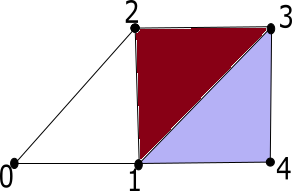
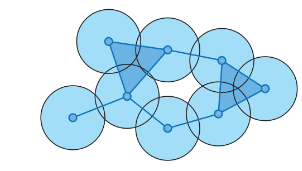

## **Topological data analysis**

Topological data analysis is a technique that uses concepts from topology to analyze complex data and find patterns and structures that are not apparent at first glance. This technique is based on the construction of a structure called a simplicial complex, which is composed of a collection of simple geometric objects called simplices. The topology of this complex is used to analyze and visualize the relationships between the data.

### **Simplicial complex**
A simplicial complex is a collection of simplices that satisfy certain conditions. A simplex is a geometric object that is defined as the convex hull of a set of affinely independent points in Euclidean space. A simplicial complex is formed by gluing simplices together along their faces, with the condition that the intersection of any two simplices is either empty or a common face.

A simplicial complex is a collection $K$ of non-empty finite sets such that if $\tau\subset \sigma$ and $\sigma\in K$, then $\tau\in K$.

1. The elements of $K$ are called **simplices**.
2. Given $\sigma \in K$, the dimension of 
$\sigma$ is given by $dim(\sigma)=\#(\sigma)-1$.
 3. The dimension of $K$ is defined as 
 $dim(K)=sup\{dim(\sigma):\sigma \in K \} $.
4. The union of the sets $K_p$ is called the $k-$**skeleton** of $K$.
  
  

  ### **Filtration**
  A filtration of a simplicial complex $K$ is a collection $K_0 \subset K_1 \subset ... \subset K_N$ of complexes such that:
  1. $K_N=K$.
  2. $K_i$ is a subcomplex of $K_{i+1}$, for $i=0,1,...,N-1$.

  

### **The Vietoris-Rips complex**
Consider $(X,\partial_X)$ a metric space and $\epsilon >0$. The Vietoris-Rips complex $VR_{\epsilon}(X,\partial_X)$ is the simplicial complex with:
1. Vertices given by the points in $X$,
2. A $k$-simplex determined by $[v_0,v_1,\ldots,v_k]$ if $ \partial_X (v_i,v_j) \leq \epsilon$.

  

## **Simplicial homology**

Simplicial homology is a technique used to quantify the topological structure of a simplicial complex. This technique is based on the identification of cycles and voids in the complex, which can be quantified by assigning integer values called "homology degrees". Simplicial homology is often used in topological data analysis to find patterns and structures in the data.

  