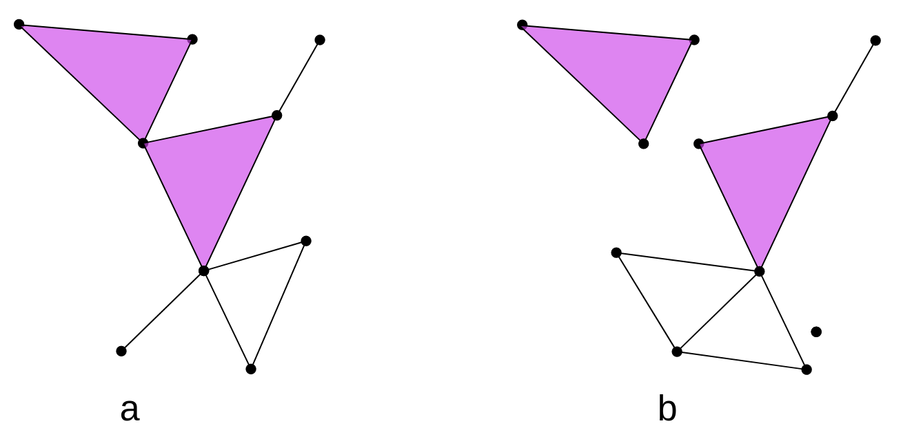
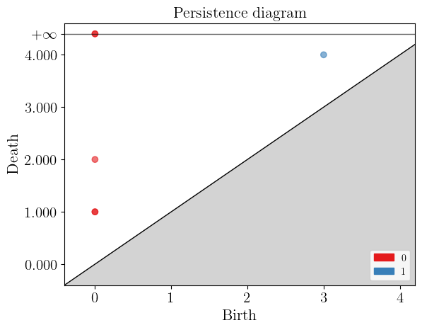
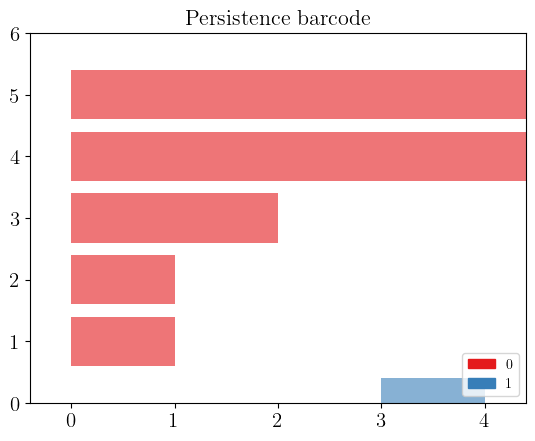

## Topological data analysis

Topological data analysis is a technique that uses concepts from topology to analyze complex data and find patterns and structures that are not apparent at first glance. This technique is based on constructing a structure called a simplicial complex, composed of a collection of simple geometric objects called simplices. The topology of this complex is used to analyze and visualize the relationships between the data.

### Simplex
A simplex (plural simplices) is a simple geometric object of any dimension (point, line segment, triangle, tetrahedron, etc.). Simplices are used to construct simplicial complexes.

> ## Simplex
>
> > ## Mathematical definition
>> Given a set $ P=\{p_0,...,p_k\}\subset \mathbb{R}^d $ of $ k+1 $ affinely independent points, the **k-dimensional simplex** $\sigma$ (or **k-simplex** for short) spanned by $P$ is the set of convex combinatios
>>
>> $ \sum_{i=0}^k\lambda_ip_i, \quad with \quad  \sum_{i=0}^k\lambda_i = 1 \quad \lambda_i \geq 0. $ 
>>
>> 
>> The points $p_0, ..., p_k$ are called the vertices of $\sigma$.
>> 
> {: .solution}
{: .discussion}

  

### Simplicial complex
A simplicial complex is a mathematical structure composed of a collection of simplices, constructed from a data set. In other words, a simplicial complex is a collection of vertices, edges, triangles, tetrahedra, and other elements. In this sense, we can think of a simplicial complex as extending the notion of a graph only formed by vertices and edges.

  

> ## Simplicial complex
>
> > ## Mathematical definition
>>A simplicial complex $K$ in $ \mathbb{R}^d $ is a collection of simplices s.t:
>> 1. any face a simplex of $K$ is a simplex of K,
>> 2. the intesection of any two simplices of $K$ is ether empty or a common face of both.
> > 
> {: .solution}
{: .discussion}

  

> ## FIXME Shaday!
> Aquí las dos imagenes están separadas por la caja de Mathematical definicion. Hay que ponerlas donde más convenga y
> hablar de ellas en el texto.
> Y explicar por qué el inciso b) no es un simplicial complex.
> Y en los alt text hay que mencionar qué se ve en la imagen, no sólo qué es la imagen.
{: .caution}

### Abstract simplex and simplicial complex

> ## FIXME Shaday!
> Aquí la explicación que sigue parece lo que va dentro de una caja de Mathematical definition. Falta el texto de explicación normal.
> Y la caja de Note creo que es algo que podría ir en el texto normal.
{: .caution}

Let $P= \{p_1,...,p_n\}$ be a (finite) set. An **abstract simplicial complex** $K$ with vertex set $P$ is a set of subsets of $P$ satisfying the two conditions:  
1. the elements of $P$ belong to $K$,  
2. if $\tau \in K$ and $\sigma \subset \tau$, then $\sigma \in K$.  

The elements of $K$ are the simplices.  

> ## Note
> Simplicial complexes can be seen at the same time as geometric/topological
> spaces (good for topological/geometrical inference) and as combinatorial objects (abstract simplicial complexes, good for computations)
{: .callout}

> ## Exercise 1: Identify the simplices
>  In the following graph, we have 2 representations of simplicial complexes.
>  
> 
> How many simplices (0-simplices, 1-simplices, 2-simplices) do the simplicial complexes in the figure have?
> > ## Solution
> >   
> > |             | **Figure A** | **Figure B** |    
> > |:-----------:|:------------:|:------------:|   
> > | 0-simplex |       9      |      11      |    
> > | 1-simplex |      11      |      12      |    
> > | 2-simplex |       2      |       2      |    
> > 
> {: .solution}
{: .challenge}

### Čech and (Vietoris)-Rips complexes

The Vietoris-Rips complex and the Čech complex are two types of simplicial complexes used to construct discrete structures from sets of points in space.

The **Vietoris-Rips complex** is constructed from a set of points in a metric space. Given a set of points and a distance parameter called the "threshold," points within a distance less than or equal to the threshold are connected, forming the 1-simplices of the complex. Higher-dimensional simplices are then constructed by closing under combinations of 1-simplices that form a complete simplex, i.e., all fully connected subsets. The Vietoris-Rips complex captures the connectivity information between points and their topological structure at different scales.

> ## FIXME Shaday!
> Aquí creo que sí se entiendo cómo se conectan los puntos, pero según yo falta explicar con qué información se pusieron
> los puntos en el espacio. Y creo que también falta decir cómo se escoge el umbral.
{: .caution}

> ## Vietoris complex
>
>> ## Mathematical definition
>> Given a point cloud $P=\{p_1,...,p_n\}\subset \mathbb{R}^d $, its **Rips complex** of radius $r>0$ is the simplicial complex $R(P,r)$ s.t. $vert(R(P,r))=P$  and
>>  $$ \sigma = [p_{i_0},p_{i_1},...,p_{i_k}] \in R(P,r) \quad iff \quad  \lVert p_{i_j} -p_{i_l}  \rVert  \leq 2r, \forall \leq j,l\leq k $$
>> 
> {: .solution}
{: .discussion}

On the other hand, the **Čech complex** is based on constructing simplicial cells rather than simply connecting points at specific distances. Given a set of points and a distance parameter, all sets of points whose balls of radius equal to the distance parameter have a non-empty intersection are considered. These sets of points become the simplices of the Čech complex. Similar to the Vietoris-Rips complex, higher-dimensional simplices can be constructed by closing under combinations of lower-dimensional simplices that form a complete simplex.

> ## Čech complex
>
>> ## Mathematical definition
>> Given a point cloud $P=\{p_1,...,p_n\}\subset \mathbb{R}^d$, its **Cech complex** of radius $r>0$ is the simplicial complex $C(P,r)$ s.t. $vert(C(P,r))=P$  and
>>  $$ \sigma = [p_{i_0},p_{i_1},...,p_{i_k}] \in C(P,r) \quad iff \quad \cap_{j=0}^k Bp_{i_j} \neq \emptyset $$
>> 
> {: .solution}
{: .discussion}

 

> ## FIXME Shaday!
> Aquí hay que mencionar/explicar la imagen en el texto.
{: .caution}

> ## Note
> Čech complexes can be quite hard to compute.
{: .callout}

Both the Vietoris-Rips complex and the Čech complex are tools used in topological analysis and computational geometry to study the structure and properties of sets of points in space. These complexes provide a discrete representation of the proximity and connectivity information of the points, enabling the analysis of their topology and geometric characteristics.

## Simplicial homology

Simplicial homology is a technique used to quantify the topological structure of a simplicial complex. This technique is based on the identification of cycles and voids in the complex, which can be quantified by assigning integer values called "homology degrees". Simplicial homology is often used in topological data analysis to find patterns and structures in the data.

**Betti Numbers:** Betti numbers are numerical invariants that measure the number of connected components and holes in a simplicial complex. Betti-0 counts the number of connected components, while Betti-1 counts the number of one-dimensional holes.

**Holes:** Holes are empty regions or connected spaces in a simplicial complex. Simplicial homology allows for the detection and quantification of the presence of holes in the complex.

**Connected Components:** Connected components are sets of simplices in a simplicial complex that are connected to each other through shared simplices. Simplicial homology can identify and count the connected components in the complex.

> ## Exercise 2:  Identify Betti number
>  In the following graph, we have 2 representations of simplicial complexes.
>  
> 
> How many 1-holes and connected components ($\beta_0 $  and $\beta_1$) are these figure?
> > ## Solution  
> >   
> >  |           | **Figure A** | **Figure B** |   
> >  |:---------:|:------------:|:------------:|   
> >  | $\beta_0$ |       1      |       3      |   
> >  | $\beta_1$ |       1      |       2      |    
> >   
> {: .solution}
{: .challenge}

> ## FIXME Shaday!
> Creo que lo de **Connetcet Components** y **Holes** deberían estar explicados antes de **Betti Numbers** porque Betti numbers hace referencia a esas otras dos cosas.
> Según entiendo Beta0 y Beta1 son Betti-0 y Betti-1, respectivamente, pero hay que decirlo en el texto. Y creo que la pregunta debería decir algo así cómo ¿Cuál es el Beta-0 y Beta-1 de estos simplicial complexes de la imagen?
> No entiendo por qué hay triángulos que sí son hoyos y otros que no (coloreados de rosa).
> 
{: .caution}

### Filtration
  
A filtration of a simplicial complex is an ordered sequence of subcomplexes of the original complex, where each subcomplex contains its predecessor in the sequence. In other words, it is a way to decompose the complex into successive stages, where each stage adds or removes simplices compared to the previous stage.

  A filtration of a simplicial complex $K$ is a collection $K_0 \subset K_1 \subset ... \subset K_N$ of complexes such that:
  1. $K_N=K$.
  2. $K_i$ is a subcomplex of $K_{i+1}$, for $i=0,1,...,N-1$.
 </figure id="fig_filtration"> 
  
  <figcaption> **Figure:** Example Filtration</figcaption>
</figure>
> ## FIXME Shaday!
> Hay que explicar la figura en el texto.  
> Lo que está antes de la figura creo que debería ir en caja de Mathematical deffinition.
{: .caution}

> ## FIXME Shaday!
> Hay que quitar los pies de figura y los números de figura porque no estamos usando ese formato en las lecciones.
> También cambiar en el texto que habla de las figuras por su número de figura.
{: .caution}

Now, to apply persistent homology, we need to vary our parameter associated with the filtration. In the filtration graph, we have 5 distinct steps for the filtered simplicial complex. In each of these steps, we can have a different number of connected components and 1-holes. 

> ## Exercise 3:  Calculate the Betti numbers.
>  For the filtration shown in Figure 1, calculate the Betti numbers ($\beta_0 $  and $\beta_1$)for each level of the filtration
> 
> > ## Solution  
> >   
> >  |           | $\beta_0$ | $\beta_1$ |   
> >  |:---------:|:------------:|:------------:|   
> >  | $K_0$ |       3      |       0      |   
> >  | $K_1$ |       2      |       0      |    
> >  | $K_2$ |       1      |       0      |   
> >  | $K_3$ |       1      |       1      |    
> >  | $K_4$ |       1      |       0      |    
> >   
> {: .solution}
{: .challenge}

To visualize these changes, we will use a representation with the following persistence diagrams and barcode.

### Persistence Diagram
The persistence diagram is a visual representation of the evolution of cycles and cavities in different dimensions as the simplicial complex is modified. It helps understand the persistence and relevance of topological structures in the complex.

Continuing with the example of the filtration in Figure 1, to construct the persistence diagram, we need to empty the information we obtained in the previous exercise.
 <figure id="fig2">
  
  <figcaption>Figure 2: Example Persistence Diagram</figcaption>
</figure>
In Figure 2, we present the persistence diagram for the filtration shown in Figure 1. In red, we see the connected components represented, and in blue, the 1-holes. For "time" 0, we can observe that we have 3 connected components with different "death times". As new simplices appear as we increase the filtration level (time), some connected components merge with each other.

### Barcode Diagram
The barcode diagram is a graphical tool used to visualize the persistence diagram. It consists of bars that represent the persistence intervals of cycles and cavities, indicating their duration and relevance in the simplicial complex.

  

## App to play
<iframe src="https://www.geogebra.org/classic/s7W7zbG4?embed" width="600" height="400" allowfullscreen style="border: 1px solid #e4e4e4;border-radius: 4px;" frameborder="0"></iframe>

> ## Exercise 4: Persistence Diagrama
>
> An exercise.
{: .challenge}

> ## Exercise 5: Barcode Diagrama
>
> An exercise.
{: .challenge}
