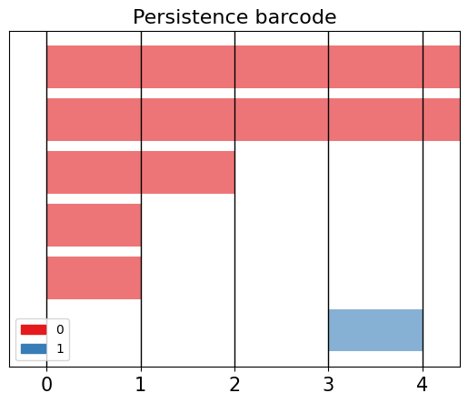
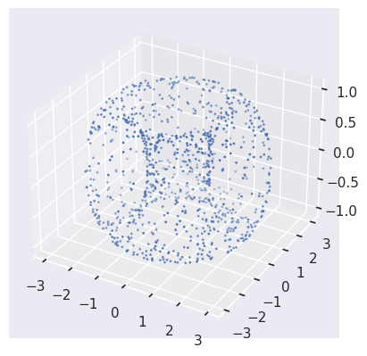
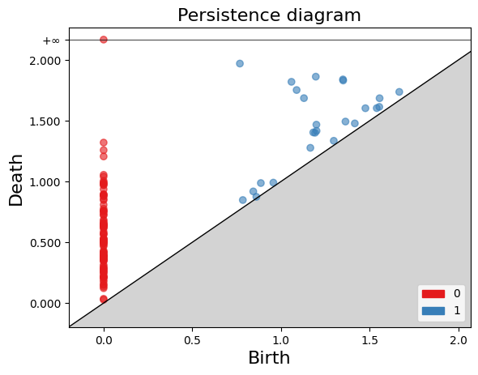

## Introduction to GUDHI and Simplicial Homology

Welcome to this lesson on using GUDHI and exploring simplicial homology. [GUDHI](https://gudhi.inria.fr/python/latest/)  (Geometry Understanding in Higher Dimensions) is an open-source that provides algorithms and data structures for the analysis of geometric data. It offers a wide range of tools for topological data analysis, including simplicial complexes and computations of their homology.  

To begin, we will import the necessary packages.
~~~
from IPython.display import Image
from os import chdir
import numpy as np
import gudhi as gd
import matplotlib.pyplot as plt
import argparse
import seaborn as sns
import requests
~~~
{: .language-python}

### **Example 1:** SimplexTree and Manual Filtration
The SimplexTree data structure in GUDHI allows efficient manipulation of simplicial complexes. You can demonstrate its usage by creating a SimplexTree object, adding simplices manually, and then filtering the complex based on a filtration value.   

#### **Create SimplexTree**
With the following command, you can create a SimplexTree object named `st`, which we will use to add the information of your filtered simplicial complex:

~~~
st = gd.SimplexTree()  ## 
~~~
{: .language-python}
#### **Insert simplex**
In GUDHI, you can use the `st.insert()` function to add simplices to a SimplexTree data structure. Additionally, you have the flexibility to specify the filtration level of each simplex. If no filtration level is specified, it is assumed to be added at filtration time 0.

~~~
#insert 0-simplex (the vertex) 
st.insert([0])
st.insert([1])
~~~
{: .language-python}
~~~
True
~~~
{: .output}

Now let's insert 1-simplices at different filtration levels. If adding a simplex requires a lower-dimensional simplex to be present, the missing simplices will be automatically completed.

Here's an example of inserting 1-simplices into the SimplexTree at various filtration levels:

~~~
# Insert 1-simplices at different filtration levels
st.insert([0, 1], filtration=0.5)
st.insert([1, 2], filtration=0.8)
st.insert([0, 2], filtration=1.2)
~~~
{: .language-python}

~~~
True
~~~
{: .output}

> ## Note
> If any lower-dimensional simplices are missing, GUDHI's SimplexTree will automatically complete them. For example, when inserting
> the 1-simplex [1, 2] at filtration level 0.8, if the 0-simplex [1] or [2] was not already present, GUDHI will add it to the SimplexTree.
{: .callout}

Now, you can use the `st.num_vertices()` and `st.num_simplices()` commands to see the number of vertices and simplices, respectively, in your simplicial complex stored in the st SimplexTree object.

~~~
num_vertices = st.num_vertices()
num_simplices = st.num_simplices()

print("Number of vertices:", num_vertices)
print("Number of simplices:", num_simplices)
~~~
{: .language-python}

~~~
Number of vertices: 3
Number of simplices: 6
~~~
{: .output}
#### **Persistence**
The `st.persistence()` function in GUDHI's SimplexTree is used to compute the persistence diagram of the simplicial complex. The persistence diagram provides a compact representation of the birth and death of topological features as the filtration parameter varies.

Here's an example of how to use `st.persistence()`:

~~~
# Compute the persistence diagram
persistence_diagram = st.persistence()

# Print the persistence diagram
for point in persistence_diagram:
    birth = point[0]
    death = point[1]
    print("Birth:", birth)
    print("Death:", death)
    print()
~~~
{: .language-python}

~~~
Birth: 0
Death: (0.0, inf)

Birth: 0
Death: (0.0, 0.5)
~~~
{: .output}

#### **Plot the persistence diagram** 
 The `gd.plot_persistence_diagram(persistence_diagram, legend=True)` is used to plot a persistence diagram using the Gudhi library in Python. A persistence diagram is a visual representation of the topological features captured by the simplicial homology computation.

The `plot_persistence_diagram()` function takes the persistence diagram as input and generates a plot to visualize this information. The `legend=True` argument enables the display of a legend, which provides additional information about the different types of topological features represented in the diagram.
~~~
gd.plot_persistence_diagram(persistence_diagram,legend=True)
~~~
{: .language-python}
~~~
<AxesSubplot:title={'center':'Persistence diagram'}, xlabel='Birth', ylabel='Death'>
~~~
{: .output}
 

#### **Plot the barcode** 
The code snippet `gd.plot_persistence_barcode(persistence_diagram, legend=True)` is used to generate a persistence barcode plot using the Gudhi library in Python. A persistence barcode provides a different way to visualize the evolution of topological features captured by the persistence diagram.

In topological data analysis, a persistence barcode represents the lifespan of topological features as intervals on a real number line. Each interval corresponds to a topological feature, and its length represents the duration of the feature's existence.

The `plot_persistence_barcode()` function takes the persistence diagram as input and generates a plot that visualizes these intervals. The bars in the barcode plot represent the topological features, and their lengths indicate the duration of their existence.

~~~
gd.plot_persistence_barcode(persistence_diagram,legend=True)
~~~
{: .language-python}

~~~
<AxesSubplot:title={'center':'Persistence barcode'}>
~~~
{: .output}
 

By examining the persistence barcode plot, one can observe the distribution and lengths of the bars. Longer bars indicate more persistent topological features, while shorter bars represent features that appear and disappear quickly. The legend displayed with legend=True provides additional information about the types of topological features represented in the barcode.

This visualization allows for the identification of significant topological features and their persistence across different scales. It provides insights into the robustness and stability of these features in the dataset, helping to reveal important structural patterns and understand the underlying topology of the data.

> ## Exercise 1: Creating a Manually Filtered Simplicial Complex.
>  In the following graph, we have $K$ a simplicial complex filtered representation of simplicial complexes.
>  <a href="../fig/tda_09_filtracion_ex.png">
>  
></a>
> 
> Perform persistent homology and plot the persistence diagram and barcode.
> > ## Solution  
> > 1. Create a SimplexTree with `gd.SimplexTree()`.
> >  ~~~
>> st = gd.SimplexTree()  
>> ~~~
>> {: .language-python}  
>> 2. Insert vertices at time 0 using `st.insert()`
> >  ~~~
>> #insert 0-simplex (the vertex), 
>> st.insert([0])
>>  st.insert([1])
>> st.insert([2])
>>  st.insert([3])
>>  st.insert([4])
>> ~~~
>> {: .language-python}   
>> 3. Insert the remaining simplices by setting the filtration time using `st.insert([0, 1], filtration=)`.
> >  ~~~
>> #insert 1-simplex level filtration 1 
>> st.insert([0, 2], filtration=1)
>> st.insert([3, 4], filtration=1)
>> #insert 1-simplex level filtration 2 
>> st.insert([0, 1], filtration=2)
>> #insert 1-simplex level filtration 3 
>>  st.insert([2, 1], filtration=3)
>> #insert 1-simplex level filtration 4 
>> st.insert([2, 1,0], filtration=4)
>> ~~~
>> {: .language-python}   
>> 4. Perform persistent homology using `st.persistence()`.
> >  ~~~
>># Compute the persistence diagram
>> persistence_diagram = st.persistence() 
>> ~~~
>> {: .language-python}  
>> 5. Plot the persistence diagram.
> >  ~~~
>># plot the persistence diagram
>> gd.plot_persistence_diagram(persistence_diagram,legend=True)
>> ~~~
>> {: .language-python}  
>> 6. Plot the barcode.
> >  ~~~
>> gd.plot_persistence_barcode(persistence_diagram,legend=True)
>> ~~~
>> {: .language-python}  
> >6. Get this output  
>> <a href="../fig/tda_09_diagram_F.png">
>>   
>> </a>  
> {: .solution}

{: .challenge}

### **Example 2:** Rips complex from datasets 
In this example, we will demonstrate an application of persistent homology using a dataset generated by us. Persistent homology is a technique used in topological data analysis to study the shape and structure of datasets.
### **Genaerate dataset**
The `make_circles()` function from scikit-learn's datasets module is used to generate synthetic circular data. We specify the number of points to generate (n_samples), the amount of noise to add to the data points (noise), and the scale factor between the inner and outer circle (factor).

The generated dataset consists of two arrays: circles and labels. The circles array contains the coordinates of the generated data points, while the labels array assigns a label to each data point (in this case, it will be 0 or 1 representing the two circles).

~~~
from sklearn import datasets  # Import the datasets module from scikit-learn

# Generate synthetic data using the make_circles function
# n_samples: Number of points to generate
# noise: Standard deviation of Gaussian noise added to the data
# factor: Scale factor between inner and outer circle
circles, labels = datasets.make_circles(n_samples=100, noise=0.06, factor=0.5)

# Print the dimensions of the generated data
print('Data dimension: {}'.format(circles.shape))
~~~
{: .language-python}

~~~
Data dimension:(100, 2)
~~~
{: .output}

### **Plot dataset**

~~~
fig = plt.figure()  # Create a new figure
ax = fig.add_subplot(111)  # Add a subplot to the figure
ax = sns.scatterplot(x=circles[:,0], y=circles[:,1], s=15)  # Create a scatter plot using seaborn
plt.title('Dataset with N=%s points'%(circles.shape[0]))  # Set the title of the plot
plt.show()  # Display the plot
~~~
{: .language-python}
 

### **Create Rips complex###
First, we create a Rips complex using the `RipsComplex` class from `gudhi`. The Rips complex is a simplicial complex constructed from the given data points by connecting them with edges if their pairwise distances are below a specified threshold. In this case, we set the `max_edge_length` parameter to 0.6, which determines the maximum length allowed for an edge to be included in the complex.

~~~
%%time
# Create a Rips complex with a maximum edge length of 0.6
Rips_complex = gd.RipsComplex(circles, max_edge_length=0.6)
{: .language-python}
~~~
~~~
CPU times: user 461 µs, sys: 88 µs, total: 549 µs
Wall time: 557 µs
~~~
{: .output}

Next, we create a simplex tree using the `create_simplex_tree()` method of the `Rips_complex` object. The simplex tree is a data structure that stores the information about the simplices in the complex. We specify `max_dimension=3` to include simplices up to dimension 3 in the complex.
~~~
%%time
#Create a simplex tree from the Rips complex with a maximum dimension of 3
Rips_simplex_tree = Rips_complex.create_simplex_tree(max_dimension=3) 
~~~
{: .language-python}
~~~
CPU times: user 2.25 ms, sys: 0 ns, total: 2.25 ms
Wall time: 1.95 ms
~~~
{: .output}

Then, we retrieve the filtration order of simplices from the `Rips_simplex_tree` using the `get_filtration()` method. Filtration is a sequence of simplices ordered by their inclusion in the complex. We convert the filtration to a list using `list()`.
~~~
%%time
# Get the filtration order of simplices
filt_Rips = list(Rips_simplex_tree.get_filtration())
~~~
{: .language-python}
~~~
CPU times: user 108 ms, sys: 0 ns, total: 108 ms
Wall time: 121 ms
~~~
{: .output}
### **Simplicial homology###
Finally, we compute the persistence of the Rips complex using the `persistence()` method of the `Rips_simplex_tree`. Persistence computes the birth and death values for each topological feature (connected components, loops, voids, etc.) in the complex. The result is assigned to the variable `diag_Rips`.
~~~
%%time
# Compute the persistence of the Rips complex
diag_Rips = Rips_simplex_tree.persistence()
~~~
{: .language-python}
~~~
CPU times: user 9.13 ms, sys: 41 µs, total: 9.17 ms
Wall time: 8.82 ms
~~~
{: .output}
### **Plots the persistence diagram and barcode**

The `plot_persistence_diagram()` function takes the persistence diagram (`diag_Rips`) as input and creates a scatter plot of the points. The birth and death values are used to determine the positions of the points in the diagram.

Additionally, the `legend` parameter is set to `True`, which displays a legend in the plot. The legend provides information about the colors or markers used to differentiate different topological dimensions or features.
~~~
%%time
# Plot the persistence diagram
gd.plot_persistence_diagram(diag_Rips, legend=True)
~~~
{: .language-python}
~~~
<AxesSubplot:title={'center':'Persistence diagram'}, xlabel='Birth', ylabel='Death'>
~~~
{: .output}
 

The persistence barcode is another graphical representation of the persistence pairs obtained from the computation of persistent homology. It visualizes the birth and death values of topological features as intervals on a barcode-like plot.

The `plot_persistence_barcode()` function takes the persistence diagram (d`iag_Rips`) as input and creates a barcode plot. Each bar in the plot represents a topological feature, and its length corresponds to the persistence or lifetime of the feature. The x-axis represents the range of values for the birth and death of the features.

The `legend` parameter is set to `True` in order to display a legend in the plot. The legend provides information about the colors or markers used to differentiate different topological dimensions or features.

~~~
gd.plot_persistence_barcode(diag_Rips,legend=True)

~~~
{: .language-python}
~~~
<AxesSubplot:title={'center':'Persistence barcode'}>
~~~
{: .output}
 

### **Example 3:** Rips complex from datasets 

We are using the gudhi library to load a 2D point cloud data from a CSV file and visualize it using matplotlib.

First, we import the necessary modules from gudhi to work with datasets and construct the Alpha complex. We import _points from gudhi.datasets.generators to generate points and AlphaComplex to construct the Alpha complex.
~~~
from gudhi.datasets.generators import _points
from gudhi import AlphaComplex
~~~
{: .language-python}

We use the `requests.get()` function to send a GET request to the specified URL and retrieve the content of the file. The content is stored in the response object, and we extract the text content using `response.text`.

The text content is then loaded into a NumPy array using `np.loadtxt()`. The `content.splitlines()` splits the text content into lines, and `delimiter=' '` specifies that the values in each line are separated by a space.

Finally, we visualize the loaded data by plotting the points using `plt.scatter()`. The `data[:, 0]` and `data[:, 1]` select the first and second columns of the data array, representing the x and y coordinates respectively. The `marker='.'` specifies the marker style as a dot, and `s=1` sets the marker size. The points are then displayed using `plt.show()`.
~~~
# Load the file spiral_2d.csv from the specified URL
url = 'https://raw.githubusercontent.com/paumayell/pangenomics/gh-pages/files/spiral_2d.csv'

# Get the content of the file
response = requests.get(url)
content = response.text

# Load the data into a NumPy array
data = np.loadtxt(content.splitlines(), delimiter=' ')

# Plot the points
plt.scatter(data[:, 0], data[:, 1], marker='.', s=1)
plt.show()
~~~
{: .language-python}

we are using the `AlphaComplex` class from the `gudhi` library to construct an Alpha complex from the loaded 2D point cloud data.

First, we create an instance of the `AlphaComplex` class, `alpha_complex`, by passing the `data` array to the points parameter. This initializes the Alpha complex object and prepares it to construct the complex based on the given points.

Next, we create a simplex tree using the `create_simplex_tree()` method of the `alpha_complex` object. The simplex tree is a data structure that stores the information about the simplices in the Alpha complex. It represents the hierarchy of simplices in the complex, from the lowest-dimensional simplices (vertices) to higher-dimensional simplices (e.g., edges, triangles).

By calling `create_simplex_tree()`, we construct the simplex tree based on the Alpha complex. The simplex tree contains information about the simplices, such as their filtration values and filtration order.

The `simplex_tree` object can be further utilized to analyze and extract topological features and their persistence from the constructed Alpha complex. It provides various methods for computing persistence, extracting persistence diagrams, and performing other topological computations.

Overall, the code segment constructs the Alpha complex from the 2D point cloud data and creates a simplex tree to store the resulting complex's information. This allows for subsequent topological analysis and computations on the constructed complex using the `simplex_tree` object.

~~~
# Construct an Alpha complex from the data points
alpha_complex = AlphaComplex(points=data)

# Create a simplex tree based on the Alpha complex
simplex_tree = alpha_complex.create_simplex_tree()
~~~
{: .language-python}
~~~
CPU times: user 5.04 s, sys: 0 ns, total: 5.04 s
Wall time: 5.06 s
~~~
{: .output}

~~~
diag = simplex_tree.persistence()
diag = simplex_tree.persistence(homology_coeff_field=2, min_persistence=0)
print("diag=", diag)

gd.plot_persistence_diagram(diag)
~~~
~~~
<AxesSubplot:title={'center':'Persistence diagram'}, xlabel='Birth', ylabel='Death'>
~~~
{: .output}
{: .language-python}

~~~
gd.plot_persistence_barcode(diag)
plt.show()
~~~
{: .language-python}
~~~
/opt/tljh/user/envs/TDA2/lib/python3.7/site-packages/gudhi/persistence_graphical_tools.py:83: UserWarning: There are 229062 intervals given as input, whereas max_intervals is set to 20000.
  % (len(persistence), max_intervals)
~~~
{: .output}
 

> ## FIXME
> Aquí también decir algo o quitar el código en el que se guarda la imagen. Aquí no está la imagen que se genera, que es igual a la anterior pero con > el formato un poquito diferente. Decir por qué se está haciendo.
{: .caution}

~~~
%%time
gd.plot_persistence_barcode(diag,legend=True)
~~~
{: .language-python}

> ## FIXME
> En el ejercicio poner el código completo para llegar a la solución
{: .caution}

> ## Exercise 2: Torus.
>  To build a torus using the `tadasets.torus(n=num_points)` function and apply persistent homology.
> 
> > ## Solution  
>> ~~~
>> #pip install tadasets
>> import tadasets
>> import gudhi
>> import matplotlib.pyplot as plt
>># Generate torus points
>>torus = tadasets.torus(n=100)
>># Create a Rips complex from the torus points
>>rips_complex = gudhi.RipsComplex(points=torus)
>># Obtain the simplicial complex
>>simplicial_complex = rips_complex.create_simplex_tree(max_dimension=2)
>># Compute the persistent homology of the simplicial complex
>>persistence = simplicial_complex.persistence()
>># Plot diagrams
>>gudhi.plot_persistence_diagram(persistence, legend=True)
>>plt.show()
>>~~~
>> <a href="../fig/tda_09_persistence_exc2.png">
>>  
>> </a>
> {: .solution}
{: .challenge}

> ## FIXME
> Poner algo más en los keypoints
{: .caution}

