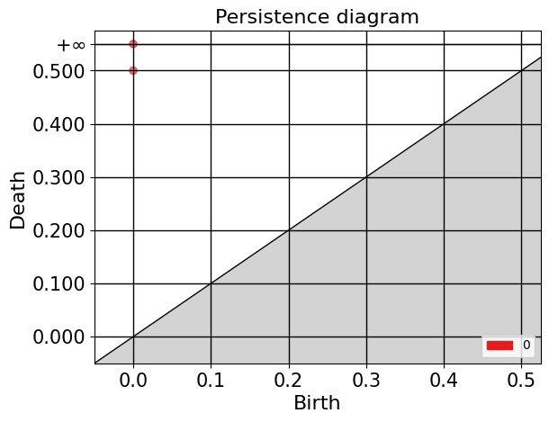
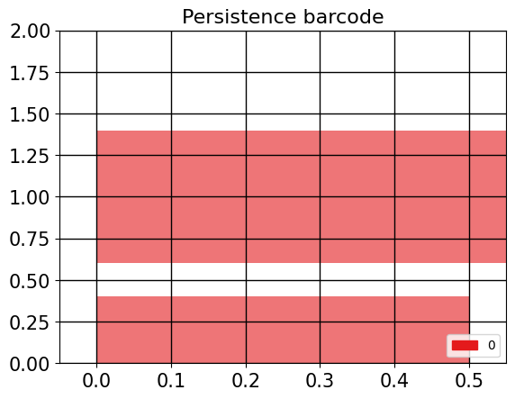
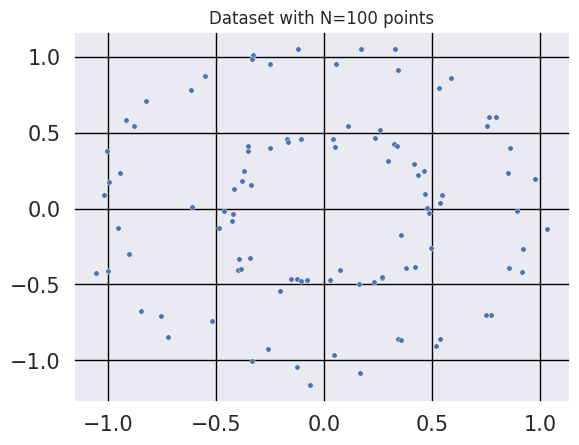
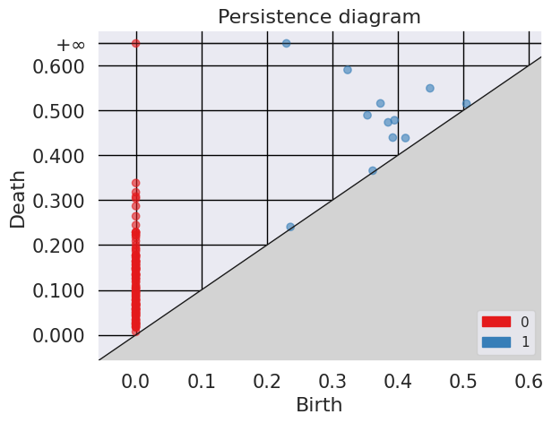
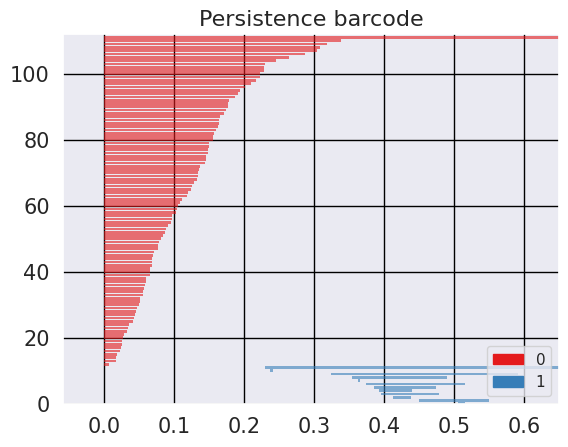
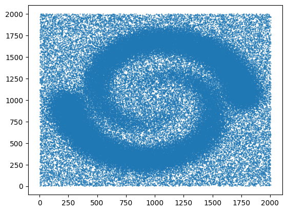
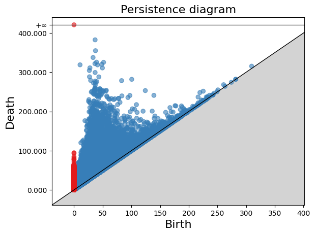
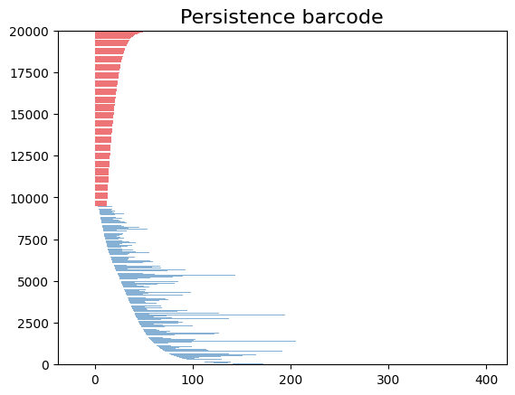

## **Introduction to GUDHI and Simplicial Homology**

Welcome to this lesson on using GUDHI and exploring simplicial homology. GUDHI (Geometry Understanding in Higher Dimensions) is an open-source C++ library that provides algorithms and data structures for the analysis of geometric data. It offers a wide range of tools for topological data analysis, including simplicial complexes and computations of their homology.
### **1. Library**
To begin, we will import the necessary packages.
~~~
from IPython.display import Image
from os import chdir
import numpy as np
import gudhi as gd
import matplotlib.pyplot as plt
import argparse
import seaborn as sns
~~~
{: .language-python}

### **Example 1:** SimplexTree and Manual Filtration
The SimplexTree data structure in GUDHI allows efficient manipulation of simplicial complexes. You can demonstrate its usage by creating a SimplexTree object, adding simplices manually, and then filtering the complex based on a filtration value.
#### **Create SimplexTree**
With the following command, you can create a SimplexTree object named ´st´, which we will use to add the information of your filtered simplicial complex:

~~~
st = gd.SimplexTree()  ## 
~~~
{: .language-python}
#### **Insert simplex**
In GUDHI, you can use the 'st.insert()' function to add simplices to a SimplexTree data structure. Additionally, you have the flexibility to specify the filtration level of each simplex. If no filtration level is specified, it is assumed to be added at filtration time 0.

~~~
#insert 0-simplex (the vertex), 
st.insert([0])
st.insert([1])

~~~
{: .language-python}
~~~
True
~~~
{: .output}

Now let's insert 1-simplices at different filtration levels. If adding a simplex requires a lower-dimensional simplex to be present, the missing simplices will be automatically completed.

Here's an example of inserting 1-simplices into the SimplexTree at various filtration levels:

~~~
# Insert 1-simplices at different filtration levels
st.insert([0, 1], filtration=0.5)
st.insert([1, 2], filtration=0.8)
st.insert([0, 2], filtration=1.2)

~~~
{: .language-python}

~~~
True
~~~
{: .output}

In the code snippet above, we create a SimplexTree object named st. We then insert three 1-simplices into the SimplexTree at filtration levels of 0.5, 0.8, and 1.2, respectively. The 1-simplices are defined by specifying their vertices as lists [v1, v2], where v1 and v2 are the indices of the vertices.

> Note: If any lower-dimensional simplices are missing, GUDHI's SimplexTree will automatically complete them. For example, when inserting the 1-simplex [1, 2] at filtration level 0.8, if the 0-simplex [1] or [2] was not already present, GUDHI will add it to the SimplexTree.

This approach allows you to gradually build the simplicial complex by inserting simplices at different filtration levels, and GUDHI takes care of maintaining the necessary lower-dimensional simplices.
Remember to provide clear instructions and explanations for each step and encourage learners to experiment with different filtration levels and simplex insertions to gain a better understanding of how GUDHI's SimplexTree handles complex construction and completion.

Now, you can use the ´st.num_vertices()´ and ´st.num_simplices()´ commands to see the number of vertices and simplices, respectively, in your simplicial complex stored in the st SimplexTree object.

~~~
num_vertices = st.num_vertices()
num_simplices = st.num_simplices()

print("Number of vertices:", num_vertices)
print("Number of simplices:", num_simplices)
~~~
{: .language-python}

~~~
Number of vertices: 3
Number of simplices: 6
~~~
{: .output}

The st.persistence() function in GUDHI's SimplexTree is used to compute the persistence diagram of the simplicial complex. The persistence diagram provides a compact representation of the birth and death of topological features as the filtration parameter varies.

Here's an example of how to use st.persistence():

~~~
# Compute the persistence diagram
persistence_diagram = st.persistence()

# Print the persistence diagram
for point in persistence_diagram:
    birth = point[0]
    death = point[1]
    print("Birth:", birth)
    print("Death:", death)
    print()
~~~
{: .language-python}

~~~
Birth: 0
Death: (0.0, inf)

Birth: 0
Death: (0.0, 0.5)
~~~
{: .output}

Plot the persitence diagram

~~~
gd.plot_persistence_diagram(diag_Rips,legend=True)
plt.grid(color = 'black', linestyle = '-', linewidth = 1)
plt.savefig('persitencediagramCircles.png' , dpi=600, transparent=True)
plt.xticks(size=15)
plt.yticks(size=15)
~~~
{: .language-python}

~~~
(array([-0.1 ,  0.  ,  0.1 ,  0.2 ,  0.3 ,  0.4 ,  0.5 ,  0.55]),
 [Text(0, -0.1, '-0.100'),
  Text(0, 0.0, '0.000'),
  Text(0, 0.1, '0.100'),
  Text(0, 0.20000000000000004, '0.200'),
  Text(0, 0.30000000000000004, '0.300'),
  Text(0, 0.4, '0.400'),
  Text(0, 0.5000000000000001, '0.500'),
  Text(0, 0.55, '$+\\infty$')])
~~~
{: .output}
 

Plot the barcode

~~~
gd.plot_persistence_barcode(persistence_diagram,legend=True)
plt.grid(color = 'black', linestyle = '-', linewidth = 1)
plt.savefig('persistencebarcodeCircles' , dpi=600, transparent=True)
plt.xticks(size=15)
plt.yticks(size=15)
~~~
{: .language-python}

~~~
(array([0.  , 0.25, 0.5 , 0.75, 1.  , 1.25, 1.5 , 1.75, 2.  ]),
 [Text(0, 0.0, '0.00'),
  Text(0, 0.25, '0.25'),
  Text(0, 0.5, '0.50'),
  Text(0, 0.75, '0.75'),
  Text(0, 1.0, '1.00'),
  Text(0, 1.25, '1.25'),
  Text(0, 1.5, '1.50'),
  Text(0, 1.75, '1.75'),
  Text(0, 2.0, '2.00')])
~~~
{: .output}
 

> ## Exercise 1: Creating a Manually Filtered Simplicial Complex.
>  In the following graph, we have $K$ a simplicial complex filtered representations of simplicial complexes.
>  
> 
> Perform persistent homology and plot the persistence diagram and barcode.
> > ## Solution  
> > 1. Create a SimplexTree with gd.SimplexTree().
>> 2. Insert vertices at time 0 using 'st.insert()'.
>> 3. Insert the remaining simplices by setting the filtration time using 'st.insert([0, 1], filtration=0.5)'.
>> 4. Perform persistent homology using 'st.persistence()'.
>> 5. Plot the barcode and persistence diagram.
> {: .solution}
{: .challenge}

### **Example 2:** Rips complex from datasets 
Import new package and make two circles 

~~~
from sklearn import datasets
circles, labels = datasets.make_circles(n_samples=100, noise=0.06, factor=0.5)
print('Data dimension:{}'.format(circles.shape))
~~~
{: .language-python}

~~~
Data dimension:(100, 2)
~~~
{: .output}

plot dataset

~~~
sns.set()

fig = plt.figure()
ax = fig.add_subplot(111)
ax = sns.scatterplot(x=circles[:,0], y=circles[:,1],   s=15)
plt.title('Dataset with N=%s points'%(circles.shape[0]))
plt.grid(color = 'black', linestyle = '-', linewidth = 1)
plt.savefig('circles2.png' , dpi=600, transparent=True)
plt.xticks(size=15)
plt.yticks(size=15)
plt.show()
~~~
{: .language-python}

 

 The `RipsComplex()` function creates a one skeleton graph from the point cloud.
~~~
%%time
Rips_complex = gd.RipsComplex(circles, max_edge_length=0.6) 
~~~
{: .language-python}
~~~
CPU times: user 0 ns, sys: 214 µs, total: 214 µs
Wall time: 217 µs
~~~
{: .output}

The `create_simplex_tree()` method creates the filtered complex.
~~~
%%time

Rips_simplex_tree = Rips_complex.create_simplex_tree(max_dimension=3) 
~~~
{: .language-python}

~~~
CPU times: user 712 µs, sys: 612 µs, total: 1.32 ms
Wall time: 645 µs
~~~
{: .output}

The `get_filtration()` method computes the simplices of the filtration
~~~
%%time

filt_Rips = list(Rips_simplex_tree.get_filtration())
~~~
{: .language-python}
~~~
CPU times: user 2.72 ms, sys: 2.91 ms, total: 5.64 ms
Wall time: 5.63 ms
~~~
{: .output}

We can compute persistence on the simplex tree structure using the `persistence()` method
~~~
%%time

diag_Rips = Rips_simplex_tree.persistence()
~~~
{: .language-python}
~~~
CPU times: user 4.13 ms, sys: 126 µs, total: 4.26 ms
Wall time: 3.58 ms
~~~
{: .output}

~~~
%%time
gd.plot_persistence_diagram(diag_Rips,legend=True)
plt.grid(color = 'black', linestyle = '-', linewidth = 1)
plt.savefig('persitencediagramCircles.png' , dpi=600, transparent=True)
plt.xticks(size=15)
plt.yticks(size=15)
~~~
{: .language-python}
~~~
(array([-0.1       ,  0.        ,  0.1       ,  0.2       ,  0.3       ,
         0.4       ,  0.5       ,  0.62569893]),
 [Text(0, -0.1, '-0.100'),
  Text(0, 0.0, '0.000'),
  Text(0, 0.1, '0.100'),
  Text(0, 0.20000000000000004, '0.200'),
  Text(0, 0.30000000000000004, '0.300'),
  Text(0, 0.4, '0.400'),
  Text(0, 0.5000000000000001, '0.500'),
  Text(0, 0.6256989291775961, '$+\\infty$')])
~~~
{: .output}

 

~~~
%%time
gd.plot_persistence_barcode(diag_Rips,legend=True)
plt.grid(color = 'black', linestyle = '-', linewidth = 1)
plt.savefig('persistencebarcodeCircles' , dpi=600, transparent=True)
plt.xticks(size=15)
plt.yticks(size=15)
~~~
{: .language-python}
~~~
(array([  0.,  20.,  40.,  60.,  80., 100., 120.]),
 [Text(0, 0.0, '0'),
  Text(0, 20.0, '20'),
  Text(0, 40.0, '40'),
  Text(0, 60.0, '60'),
  Text(0, 80.0, '80'),
  Text(0, 100.0, '100'),
  Text(0, 120.0, '120')])
~~~
{: .output}

 

### **Example 3:** Rips complex from datasets 

~~~
from gudhi.datasets.generators import _points
from gudhi import AlphaComplex
~~~
{: .language-python}

~~~
import requests
#load the file spiral_2d.csv
url = 'https://raw.githubusercontent.com/paumayell/pangenomics/gh-pages/files/spiral_2d.csv'
# Obtener el contenido del archivo
response = requests.get(url)
content = response.text
# Cargar los datos en un arreglo de NumPy
data = np.loadtxt(content.splitlines(), delimiter=' ')
# Graficar los puntos
plt.scatter(data[:, 0], data[:, 1], marker='.', s=1)
plt.show()
~~~
{: .language-python}

Define simplicial complex
~~~
alpha_complex = AlphaComplex(points = data)
simplex_tree = alpha_complex.create_simplex_tree()
~~~
{: .language-python}

~~~
diag = simplex_tree.persistence()
diag = simplex_tree.persistence(homology_coeff_field=2, min_persistence=0)
print("diag=", diag)

gd.plot_persistence_diagram(diag)
~~~
{: .language-python}

~~~
gd.plot_persistence_barcode(diag)
#plt.savefig('persistence_barcodeSpiral.svg' , dpi=1200)
plt.show()
~~~
{: .language-python}

 

~~~
%%time
gd.plot_persistence_barcode(v,legend=True)
plt.grid(color = 'black', linestyle = '-', linewidth = 1)
#plt.savefig('persistencebarcodeCircles' , dpi=600, transparent=True)
plt.xticks(size=15)
plt.yticks(size=15)
~~~
{: .language-python}

> Exercice 
