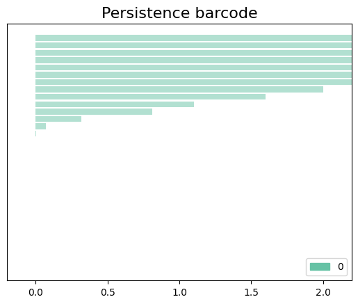

## Persistent approach to pangenomics

We will work with the four mini genomes of episode 4. First we need to import all the libraries that we will use.

~~~
import pandas as pd
from matplotlib import cm
import numpy as np
import gudhi
import time
import os  
~~~
{: .language-python}

Now, we need to read the `mini-genomes.blast` file that we produce in episode 4. 

~~~
os.getcwd()
blastE = pd.read_csv( '~/pan_workshop/results/blast/mini/output-blast/mini-genomes.blast', sep = '\t',names = ['qseqid','sseqid', 'evalue'])  
~~~
{: .language-python}

Obtain a list with the unique genes.

~~~
qseqid_unique=pd.unique(blastE['qseqid'])
sseqid_unique=pd.unique(blastE['sseqid'])
genes = pd.unique(np.append(qseqid_unique, sseqid_unique))
~~~
{: .language-python}

We have 43 unique genes, we can check it as follows.

~~~
len(genes)
~~~
{: .language-python}

Also, we will need a list with the unique genomes in our database. First, we convert to a data frame object the list of genes, then we split each gene in the genome and gen part, finally we obtain a list of the unique genomes and we save it in the object `genomes`.

~~~
df_genes=pd.DataFrame(genes, columns=['Genes'])
df_genome_genes=df_genes["Genes"].str.split("|", n = 1, expand = True)
df_genome_genes.columns= ["Genome", "Gen"]
genomes=pd.unique(df_genome_genes['Genome'])
genomes=list(genomes)
genomes
~~~
{: .language-python}

~~~
['2603V', '515', 'A909', 'NEM316']
~~~
{: .output}

To use the `gudhi` packages, we need a distance matrix. In this case we will use the `evalue` as the measure of how similar the genes are. First, we will process the `blastE` data frame to a list and then we will convert it into a matrix object.

~~~
distance_list = blastE[ blastE['qseqid'].isin(genes) & blastE['sseqid'].isin(genes)]
distance_list.head()
~~~
{: .language-python}

~~~
  qseqid	              sseqid	              evalue
0	2603V|GBPINHCM_01420	NEM316|AOGPFIKH_01528	4.110000e-67
1	2603V|GBPINHCM_01420	A909|MGIDGNCP_01408	4.110000e-67
2	2603V|GBPINHCM_01420	515|LHMFJANI_01310	4.110000e-67
3	2603V|GBPINHCM_01420	2603V|GBPINHCM_01420	4.110000e-67
4	2603V|GBPINHCM_01420	A909|MGIDGNCP_01082	1.600000e+00
~~~
{: .output}

To convert the `distance_list` to a matrix object we will use the convention that the maximum biological distance between genes are `5`, so if we do not have the `evalue` between two genes, that imply that the evalua was too big, so we will fill that spots with the maximum biological distance.

~~~
MaxDistance = 5.0000000

# reshape long to wide
matrixE = pd.pivot_table(distance_list,index = "qseqid",values = "evalue",columns = 'sseqid')
matrixE.iloc[1:5,1:5]
~~~
{: .language-python}

~~~
sseqid	2603V|GBPINHCM_00065	2603V|GBPINHCM_00097	2603V|GBPINHCM_00348	2603V|GBPINHCM_00401
qseqid				
2603V|GBPINHCM_00065	1.240000e-174	NaN	NaN	NaN
2603V|GBPINHCM_00097	NaN	9.580000e-100	NaN	NaN
2603V|GBPINHCM_00348	NaN	NaN	0.0	NaN
2603V|GBPINHCM_00401	NaN	NaN	NaN	2.560000e-135
~~~
{: .output}

~~~~
matrixE2=matrixE.fillna(MaxDistance)
matrixE2.iloc[0:4,0:4]
~~~~
{: .language-python}

~~~
sseqid	2603V|GBPINHCM_00065	2603V|GBPINHCM_00097	2603V|GBPINHCM_00348	2603V|GBPINHCM_00401
qseqid				
2603V|GBPINHCM_00065	1.240000e-174	5.000000e+00	5.0	5.000000e+00
2603V|GBPINHCM_00097	5.000000e+00	9.580000e-100	5.0	5.000000e+00
2603V|GBPINHCM_00348	5.000000e+00	5.000000e+00	0.0	5.000000e+00
2603V|GBPINHCM_00401	5.000000e+00	5.000000e+00	5.0	2.560000e-135
~~~
{: .output}

We need to have an object with the names of the columns of the matrix that we will use later.

~~~
name_columns = matrixE2.columns
name_columns
~~~
{: .language-python}

~~~
Index(['2603V|GBPINHCM_00065', '2603V|GBPINHCM_00097', '2603V|GBPINHCM_00348',
       '2603V|GBPINHCM_00401', '2603V|GBPINHCM_00554', '2603V|GBPINHCM_00748',
       '2603V|GBPINHCM_00815', '2603V|GBPINHCM_01042', '2603V|GBPINHCM_01226',
       '2603V|GBPINHCM_01231', '2603V|GBPINHCM_01420', '515|LHMFJANI_00064',
 ...,
       'NEM316|AOGPFIKH_01341', 'NEM316|AOGPFIKH_01415',
       'NEM316|AOGPFIKH_01528', 'NEM316|AOGPFIKH_01842'],
      dtype='object', name='sseqid')
~~~
{: .output}

Finaly, we need the distance matrix as a `numpy` array.

~~~
DistanceMatrix = matrixE2.to_numpy()
DistanceMatrix
~~~
{: .language-python}

~~~
array([[1.24e-174, 5.00e+000, 5.00e+000, ..., 5.00e+000, 5.00e+000,
        5.00e+000],
       [5.00e+000, 9.58e-100, 5.00e+000, ..., 5.00e+000, 5.00e+000,
        5.00e+000],
       [5.00e+000, 5.00e+000, 0.00e+000, ..., 5.00e+000, 5.00e+000,
        5.00e+000]
~~~
{: .output}

Now, we want to construct the Rips complex associated with the genes with respect to the distance matrix that we obtained. To do this, we will impose the condition that the maximal distance between genes will be 2.

~~~
max_edge_length = 2
# Rips complex with the distance matrix
start_time = time.time()
ripsComplex = gudhi.RipsComplex(
    distance_matrix = DistanceMatrix, 
    max_edge_length = max_edge_length
)
print("The Rips complex was created in %s" % (time.time() - start_time) )
~~~
{: .language-python}

~~~
The Rips complex was created in 0.00029540061950683594
~~~
{: .output}

> ## Discussion: Changing the maximum dimension of the edges
> To create the Rips Complex, we fixed that the maximum edge length was 2. What happend if we use a different parameter?  
> For example, if we use `max_edge_lenght=1`. Do you expect to have more simplices? Why?
>  
> > ## Solution
> > 
> > 
> > 
> {: .solution}
{: .challenge}

As we see in the previous episodes, we now need a filtration. We will use the gudhi function `create_simplex_tree` to obtain the filtration associated with the Rips complex. We need to specify the argument `max_dimension`, this argument is the maximum dimension of the simplicial complex that we will obtain. If it is for example 4, this means that we will obtain gene families with at most 4 genes. In this example, we will use `8` as the maximum dimension so we can have families with at most 2 genes for each genomes or 8 different genes.

**Note**:  For complete genomes, the maximum dimension of the simplicial complex needs to be carefully chosen because  the computation in Python is demanding in terms of system resources. For example, with 4 complete genomes the maximum dimension that we can compute is 5.  

~~~
start_time = time.time()
simplexTree = ripsComplex.create_simplex_tree(
    max_dimension = 8)
print("The filtration of the Rips complex was created in %s" % (time.time() - start_time))
~~~
{: .language-python}

~~~
The filtration of the Rips complex was created in 0.001073598861694336
~~~
{: .output}

With the `persistence()` function, we will obtain the persistence of each simplicial complex.

~~~
start_time = time.time()
persistence = simplexTree.persistence()  
print("The persistente diagram of the Rips complex was created in %s" % (time.time() - start_time))
~~~
{: .language-python}

~~~
The persistente diagram of the Rips complex was created in 0.006387233734130859
~~~
{: .output}

We can print the birth time of the simplices. If we check the output of the following, we can see the simplices with how many vertices they have and with the birth time of each.

~~~
result_str = 'Rips complex of dimension ' + repr(simplexTree.dimension())
print(result_str)
fmt = '%s -> %.2f'
for filtered_value in simplexTree.get_filtration():
    print(tuple(filtered_value))
~~~
{: .language-python}

~~~
Rips complex of dimension 7
([0], 0.0)
([1], 0.0)
([2], 0.0)
([3], 0.0)
([4], 0.0)
([5], 0.0)
([6], 0.0)
([7], 0.0)
...
~~~
{: .output}

~~~
simplexTree.dimension(), simplexTree.num_vertices(), simplexTree.num_simplices()
~~~
{: .language-python}

~~~
(7, 43, 467)
~~~
{: .output}

The following is the barcode of the filtration that we created. We observe in this case that we only have objects in dimension 0.

~~~
start_time = time.time()
gudhi.plot_persistence_barcode(
    persistence = persistence, 
    alpha = 0.5,
    colormap = cm.Set2.colors
)
print("Bar code diagram was created in %s" % (time.time() - start_time))
~~~
{: .language-python}

~~~
Bar code diagram was created in 0.05829215049743652
~~~
{: .output}

<em> Figure 1. Barcode plot for the filtration with bars only in dimension 0. <em/>

The following function allows us to obtain the dimension of the simplices.

~~~
def dimension(list):
    return (len(list[0])-1, list[1])
~~~
{: .language-python}

We filter according to the dimension function: it orders the simplices from largest dimension to smallest and then from longest birth time to smallest.

~~~
all_simplex_sorted_dim_1 = sorted(simplexTree.get_filtration(), key = dimension, reverse = True)
all_simplex_sorted_dim_1 
~~~
{: .language-python}

~~~
[([4, 9, 15, 18, 25, 30, 37, 39], 0.014),
 ([4, 9, 15, 18, 25, 30, 37], 0.014),
 ([4, 9, 15, 18, 25, 30, 39], 0.014),
 ([4, 9, 15, 18, 25, 37, 39], 0.014),
...
 ([35], 0.0),
 ([36], 0.0),
 ([37], 0.0),
 ([38], 0.0),
 ([39], 0.0),
 ([40], 0.0),
 ([41], 0.0),
 ([42], 0.0)]
~~~
{: .output}

Obtain the persistence of each simplex.

~~~
d_simplex_time = dict()
d_simplex_const = dict()
names = []
for tuple_simple in all_simplex_sorted_dim_1:
    list_aux = []
    if len(tuple_simple[0])-1 == simplexTree.dimension(): 
        t_birth = tuple_simple[1]
        t_death = max_edge_length
        d_simplex_time[tuple(tuple_simple[0])] = (t_birth,t_death)
        list_aux = tuple([name_columns[tuple_simple[0][i]] for i in range(len(tuple_simple[0]))])
        d_simplex_const[list_aux] = (t_birth,t_death)
    else:
        t_birth = tuple_simple[1] 
        t_death = max_edge_length
        for simplex in d_simplex_time.keys():
            if set(tuple_simple[0]).issubset(set(simplex)):
                t_death = d_simplex_time[simplex][0] 
        d_simplex_time[tuple(tuple_simple[0])] = (t_birth,t_death)
        list_aux = tuple([name_columns[tuple_simple[0][i]] for i in range(len(tuple_simple[0]))])
        d_simplex_const[list_aux] = (t_birth,t_death) 
~~~
{: .language-python}

We can save the name of the simplices, i.e. the keys in the object `d_simplex_const`, in a list called `simplices`.

~~~
simplices = list()
simplices = list(d_simplex_const.keys())
~~~
{: .language-python}

Now, we want an object with the information of how many genes of each genome are in each family.

~~~
bool_gen = dict()
genes_contains = dict()
num_new_columns = len(genomes)
for simplex in simplices:
    genes_contains = dict()
    genes_contains = {'2603V': 0, '515': 0, 'A909': 0, 'NEM316': 0}
    for i in range(len(simplex)):
        for genoma in genomes:
            if genoma in simplex[i]:
                genes_contains[genoma] = genes_contains[genoma] +1
    for gen in genomes:
        if gen not in genes_contains.keys():
            genes_contains[gen] = 0
    bool_gen[simplex] = genes_contains
~~~
{: .language-python}

The bool_gen numbers looks like:

~~~
{('2603V|GBPINHCM_00554',
  '2603V|GBPINHCM_01231',
  '515|LHMFJANI_00548',
  '515|LHMFJANI_01178',
  'A909|MGIDGNCP_00580',
  'A909|MGIDGNCP_01268',
  'NEM316|AOGPFIKH_00621',
  'NEM316|AOGPFIKH_01341'): {'2603V': 2, '515': 2, 'A909': 2, 'NEM316': 2},
 ('2603V|GBPINHCM_00554',
  '2603V|GBPINHCM_01231',
  '515|LHMFJANI_00548',
  '515|LHMFJANI_01178',
  'A909|MGIDGNCP_00580',
  'A909|MGIDGNCP_01268',
  'NEM316|AOGPFIKH_00621'): {'2603V': 2, '515': 2, 'A909': 2, 'NEM316': 1},
...
('NEM316|AOGPFIKH_00855',): {'2603V': 0, '515': 0, 'A909': 0, 'NEM316': 1},
 ('NEM316|AOGPFIKH_01341',): {'2603V': 0, '515': 0, 'A909': 0, 'NEM316': 1},
 ('NEM316|AOGPFIKH_01415',): {'2603V': 0, '515': 0, 'A909': 0, 'NEM316': 1},
 ('NEM316|AOGPFIKH_01528',): {'2603V': 0, '515': 0, 'A909': 0, 'NEM316': 1},
 ('NEM316|AOGPFIKH_01842',): {'2603V': 0, '515': 0, 'A909': 0, 'NEM316': 1}}
~~~
{: .output}

How can we read the object `bool_gen`?

We have a dictionary of dictionaries. Every key in the dictionary is a family and in the values we have how many genes are from each genome in each family.

Now, we want to obtain a dataFrame with the information of the time of births, death and persistence of every simplice (i.e. every family). First we will obtain this information from our object `d_simplex_time` and we will save in tree lists.

~~~
births = []
deaths = []
persistent_times = []
for values in d_simplex_time.values():
    births.append(values[0])
    deaths.append(values[1])
    persistent_times.append(values[1]-values[0])
~~~
{: .language-python}

Now that we have the information we will save it in the dataFrame `simplex_list`
~~~
data = {
    't_birth': births,
    't_death': deaths,
    'persistence': persistent_times
}
simplex_list = pd.DataFrame(index = simplices, data = data)
simplex_list.head(4)
~~~
{: .language-python}

~~~
	t_birth	t_death	persistence
(2603V|GBPINHCM_00554, 2603V|GBPINHCM_01231, 515|LHMFJANI_00548, 515|LHMFJANI_01178, A909|MGIDGNCP_00580, A909|MGIDGNCP_01268, NEM316|AOGPFIKH_00621, NEM316|AOGPFIKH_01341)	0.014	2.000	1.986
(2603V|GBPINHCM_00554, 2603V|GBPINHCM_01231, 515|LHMFJANI_00548, 515|LHMFJANI_01178, A909|MGIDGNCP_00580, A909|MGIDGNCP_01268, NEM316|AOGPFIKH_00621)	0.014	0.014	0.000
(2603V|GBPINHCM_00554, 2603V|GBPINHCM_01231, 515|LHMFJANI_00548, 515|LHMFJANI_01178, A909|MGIDGNCP_00580, A909|MGIDGNCP_01268, NEM316|AOGPFIKH_01341)	0.014	0.014	0.000
(2603V|GBPINHCM_00554, 2603V|GBPINHCM_01231, 515|LHMFJANI_00548, 515|LHMFJANI_01178, A909|MGIDGNCP_00580, NEM316|AOGPFIKH_00621, NEM316|AOGPFIKH_01341)	0.014	0.014	0.000
~~~
{: .output}

Finally, we want the data frame with the complete information, so we will concatenate the objects `simplex_list` and `bool_gen` in a convenient way.

~~~
aux_simplex_list = simplex_list
for gen in genes_numbers:
    data = dict()
    dataFrame_aux = []
    for simplex in simplices:
        data[simplex] = bool_gen[simplex][gen]
    dataFrame_aux = pd.DataFrame.from_dict(data, orient='index', columns = [str(gen)])
    aux_simplex_list=pd.concat([aux_simplex_list, dataFrame_aux], axis = 1)
~~~
{: .language-python}

~~~
	t_birth	t_death	persistence	2603V	515	A909	NEM316
(2603V|GBPINHCM_00554, 2603V|GBPINHCM_01231, 515|LHMFJANI_00548, 515|LHMFJANI_01178, A909|MGIDGNCP_00580, A909|MGIDGNCP_01268, NEM316|AOGPFIKH_00621, NEM316|AOGPFIKH_01341)	0.014	2.000000e+00	1.986000e+00	2	2	2	2
(2603V|GBPINHCM_00554, 2603V|GBPINHCM_01231, 515|LHMFJANI_00548, 515|LHMFJANI_01178, A909|MGIDGNCP_00580, A909|MGIDGNCP_01268, NEM316|AOGPFIKH_00621)	0.014	1.400000e-02	0.000000e+00	2	2	2	1
(2603V|GBPINHCM_00554, 2603V|GBPINHCM_01231, 515|LHMFJANI_00548, 515|LHMFJANI_01178, A909|MGIDGNCP_00580, A909|MGIDGNCP_01268, NEM316|AOGPFIKH_01341)	0.014	1.400000e-02	0.000000e+00	2	2	2	1
(2603V|GBPINHCM_00554, 2603V|GBPINHCM_01231, 515|LHMFJANI_00548, 515|LHMFJANI_01178, A909|MGIDGNCP_00580, NEM316|AOGPFIKH_00621, NEM316|AOGPFIKH_01341)	0.014	1.400000e-02	0.000000e+00	2	2	1	2
(2603V|GBPINHCM_00554, 2603V|GBPINHCM_01231, 515|LHMFJANI_00548, 515|LHMFJANI_01178, A909|MGIDGNCP_01268, NEM316|AOGPFIKH_00621, NEM316|AOGPFIKH_01341)	0.014	1.400000e-02	0.000000e+00	2	2	1	2
...	...	...	...	...	...	...	...
(NEM316|AOGPFIKH_00855,)	0.000	0.000000e+00	0.000000e+00	0	0	0	1
~~~
{: .output}

We can save the data frame as follows.

~~~
aux_simplex_list.to_csv('~/pan_workshop/results/blast/mini/persistent_simplices.csv')
~~~
{: .language-python}

In this data frame, we can see how many families are at the end if we filter by `t_death=2`. Also, we can see how the families are formed and the families that are formed since the first time.

> ## Exercise 1: Partitioning the pangenome
> Filter the table by `t_death=2`. Which genes and families are in each partition **Core**, **Shell** and **Cloud**? 
>  
> Note: You might want to download the file to your computer and open it in a spreadsheet program to read it easily.
> > ## Solution
> > 
> > |Genes families | No. Genomes | Partition |
> > |---|---|---|
> > |    |   |    |
> > 
> {: .solution}
{: .challenge}

> ## Exercise 2: Changing the dimension of the simplices
> When we create the object `simplexTree` we define that the maximum dimension of the simplices were 8. Change this parameter.  
> With the new parameter, how many simplices do you obtain? An edges?
> If you run all the code with this new parameter, how many families do you obtain in the core?
> > ## Solution
> > 
> > 
> > 
> {: .solution}
{: .challenge}
