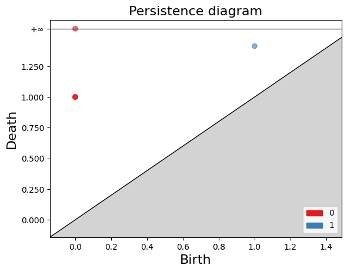
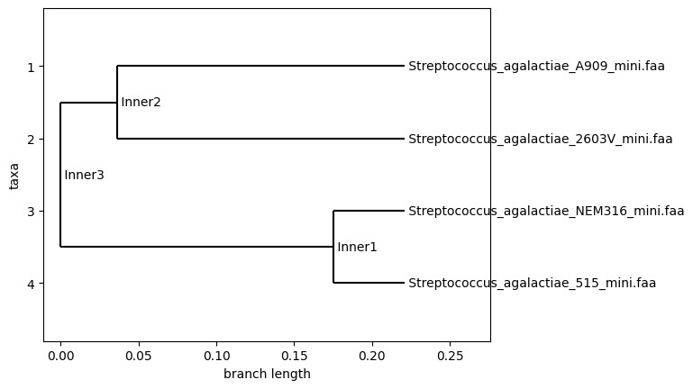
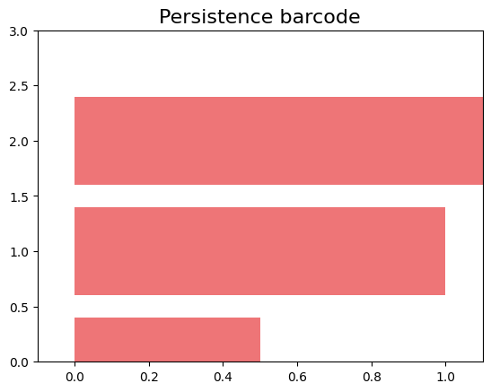
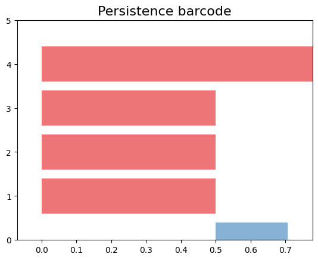
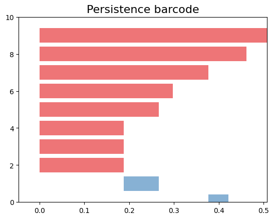
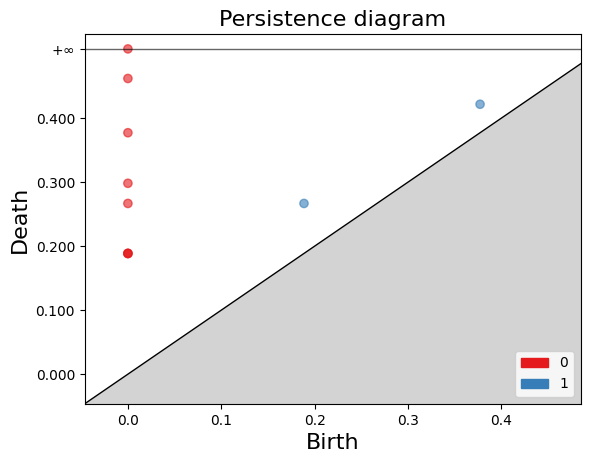

### **1. Library**
To begin, we will import the necessary packages.
~~~
import pandas as pd
import numpy as np
import umap
import gudhi as gd
import matplotlib.pyplot as plt
from scipy.spatial.distance import pdist, squareform
from itertools import combinations
import scipy.cluster.hierarchy as sch

from Bio import SeqIO
from Bio.Align import MultipleSeqAlignment
from Bio.Phylo.TreeConstruction import DistanceCalculator, DistanceTreeConstructor
from Bio.Phylo import draw
~~~
{: .language-python}

### Example 1: From book
~~~
data = {'Genoma1': [0, 0],
        'Genoma2': [1, 0],
        'Genoma3': [0, 1],
        'Genoma4': [1, 1]}
df_1 = pd.DataFrame(data, index=['Gen1', 'Gen2'])
df_1
~~~
{: .language-python}

~~~
Genoma1	Genoma2	Genoma3	Genoma4
Gen1	0	1	0	1
Gen2	0	0	1	1
~~~
{: .output}

The distance function takes a DataFrame df and an optional parameter metrica (defaulting to 'hamming').

The resulting distance_matrix can be used for further analysis, such as clustering or dimensionality reduction, to explore the relationships and similarities between the variables/columns of the DataFrame. 
~~~
def distance(df, metrica='hamming'):
    # Compute pairwise distances between columns of the DataFrame
    distances = pdist(df.values.T, metric=metrica)
    
    # Convert the condensed distance matrix to a squareform distance matrix
    distance_matrix = squareform(distances)
    return(distance_matrix)

~~~
{: .language-python}
Calculate 
~~~
matrix_distance_1=distance(df_1)
matrix_distance_1
~~~
{: .language-python}

~~~
array([[0. , 0.5, 0.5, 1. ],
       [0.5, 0. , 1. , 0.5],
       [0.5, 1. , 0. , 0.5],
       [1. , 0.5, 0.5, 0. ]])
~~~
{: .output}

Define the function `complejo` to compute the persistence of a Rips simplicial complex from a distance matrix.
~~~
def complejo(distance_matrix):
    # Create the Rips simplicial complex from the distance matrix
    rips_complex = gd.RipsComplex(distance_matrix)
    # Create the simplex tree from the Rips complex with a maximum dimension of 3
    simplex_tree = rips_complex.create_simplex_tree(max_dimension=3)
    # Compute the persistence of the simplicial complex
    persistence = simplex_tree.persistence()
    # Return the persistence diagram or barcode
    return persistence
~~~
{: .language-python}

we used the previous function and calculate de persistence and plot
~~~
persistence_1=complejo(matrix_distance_1)
gd.plot_persistence_barcode(persistence_1)
~~~
{: .language-python}

~~~
gd.plot_persistence_diagram(persistence_1,legend=True)
~~~
{: .language-python}

### Example 2: Genes
In this example, we want to use Topological Data Analysis to detect if there is Horizontal Gene Transfer within this group of genomes.

First, let's import the file `familias_mini.csv` which contains a table of gene presence and absence in 4 _Streptococcus_ genomes.
~~~
df = pd.read_csv("https://raw.githubusercontent.com/paumayell/pangenomics/gh-pages/files/familias_minis.csv", index_col=0)

df_filled = df.fillna(0)
df=df_filled.replace(to_replace=r'.+', value=1, regex=True)
df
~~~
{: .language-python}
~~~
	g_A909	g_2603V	g_515	g_NEM316
A909|MGIDGNCP_01408	1	1	1	1
A909|MGIDGNCP_00096	1	1	1	1
A909|MGIDGNCP_01343	1	0	0	1
A909|MGIDGNCP_01221	1	0	1	0
A909|MGIDGNCP_01268	1	1	1	1
A909|MGIDGNCP_00580	1	1	1	1
A909|MGIDGNCP_00352	1	1	1	1
A909|MGIDGNCP_00064	1	1	1	1
A909|MGIDGNCP_00627	1	0	0	0
A909|MGIDGNCP_01082	1	1	0	0
A909|MGIDGNCP_00877	1	1	1	1
A909|MGIDGNCP_00405	1	1	1	1
2603V|GBPINHCM_00748	0	1	0	0
2603V|GBPINHCM_01226	0	1	0	0
515|LHMFJANI_01625	0	0	1	1
~~~
{: .output}

Now we will use the file 'minigenomes_allig.fasta,' which contains the sequence of the previously aligned genomes, to build a phylogenetic tree among them.
~~~
url = "https://raw.githubusercontent.com/paumayell/pangenomics/gh-pages/files/minigenomes_allig.fasta"
response = requests.get(url)
response.raise_for_status()  # Check if any errors occurred during the download
# Save the downloaded content to a local file
with open("minigenomes_allig.fasta", "wb") as file:
    file.write(response.content)
sequences = list(SeqIO.parse("minigenomes_allig.fasta", "fasta"))
# Rest of your code that uses the sequences
alignment = MultipleSeqAlignment(sequences)
# Calculate the distance matrix
calculator = DistanceCalculator('identity')
distance_matrix = calculator.get_distance(alignment)

# Build the UPGMA tree
constructor = DistanceTreeConstructor()
upgma_tree = constructor.upgma(distance_matrix)

# Draw the UPGMA tree
draw(upgma_tree)
~~~
{: .language-python}
 

The phylogenetic tree groups the genomes into pairs, which does help infer whether horizontal gene transfer occurred at some point during evolution among these species. Next, we will use persistent homology to try to detect this by identifying 1-hole structures.

~~~
matrix_distance_genes=distance(df)
persistence_genes=complejo(matrix_distance_genes)
gd.plot_persistence_barcode(persistence_genes)
~~~
{: .language-python}
 

In the persistence barcode code, we did not detect any 1-hole structures. We can explore various strategies to try to detect this.

### Select by groups.
We start select the first four genes and repeat the previous calculations.
The first 4 rows of the DataFrame df are selected, and their pairwise distances are used to create a simplicial complex. The persistence of this complex is then computed, and a persistence barcode plot is generated to visualize the topological features and their lifespans.

~~~
# Select the first 4 rows of the DataFrame 'df' and assign it to 'df_primera'
df_primera = df.iloc[:4, :]

# Compute the distance matrix using the 'distance' function on 'df_primera'
matrix_distance_genes_primera = distance(df_primera)

# Compute the persistence of the simplicial complex created from 'matrix_distance_genes_primera'
persistence_genes_primera = complejo(matrix_distance_genes_primera)

# Plot the persistence barcode using the 'plot_persistence_barcode' function from the Gudhi library
gd.plot_persistence_barcode(persistence_genes_primera)

~~~
{: .language-python}
 
We can observe that we have a 1-hole, indicating the presence of horizontal gene transfer among our four genomes.

Now, if we make another selection by taking the last four genes, we can observe the following:

~~~
df_segunda=df.iloc[-4:,:]
df_segunda
~~~
{: .language-python}
~~~
	g_A909	g_2603V	g_515	g_NEM316
A909|MGIDGNCP_00405	1	1	1	1
2603V|GBPINHCM_00748	0	1	0	0
2603V|GBPINHCM_01226	0	1	0	0
515|LHMFJANI_01625	0	0	1	1
~~~
{: .output}
~~~
matrix_dintancia_genes_segunda=distance(df_segunda)
persistence_genes_segunda=complejo(matrix_dintancia_genes_segunda)
gd.plot_persistence_barcode(persistence_genes_segunda)
~~~
{: .language-python}
 

In this selection, we did not detect any holes today, but we need to find a more accurate way than selecting groups of genomes. In this sense, explore the following method for me.

### **The mediam complex**

The median complex is an alternative construction on sequence data aimed at recovering signal of phylogenetic incompatibility using homology. First, we define the median of a set of aligned sequences.

Definition:  For any three aligned sequences $a$, $b$, and $c$,
the median sequence $m(a, b, c)$ is defined such that each position of the median is the majority consensus of the three
sequences.
Next, we define the median closure. Given an alignment S, the median closure, $S̄$, is defined as the vertex set generated from the original set S that is closed under the median operation

We obtain the median closure by repeatedly applying the
median operation to all sequence triplets until no new sequences are added. The median closure consists of the original vertex set augmented by the computed medians. We informally refer to topological complexes formed from the median closure as median complexes. We can then compute persistent homology on the new vertex set.
~~~
# Create a dictionary for each genome converted to "0" and "1" representing the presence and absence of genes
genomes = {}

# Iterate over each column in the DataFrame
for column in df.columns:
    # Convert the column values to a NumPy array and store it as a list in the dictionary
    genomes[column] = list(np.array(df[column]))

# Print the genomes dictionary
genomes
~~~
{: .language-python}
~~~
{'g_A909': [1, 1, 1, 1, 1, 1, 1, 1, 1, 1, 1, 1, 0, 0, 0],
 'g_2603V': [1, 1, 0, 0, 1, 1, 1, 1, 0, 1, 1, 1, 1, 1, 0],
 'g_515': [1, 1, 0, 1, 1, 1, 1, 1, 0, 0, 1, 1, 0, 0, 1],
 'g_NEM316': [1, 1, 1, 0, 1, 1, 1, 1, 0, 0, 1, 1, 0, 0, 1]}
~~~
{: .output}

Now, using persistent homology on the 'median complex', let's define the following functions that allow us to calculate it
~~~
# Calculate the median sequence from vectors
def compute_median_vector(a, b, c):
    # Convert the input vectors to NumPy arrays
    a = np.array(a)
    b = np.array(b)
    c = np.array(c)

    # Create an array of zeros with the same shape as 'a'
    median = np.zeros_like(a)

    # Iterate over each index of the vectors
    for i in range(len(a)):
        # Count the occurrences of each element at index 'i' in the three vectors
        counts = np.bincount([a[i], b[i], c[i]])

        # Find the element with the highest count
        majority = np.argmax(counts)

        # Set the median value at index 'i' to the majority element
        median[i] = majority

    # Convert the median NumPy array to a list and return it
    return median.tolist()

~~~
{: .language-python}

~~~
# Create a new dictionary based on the previous one and add the median vectors
def process_dict_elements(dictionary):
    keys = list(dictionary.keys())  # Get the keys of the dictionary
    result = {}  # Initialize an empty dictionary to store the results
    for combination in combinations(keys, 3):  # Iterate over all combinations of 3 keys
        a, b, c = combination  # Extract the three keys from the combination
        median = compute_median_vector(dictionary[a], dictionary[b], dictionary[c])  # Compute the median vector
        new_key = f"{a}_{b}_{c}"  # Create a new key based on the combination of original keys
        result[new_key] = median  # Add the median vector to the result dictionary with the new key
    dictionary.update(result)  # Add the calculated medians to the original dictionary
    return dictionary
~~~
{: .language-python}

Now lets run the function on genomes 
~~~
genomes_mediam=process_dict_elements(genomes)
genomes_mediam
~~~
{: .language-python}

~~~
# Create a DataFrame from the dictionary 'genomes_mediam' and assign it to 'df_mediam'
df_mediam = pd.DataFrame.from_dict(genomes_mediam)

# Print the DataFrame 'df_mediam'
df_mediam

~~~
{: .language-python}
~~~
{'g_A909': [1, 1, 1, 1, 1, 1, 1, 1, 1, 1, 1, 1, 0, 0, 0],
 'g_2603V': [1, 1, 0, 0, 1, 1, 1, 1, 0, 1, 1, 1, 1, 1, 0],
 'g_515': [1, 1, 0, 1, 1, 1, 1, 1, 0, 0, 1, 1, 0, 0, 1],
 'g_NEM316': [1, 1, 1, 0, 1, 1, 1, 1, 0, 0, 1, 1, 0, 0, 1],
 'g_A909_g_2603V_g_515': [1, 1, 0, 1, 1, 1, 1, 1, 0, 1, 1, 1, 0, 0, 0],
 'g_A909_g_2603V_g_NEM316': [1, 1, 1, 0, 1, 1, 1, 1, 0, 1, 1, 1, 0, 0, 0],
 'g_A909_g_515_g_NEM316': [1, 1, 1, 1, 1, 1, 1, 1, 0, 0, 1, 1, 0, 0, 1],
 'g_2603V_g_515_g_NEM316': [1, 1, 0, 0, 1, 1, 1, 1, 0, 0, 1, 1, 0, 0, 1]}
~~~
{: .output}

This following code creates a `DataFrame` called df_mediam using the `pd.DataFrame.from_dict()` function. The genomes_mediam dictionary is used as the input, and the function converts it into a DataFrame format. The resulting DataFrame is then assigned to the variable `df_mediam`. Finally, the code prints the contents of the DataFrame `df_mediam`.
~~~
# Create a DataFrame from the dictionary 'genomes_mediam' and assign it to 'df_mediam'
df_mediam = pd.DataFrame.from_dict(genomes_mediam)

# Print the DataFrame 'df_mediam'
df_mediam

~~~
{: .language-python}
~~~
	g_A909_g_2603V_g_NEM316	g_A909_g_515_g_NEM316	g_2603V_g_515_g_NEM316
0	1	1	1
1	1	1	1
2	1	1	0
3	0	1	0
~~~
{: .output}

~~~
# Calculate the extended distance matrix using the function 'distance' with 'df_mediam' as input
matrix_distance_extendida = distance(df_mediam)

# Create the extended persistence complex using the function 'complejo' with 'matrix_distance_extendida' as input
persistence_extendida = complejo(matrix_distance_extendida)

# Print the extended distance matrix 'matrix_distance_extendida'
matrix_distance_extendida

~~~
{: .language-python}
~~~
array([[0.        , 0.33333333, 0.26666667, 0.26666667, 0.13333333,
        0.13333333, 0.2       , 0.33333333],
       [0.33333333, 0.        , 0.33333333, 0.33333333, 0.2       ,
        0.2       , 0.4       , 0.26666667],
       [0.26666667, 0.33333333, 0.        , 0.13333333, 0.13333333,
        0.26666667, 0.06666667, 0.06666667],
       [0.26666667, 0.33333333, 0.13333333, 0.        , 0.26666667,
        0.13333333, 0.06666667, 0.06666667],
       [0.13333333, 0.2       , 0.13333333, 0.26666667, 0.        ,
        0.13333333, 0.2       , 0.2       ],
       [0.13333333, 0.2       , 0.26666667, 0.13333333, 0.13333333,
        0.        , 0.2       , 0.2       ],
       [0.2       , 0.4       , 0.06666667, 0.06666667, 0.2       ,
        0.2       , 0.        , 0.13333333],
       [0.33333333, 0.26666667, 0.06666667, 0.06666667, 0.2       ,
        0.2       , 0.13333333, 0.        ]])
~~~
{: .output}

~~~
gd.plot_persistence_barcode(persistence_extendida)
~~~
{: .language-python}
 

~~~
gd.plot_persistence_diagram(persistence_extendida,legend=True)
~~~
{: .language-python}
 

## Explore this code

This code attempts to generate a pangenome with a specified percentage of core/shell/cloud gene families. Nevertheless, caution is recommended because, in a real pangenome, data should have a more hierarchical structure. This is temporary data to exemplify TDA concepts.
~~~
import pandas as pd
import numpy as np
import random

import warnings

warnings.filterwarnings("ignore")  # Deactivate Python warnings

m =5 # The number of genomes (Cols)
n = 10  # Specify the number of genes (rows)
shellsize=int(m/2)+1

core = 0.3  # Probability of being core filling a row with ones
shell = 0.6  # Probability of being shell filling the remaining zeros with ones
cloud =1-core-shell

# Create an empty DataFrame
# Create an empty DataFrame
df = pd.DataFrame(columns=[f'Column{i+1}' for i in range(m)])

# Fill each row with ones based on probabilities P1 and P2
for _ in range(n):
    P1=random.random()  # Generate a random value between 0 and 1

    #print("P1",P1)
    if (core>1-P1): 
      row = [1] * m
      #print("core",row)
  
    elif(core+shell>1-P1): 
        #If the row is not already filled with ones, randomly distribute m/2 ones based on P2
        genome_row = np.random.choice([shellsize, m-1])  # Fill the row with ones based on P1
        #print("number of genomes in which this family is present",genome_row)
        # Create an empty list representing the row
        row = [0] * m
        # Generate k unique random indices
        indices = random.sample(range(m), genome_row)
        # Set the values at the random indices to 1
        for index in indices:
          row[index] = 1
        #print("shell",row)
    else:
        row = [0] * m
        num_ones = 1  # Calculate the number of ones to distribute
        # Choose a random index within the row
        random_index = random.randint(0, m - 1)
        #print("rNDOM INDEX", random_index)  
        # Set the value at the random index to 1
        row[random_index] = 1
        #print("cloud",row)

    # row van a ser las columnas del dataframe
    df = df.append(pd.Series(row, index=df.columns), ignore_index=True)  # Append the row to the DataFrame

print(df)
~~~
{: .python}

